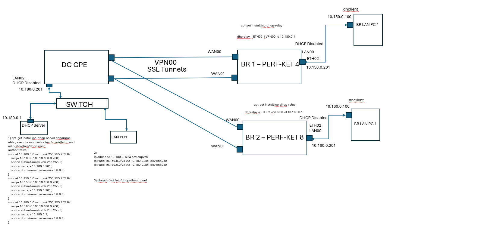

# DHCP RELAY 
DHCP relay agent provides a method of relaying/forwarding DHCP and BOOTP requests from a DHCP client and DHCP server on different IP networks. It acts as an interface between DHCP client and the server. The DHCP Relay Agent listens for DHCPv4 or DHCPv6 queries from clients or other relay agents on one or more interfaces, passing them along to upstream servers .  When a reply is received from upstream, it is multicast or unicast back downstream to the source of the original request. This page explains about configuring DHCP Relay in zWAN CPE for IPV4.

The DHCP relay service allows you to pass DHCP broadcast messages to network segments that a client computer is not directly attached to. DHCP relaying can be used to share a single DHCP server across logical network segments that are separated by a firewall. The DHCP relay service does not handle IP addresses. It sends unicast messages instead of broadcast messages.

A sample DHCP Relay network topology is depicted below.

Pre-requisite:
DHCP server config should be disabled/deleted on interfaces which is to be added part of DHCP relay configuration.

# Functionality

The zWAN CPE can be configured for DHCP relay by adding the DHCP server IP and the relay interfaces in the zWAN CPE.

# Parameters

    1) Config Name: Configuration Name for reference
    
    2) Config Status : Configuration Status to enable the specifc relay server config
    
    3) Server IP : IP addresses of the DHCP server
    
    4) Relay interfaces : Network interfaces that are used by the DHCP relay agent to connect to the DHCP server and client networks. Add incoming (connected to the client network)  and forwarding (connected to DHCP server) interfaces . Minimum 2 interfaces is required.

    Advanced Options

    5) Port : Listen and transmit on port PORT. This is mostly useful for debugging purposes. Default is 67 <Optional> 

     
    6) Max Packet Size : Specify  the  maximum  packet size in bytes to send to a DHCPv4/BOOTP server. This might be done to allow sufficient space for addition of relay agent options while still fitting into the Ethernet MTU size. Default 1400 Bytes <Optional>

    7) Add AgentID : Append an Agent ID field to each request from relay server before forwarding to the DHCP server. An agent ID indicates that the data has been relayed.Agent option fields in responses sent from servers to clients will be stripped before forwarding such responses back to the client <Optional>.
    
    8) Relay AIDPolicy:  Control the handling of incoming DHCPv4 packets which already contain relay agent options. If such a packet does not have giaddr set in its header, the DHCP standard requires that the packet be discarded. However, if giaddr is set, the relay agent may handle the situation in four ways: It may append its own set of relay options to the packet, leaving  the supplied option field intact; it may replace the existing agent option field; it may forward the packet unchanged; or, it may discard it. Default is 'append'. Note: Using relay policy options such as replace or discard on relays upstream from one using RFC 3527 compliance can pose problems.
    The relay agent will wipe out the initial relay agent option containing the link selection while leaving the re-purposed giaddr value in place, causing packets to go astray. <Optional>.
    
    9) Drop Reply AID Mismatch Policy: Drop packets from upstream servers if they contain Relay Agent Information options that indicate they were generated in response to a query that came via a different relay agent. If this option is not specified, such packets will be relayed anyway. The Reply AID Mismatch Policy setting is important when multiple relay agents serve the DHCP server.<Optional>

    10) Packet HopCount: When forwarding packets, dhcrelay discards packets which have reached the configured hop count.  Default is 10. Maximum is 255 <Optional>t
    
    11) RFC 3527 Complaince and Getway Inteface: Enables the addition of a RFC 3527 compliant link selection suboption for clients directly connected to the relay. This RFC 3527 option allows a relay agent to specify two different IP addresses: one for the server to use when communicating with the relay (giaddr) the other for choosing the subnet for the client (the suboption). This can be useful if the server is unable to send packets to the relay via the address used for the subnet. Note: Using relay policy options such as replace or discard on relays upstream from one using RFC 3527 compliance can pose problems.  The upstream relay agent will wipe out the initial
    relay agent option containing the link selection while leaving the re-purposed giaddr value in place, causing packets to go astray. This option is off by default <Optional>.

Functionalities in UI include the following:

1) Add V4 Relay configuration

    

2) Edit V4 Relay configuration

      

3) Delete V4 Relay configuration

      

4) List V4 Relay configuration

      

5) Display Config Info

    

# CURL API's

Add Relay Config:
curl -X POST http://127.0.0.1:8765/graphql -H "Content-Type: application/json" -d '{ "query" : "mutation { addV4RelayInfo(relayInfo: {configName:\"amzetta.com\", relayID:1, configStatus:true, ifaces: [ \"ETH00\", \"ETH01\" ], serverIP: [\"10.150.0.1\"], port:67, packetSize:1400, addAgentID: true, relayIDPolicy:\"forward\" } ) {code,success,message, id} }"}'

Edit Relay Config:
curl -X POST http://127.0.0.1:8765/graphql -H "Content-Type: application/json" -d '{ "query" : "mutation { editV4RelayInfo(relayInfo: {relayID;38, configName:\"cgfhfhgf\", ifaces: [\"LAN00\"], configStatus: true, serverIP: [\"10.150.1.1\"], addAgentID: true, relayAIDPolicy: \"discard\", dropReplyAIDMismatch: false} ) {code,success,message} }"}'

Delte Relay Config:
curl -X POST http://127.0.0.1:8765/graphql -H "Content-Type: application/json" -d '{ "query" : "mutation { deleteV4RelayInfo(id: [2] ) {code,success,message} }"}'

List Relay Config:
curl -X POST http://127.0.0.1:8765/graphql -H "Content-Type:application/json" --max-time 600 -d '{ "query" : "query { network {listV4RelayInfo(page:{offset:0, limit:50} ) {offset, limit, totalCount, result{configName, relayID,configStatus,port, ifaces, serverIP,packetSize, addAgentID, relayAIDPolicy,dropReplyAIDMismatch, packetHopCount, rfc3527Iface} } } }"}'

# Use case : 

# Network Topology of DHCP Relay from Branch to DC where seperate DHCP server is running behind DC

   

# References

https://campus.barracuda.com/product/cloudgenfirewall/doc/98210078/how-to-configure-the-dhcp-relay-agent/

https://launchpad.net/ubuntu/+source/isc-dhcp/4.4.3-P1-4ubuntu2

https://launchpad.net/ubuntu/+archive/primary/+sourcefiles/isc-dhcp/4.4.3-P1-4ubuntu2/isc-dhcp_4.4.3-P1.orig.tar.gz

https://launchpad.net/ubuntu/+archive/primary/+sourcefiles/isc-dhcp/4.4.3-P1-4ubuntu2/isc-dhcp_4.4.3-P1-4ubuntu2.debian.tar.xz

https://docs.nvidia.com/networking-ethernet-software/cumulus-linux-41/Layer-1-and-Switch-Ports/DHCP-Relays/

https://docs.nvidia.com/networking-ethernet-software/cumulus-linux-59/Layer-1-and-Switch-Ports/DHCP/DHCP-Relays/

https://docs.netgate.com/pfsense/en/latest/services/dhcp/relay.html

https://kb.isc.org/docs/isc-dhcp-44-manual-pages-dhcrelay

https://www.reddit.com/r/networking/comments/r9h1ve/ubuntu_dhcp_relay_agent/

