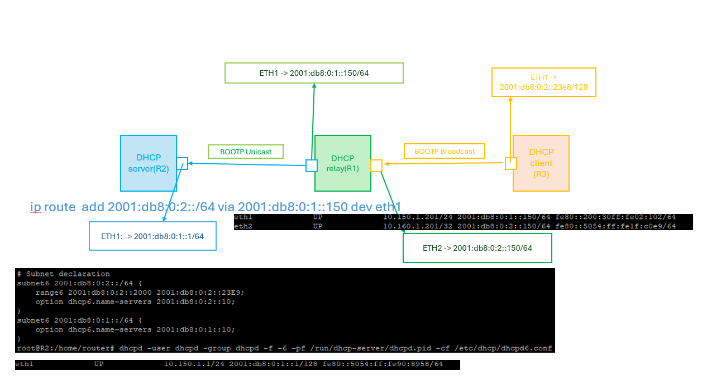
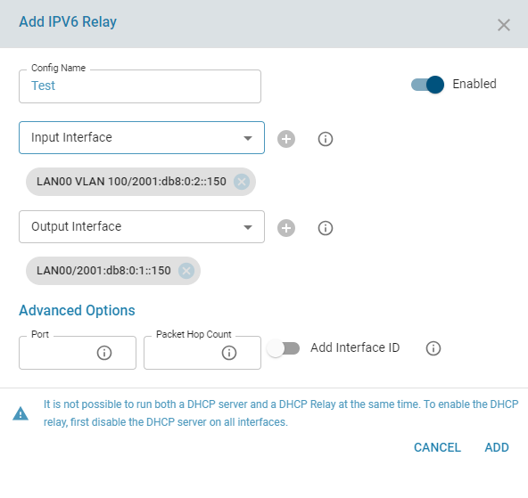
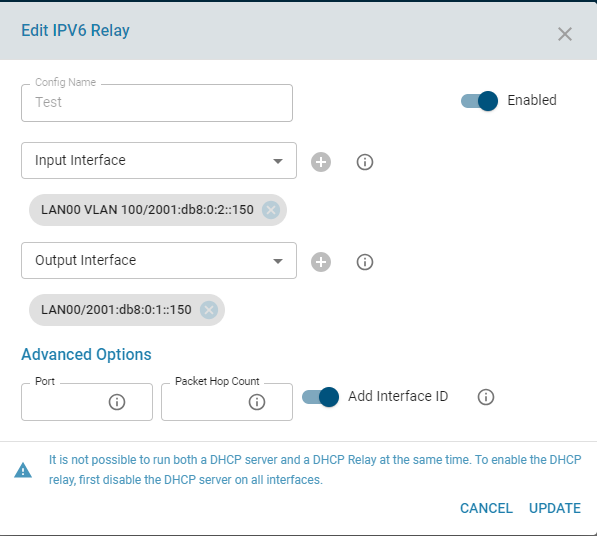
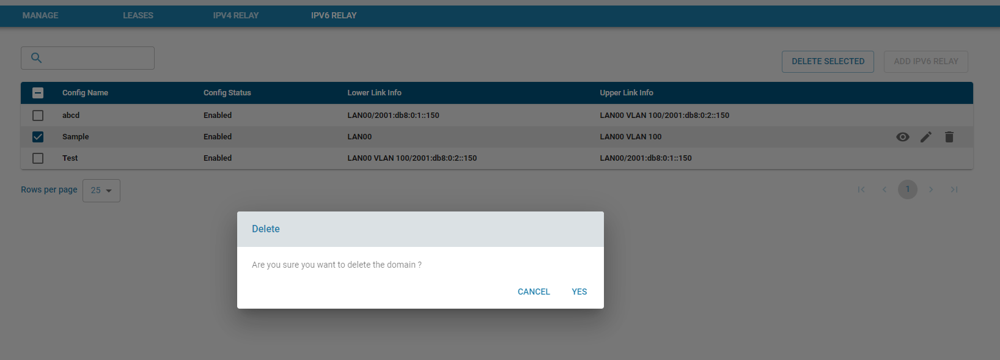
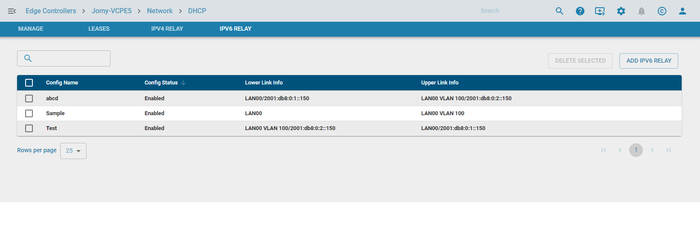
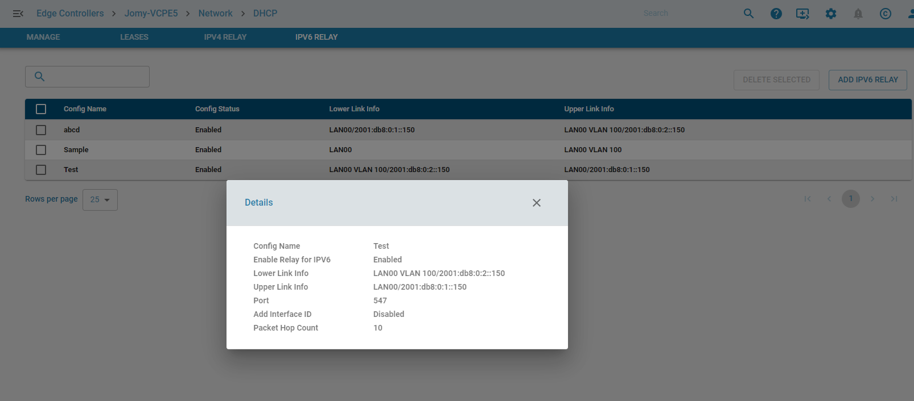

# DHCP RELAY 
DHCP relay agent provides a method of relaying/forwarding DHCP and BOOTP requests from a DHCP client and DHCP server on different IP networks. It acts as an interface between DHCP client and the server. The DHCP Relay Agent listens for DHCPv4 or DHCPv6 queries from clients or other relay agents on one or more interfaces, passing them along to upstream servers .  When a reply is received from upstream, it is multicast or unicast back downstream to the source of the original request. This page explains about configuring DHCP Relay in zWAN CPE for IPV6.

A sample DHCP Relay network topology is depicted below.

Pre-requisite:
DHCP server config should be disabled/deleted on interfaces which is to be added part of DHCP relay configuration.

# Functionality

The zWAN CPE can be configured for DHCP IPv6 relay by adding the DHCP server IP and the relay interfaces in the zWAN CPE.

# Parameters
     
    Configuration Name: Configuration Name for reference
    
    Config Status : Configuration Status to enable the particular relay server config
    
    Port : Listen and transmit on configured port. Default is 547 <Optional>
    
    LowerLink : Specify the lower network interface/link  info on which requests will be received from clients or from other relay agents. If V6 IP is not provided, the first non-link local IP of the interface will be taken.
    
    UpperLink : Specify the upper network interface/link for DHCPv6 interface to which requests from clients and other relay agents should be forwarded. If address is not specified, the requests will be forwarded to the FF02::1:2
    multicast address (All_DHCP_Relay_Agents_and_Servers).
    
    Add Interface ID : Interface ID to force the use of the DHCPv6 Interface-ID option. This option is automatically sent when there are two or more downstream interfaces in use, in order to disambiguate between them.

    Hop Count: When forwarding packets, dhcrelay agent will discard packets which have reached the configured hop count.  Default is 10. Maximum is 255 <Optional>

Functionalities include 
 

1) Add V6 Relay configuration

     

2) Edit V6 Relay configuration

      

3) Delete V6 Relay configuration

       

4) List V6 Relay configuration

      

5) Display Config Info

    
  

# CURL API's

ADD V6 Relay Config:

curl -X POST http://127.0.0.1:8765/graphql -H "Content-Type: application/json" -d '{ "query" : "mutation { addV6RelayInfo(relayInfo: {configName:\"amzetta1.com\", configStatus:true, lowerLink: [ {iface:\"ETH00\"}], upperLink:[{iface:\"ETH01\"} ]  } ) {code,success,message, id} }"}'

Edit V6 Relay COnfig:

curl -X POST http://127.0.0.1:8765/graphql -H "Content-Type: application/json" -d '{ "query" : "mutation { editV6RelayInfo(relayInfo: {relayID:2, configName:\"amzetta2\", configStatus:true, lowerLink: [ {iface:\"ETH01\"}], upperLink:[{iface:\"ETH02\"} ]  } ) {code,success,message} }"}'

Delete V6 Relay Config:

curl -X POST http://127.0.0.1:8765/graphql -H "Content-Type: application/json" -d '{ "query" : "mutation { deleteV6RelayInfo(id: [2] ) {code,success,message} }"}'

List V6 Relay Config:

curl -X POST http://127.0.0.1:8765/graphql -H "Content-Type:application/json" --max-time 600 -d '{ "query" : "query { network {listV6RelayInfo(page:{offset:0, limit:50} ) {offset, limit, totalCount, result{configName, relayID,configStatus,port, lowerLink{iface, address}, upperLink {iface,address}} } } }"}'

# References

https://campus.barracuda.com/product/cloudgenfirewall/doc/98210078/how-to-configure-the-dhcp-relay-agent/

https://launchpad.net/ubuntu/+source/isc-dhcp/4.4.3-P1-4ubuntu2

https://launchpad.net/ubuntu/+archive/primary/+sourcefiles/isc-dhcp/4.4.3-P1-4ubuntu2/isc-dhcp_4.4.3-P1.orig.tar.gz

https://launchpad.net/ubuntu/+archive/primary/+sourcefiles/isc-dhcp/4.4.3-P1-4ubuntu2/isc-dhcp_4.4.3-P1-4ubuntu2.debian.tar.xz

https://docs.nvidia.com/networking-ethernet-software/cumulus-linux-41/Layer-1-and-Switch-Ports/DHCP-Relays/

https://docs.nvidia.com/networking-ethernet-software/cumulus-linux-59/Layer-1-and-Switch-Ports/DHCP/DHCP-Relays/

https://docs.netgate.com/pfsense/en/latest/services/dhcp/relay.html

https://kb.isc.org/docs/isc-dhcp-44-manual-pages-dhcrelay

https://www.reddit.com/r/networking/comments/r9h1ve/ubuntu_dhcp_relay_agent/
