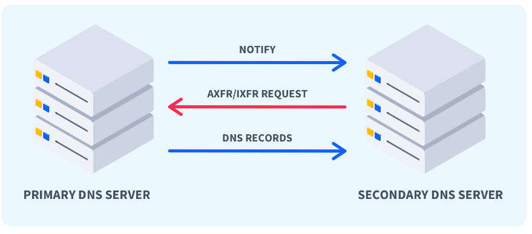
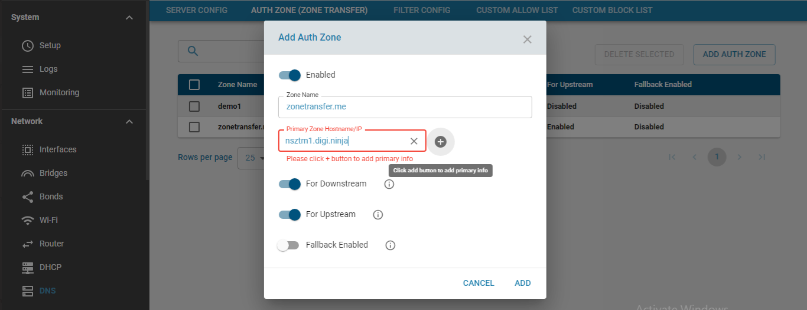
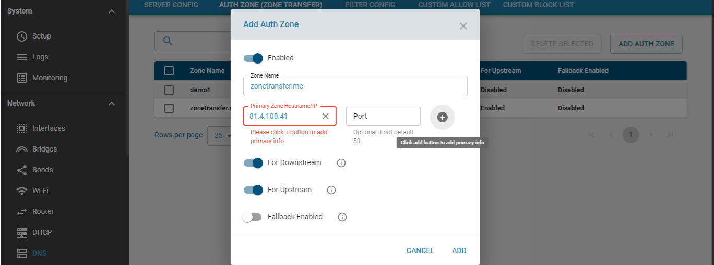
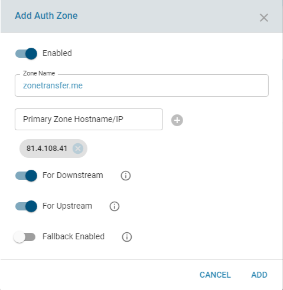
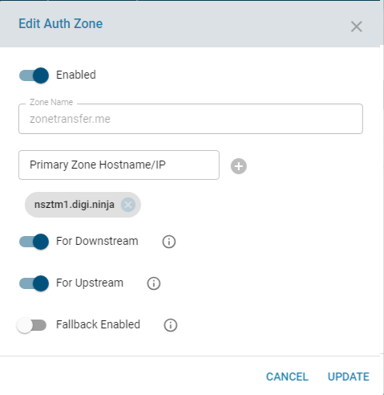
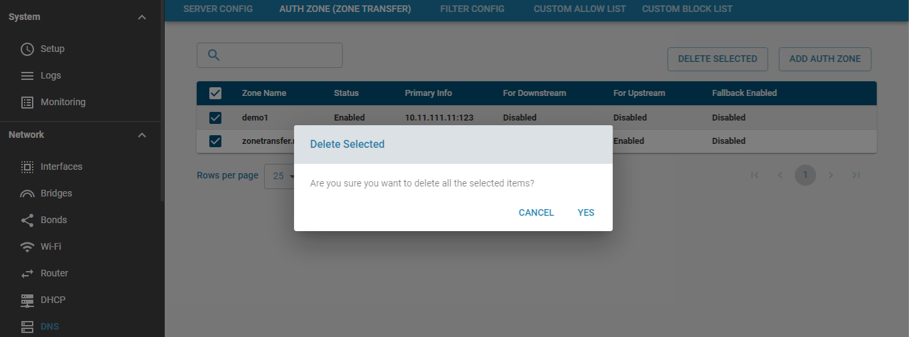
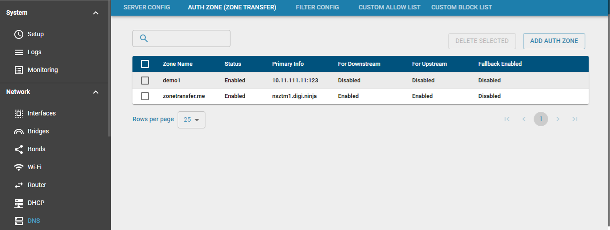
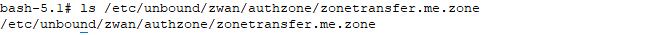
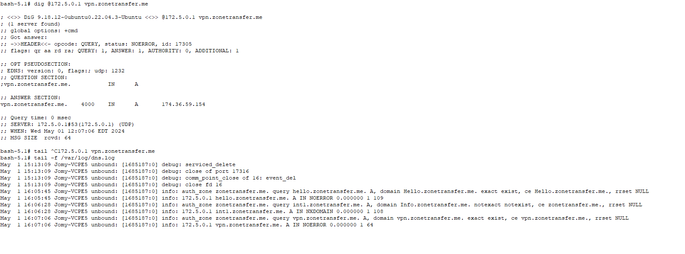

# DNS AUTH ZONE (ZONE TRANSFER)

Authoritative zones in zWAN CPE provides a functionality of configuring zone transfer feature. Zone transfer provides fault tolerance by synchronizing the zone file/info in a primary DNS server with the zone file in a secondary DNS server. The zWAN CPE (secondary DNS server) should be allowed access and permission to transfer the zone info/file in the Primary DNS server. zWAN CPE can be configured for zone transfer feature for a specified zone from a primary DNS server thereby allowing it to act as secondary DNS server by the process of copying the contents of Primary zone file by AXFR(Full zone transfer) or IXFR(Incremental zone transfer) methods. 

# Process Overview:

Zone transfer helps keep data accurate and up to date in case a DNS zone is unreachable. The process differs depending on whether a DNS zone has been replicated before or if this is the first request. The process involves a secondary server requesting a full zone transfer (AXFR) from a primary DNS server. The first step involves the secondary server sending an AXFR request to the primary DNS server, which is a request for the full DNS zone file. The primary DNS server then responds with the full DNS zone and a serial number associated with the version. This version contains the Start of Authority (SOA) Resource Record (RR), which provides a specified refresh interval. This refresh interval lets the secondary server know when to request potential updates from the primary DNS server, usually around 15 minutes. Upon expiration of the refresh interval, the secondary server sends an SOA query to the primary server for updates. The primary server responds with the serial number of the latest SOA RR, which the secondary server compares with the last serial number it received. The secondary server will restart the refresh interval if the two serial numbers match. If the two serial numbers do not match, the secondary server knows updates have occurred and will request an incremental DNS zone transfer, along with the serial number of its most recent zone file. 

The primary server will then inspect the supplied serial number and do one of two things: 

If the primary DNS server is capable of IXFR, the server will begin sending any changes between the two zone files to the secondary server.

If the primary DNS server cannot IXFR, it will respond with a full zone transfer.

This process will continue so long as the two servers can communicate to ensure DNS zone files are properly replicated across all DNS servers. 

# Functionality

Auth zone can be configured for zone transfer in zWAN CPE by using the Add Auth Zone functionality. Authority zones are configured with auth-zone config, and each one must have a name. There can be multiple ones, by listing multiple auth-zone configs, each with a different name, pertaining to that part of the namespace. The authority zone with the name closest to the name looked up is used. 

Authority zones are processed after local-zones and before cache (for-downstream: enabled), and when used in this manner make zWAN CPE respond like an authority server.  

Authority zones are also processed after cache, just before going to the network to fetch information for recursion (for-upstream:enabled), and when used
in this manner provide a local copy of an authority server that speeds up
lookups of that data.

# Parameters 
        
    1) IP address or host name:

        Where to download a copy of the zone from, with AXFR and IXFR. Multiple primaries can be
        specified. They are all tried if one fails.If you point it at another Unbound (zWAN CPE)
        instance,it would not work because that does not support AXFR/IXFR for the zone.
        If you specify the hostname, you cannot use the domain from the zone file,
        because it may not have that when retrieving that data,
        instead use a plain IP address avoid a circular dependency on retrieving that IP address.

    2) FallbackEnabled

        Default - False.  If enabled, Router(CPE) DNS falls back to querying the internet as
        a resolver for this zone when lookups fail. 

    3) For Downstream: 

        Default - True.  If enabled, Router(CPE) DNS serves authority responses to
        downstream clients for this zone.  This option makes CPE behave, for
        the queries with names in this zone, like one of the authority servers for
        that zone.  Turn it off if you want CPE to provide recursion for the
        zone but have a local copy of zone data.  If for-downstream is disabled and
        for-upstream is enabled, then CPE will DNSSEC validate the contents of the
        zone before serving the zone contents to clients and store validation
        results in the cache.

    4) For Upstream

        Default - True. If enabled, Router(CPE) DNS fetches data from this data collection
        for answering recursion queries.  Instead of sending queries over the internet
        to the authority servers for this zone, it'll fetch the data directly from
        the zone data.  Turn it on when you want CPE to provide recursion for
        downstream clients, and use the zone data as a local copy to speed up lookups.

# API's

* Add Auth Zone:

The main functionality of this API is to configure the CPE as secondary DNS server for zone transfer. For this the primary should allow the CPE to access/request its zone information. The main parmaters required to configure Auth zone are zone name and primary DNS server info. The primary server info can be a hostname of name server or the ipaddress of the name server and port (optional) if default port is other than 53.

The below screen shows how to configure auth zone for zone name 'zonetransfer.me' using its corresponding nameserver name 'nsztm1.digi.ninja'. So any fqdn names which matches closest to zonetransfer.me will be answered using the zone records transferred from the name server to the CPE.

The below screen shows how to configure auth zone for zone name 'zonetransfer.me' using its corresponding IP of the name server 'nsztm1.digi.ninja' which is '81.4.108.41'. If a port other than default port number 53 is used in primary DNS server, user should enter the correct port number.

Once the primary details are entered with the other default and optional parameters, click the add button to save the primary zone config for the zone transfer.

* Edit Auth Zone

    The edit API allows the user to change any of the configured Auth Zone parameters. It can also be used to temporarily disable the authzone without deleting the Auth Zone config.

*  Delete Auth Zone:

    The delete API allows the user to delete any configured or disabled Auth Zone configs. Multiple zones can be deleted all at once by a single delete API.

*  List Auth Zones
    
    List API will display all the Auth zones added. This is implemented as a paginated query and has search and sort functionalities.

# CURL APIs
    Add Auth Zone

    curl -X POST http://127.0.0.1:8765/graphql -H "Content-Type: application/json" -d '{ "query" : "mutation { addStubZone(zoneInfo: {name:\"amzetta.com\", serverInfo: [ {stubHost:\"usad1.corp.amzetta.com\", stubAddr:\"10.11.0.3\"} ], configStatus: true, stubFirst: false, stubNoCache: false, stubTLSUpstream:false, stubPrime:false} ) {code,success,message} }"}'

    Edit Auth Zone:

    curl -X POST http://127.0.0.1:8765/graphql -H "Content-Type: application/json" -d '{ "query" : "mutation { editStubZone(zoneInfo: {name:\"amzetta.com\", id: 1, serverInfo: [ {stubHost:\"usad2.corp.amzetta.com\", stubAddr:\"10.11.0.3\"} ], configStatus: true, stubFirst: false, stubNoCache: true, stubTLSUpstream:false, stubPrime:false} ) {code,success,message} }"}'

    Delete Auth Zone: 

    curl -X POST http://127.0.0.1:8765/graphql -H "Content-Type: application/json" -d '{ "query" : "mutation { deleteStubZone(id: [1] ) {code,success,message} }"}'

    List Auth Zones:

    curl -X POST http://127.0.0.1:8765/graphql -H "Content-Type:application/json" --max-time 600 -d '{ "query" : "query { network {listAuthZones(page:{offset:0, limit:50} ) {offset, limit, totalCount, result{name, id} } } }"}'

# Troubleshooting

1) Once auth zone is configured successfully, a zone file will be created with name \<zonename\>.zone in /etc/unbound/zwan/authzone directory.

2) Increase the verbose log level to check for any errors which may denote failure to connect to the IP address or cannot resolve or reach the hostname of the zone.

3) If zone transfer is successfull, execute dig command to the CPE's dns server IP for  any of the fqdn under that zone and it will return NOERROR results.

Successfull auth-zone query response reference in the below screenshot.

 
# References:

https://github.com/NLnetLabs/unbound/blob/branch-1.13.1/doc/example.conf.in

https://digi.ninja/projects/zonetransferme.php

https://gokhnayisigi.medium.com/what-is-a-dns-zone-transfer-attack-and-how-to-test-it-12bdc52da086

https://securityforeveryone.com/tools/dns-zone-transfer

https://www.cbtnuggets.com/blog/technology/networking/what-are-dns-zone-transfers

https://calomel.org/unbound_dns.html

