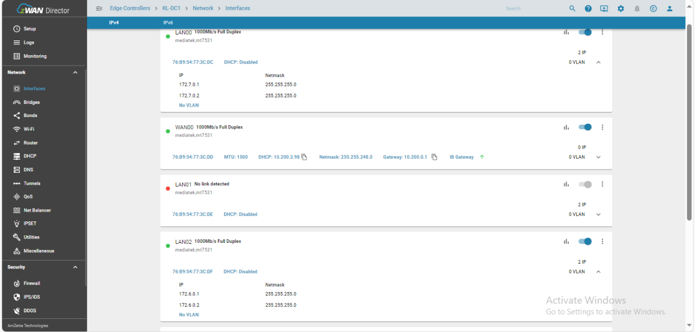
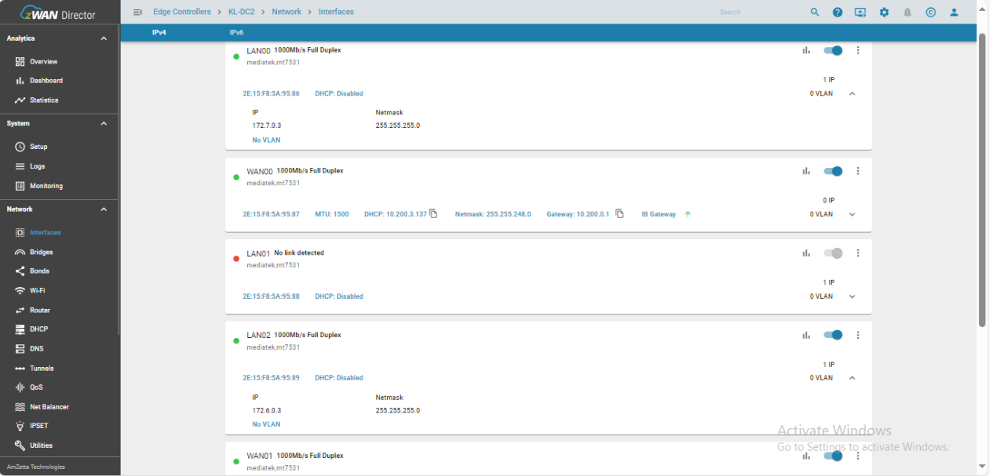
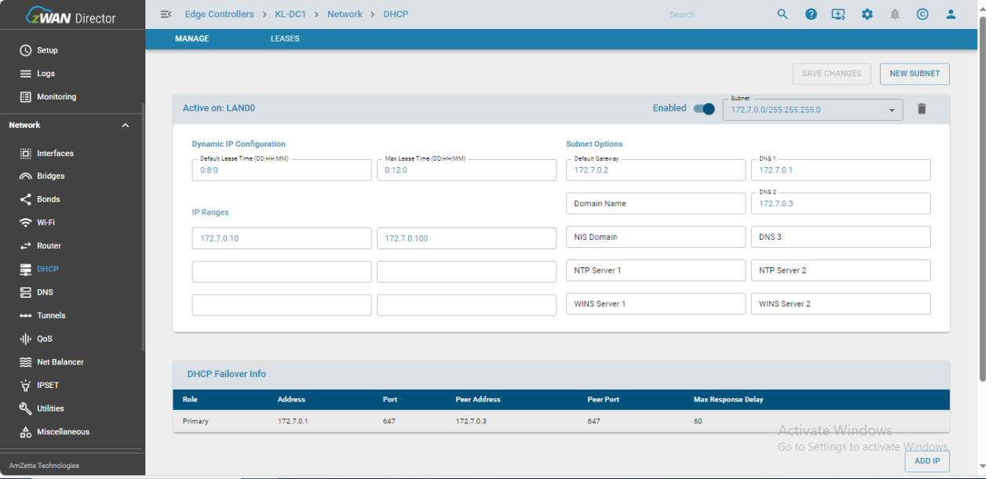
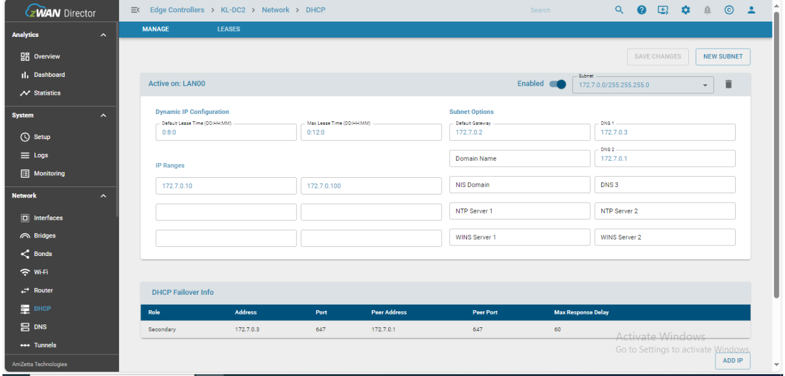

# DNS configuration for HA setup

For DNS queries in HA configuration to work seamlessly across failover/failback, the interface IPs of both HA servers should be entered in correct order in DHCP config page.

## Recommended DNS configuration for HA setup

For HA configuration to work seamlessly across failover/failback the interface IPs of both HA servers should be entered in correct order in DHCP config page. 
The order should be as follows

    Primary DNS server:  Local interface IP of current HA server
    
    Secondary DNS server: Remote inteface IP of the peer HA server

Please refer the following sample screenshots of interface pages and DHCP config pages of both HA servers.

Interface info of DC1-HA Server

Interface info of DC2-HA Server

DHCP config info of DC1-HA Server

DHCP config info of DC2-HA Server

## Known Limitations
Across failover/failback some of the fqdn category based Flow classification rules may not work since the IP address discovered in one HA server may not be updated in the other HA server.