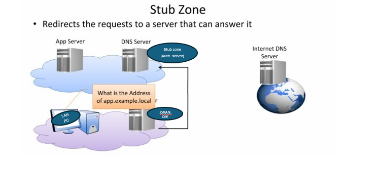
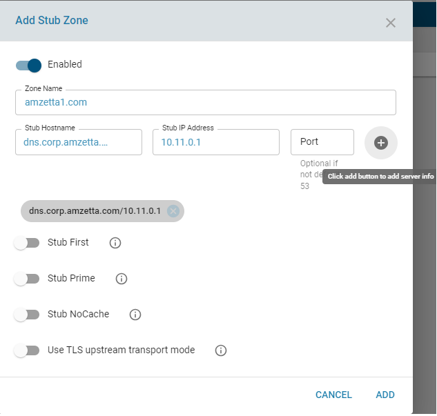
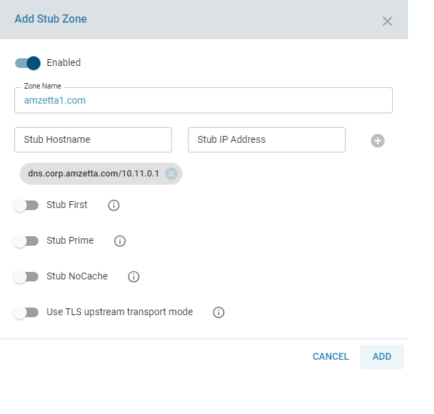
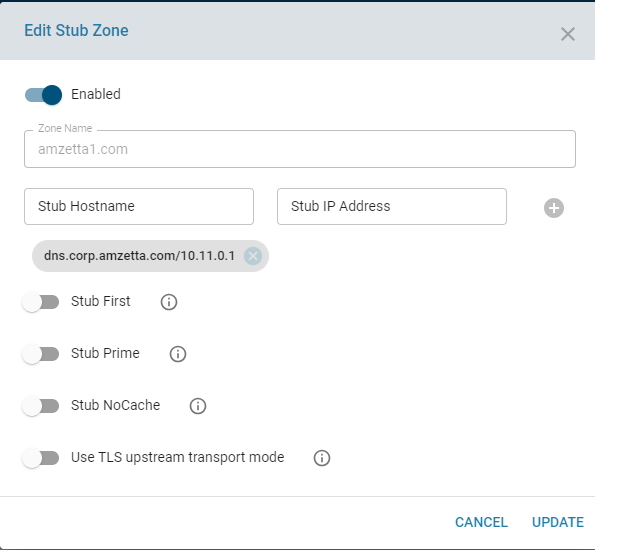
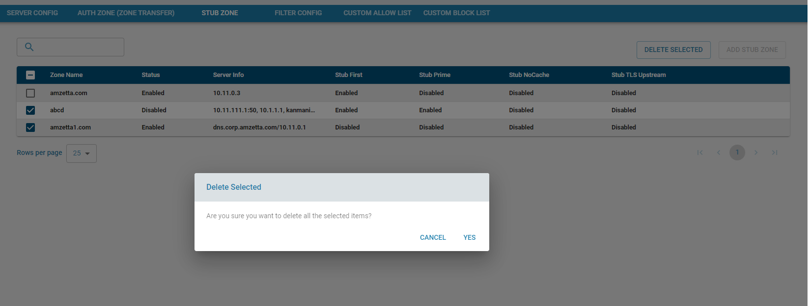
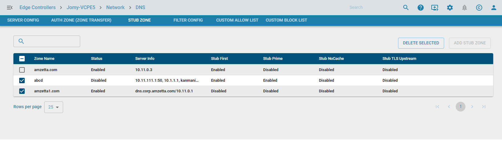

# DNS STUB ZONE 

Stub zone in ZWAN CPE can be configured to point to an authoritative server for references to a specific zone. This can be a local or external DNS server which should be directly reachable from zWAN CPE. A stub zone is a copy of a zone that contains only those resource records necessary to identify the authoritative Domain Name System (DNS) servers for that zone. A stub zone is used to resolve names between separate DNS namespaces. This type of resolution may be necessary when a corporate merger requires that the DNS servers for two separate DNS namespaces resolve names for clients in both namespaces. This can also be used if there is an existing DNS server in an organisation where zWAN CPE is deployed. All references to the local zones can be pointed to the existing Authoritative DNS server. A stub zone consists of:
    
    1) The start of authority (SOA) resource record, name server (NS) resource records, and the glue A resource records for the delegated zone.

    2) The IP address of one or more master servers that can be used to update the stub zone. The master servers for a stub zone are one or more DNS servers authoritative for the child zone,usually the DNS server hosting the primary zone for the delegated domain name

The stub zone will always keep just the information needed to contact the authoritative DNS servers. This means the NS records and the A records needed to resolve the NS records.

Any host records in the domain zone of the authoritative DNS servers are cached on your DNS server like any other records that are resolved on external DNS: They are stored in your local DNS cache for the duration of the TTL set on the DNS record.

Differences between Forward Zone, Auth Zone and Stub Zone

    a) Stub-zone: can be used to have zWAN CPE DNS server to send queries to another server, an authoritative server, to fetch the information.

    b) Forward-zone: zWAN CPE DNS server sends queries to a server that is a recursive server to fetch the information.

    c) Auth-zone: A zone can be loaded from file and used, it can be used like a local zone for users downstream, or the auth-zone: information can be used to fetch information from when resolving like it is an upstream server.

 There is a difference between forward zones and stub zones - stub zones will only work when connected to an authoritative DNS server directly. This would work for lookups from a BIND DNS server if it is providing authoritative DNS - but if you are referring queries to an zWAN CPE server in which internal lookups are forwarded on to another DNS server, then defining the referral as a stub zone in the machine here will not work. In that case it is necessary to define a forward zone since forward zones can have daisy chain lookups onward to other DNS servers. i.e. forward zones can refer queries to recursive DNS servers. This distinction is important as you do not get any error messages indicating what the problem is if you use a stub zone inappropriately.

# Process Overview:

Stub zone resolution:

When a DNS client performs a recursive query operation on a DNS server hosting a stub zone, the DNS server uses the resource records in the stub zone to resolve the query. The DNS server sends an iterative query to the authoritative DNS servers specified in the NS resource records of the stub zone as if it were using NS resource records in its cache. If the DNS server cannot find the authoritative DNS servers in its stub zone, the DNS server hosting the stub zone attempts standard recursion using its root hints. The DNS server will store the resource records it receives from the authoritative DNS servers listed in a stub zone in its cache, but it will not store these resource records in the stub zone
itself; only the SOA, NS, and glue A resource records returned in response to the query are stored in the stub zone. The resource records stored in the cache are cached according to the Time-to-Live (TTL) value in each resource record. The SOA, NS, and glue A resource records, which are not written to cache, expire according to the expire interval specified in the stub zone's SOA record, which is created during the creation of the stub zone and updated during transfers to the stub zone from the original, primary zone.

If the query was an iterative query, the DNS server returns a referral containing the servers specified in the stub zone.

Communication between DNS servers hosting parent and child zones:

A DNS server that has delegated a domain to a child zone on a different DNS server is made aware of new authoritative DNS servers for the child zone only when the resource records for these new DNS servers are added to the parent zone hosted on the DNS server. This is a manual process and requires that the administrators for the different DNS servers communicate often. With stub zones, a DNS server hosting a stub zone for one of its delegated domains can obtain updates of the authoritative DNS servers for the child zone when the stub zone is updated. The update is performed from the DNS server hosting the stub zone and the administrator for the DNS server hosting the child zone does not need to be contacted

# Functionality

Stub zone can be configured in zWAN CPE by using the Add Stub Zone functionality. Stub zones are configured with stub-zone config, and each one must have a name. There can be multiple ones, by listing multiple stub-zone configs, each with a different name, pertaining to that part of the namespace. The authority zone with the name closest to the name looked up is used. 

# Parameters 

    
    serverInfo: IP/Hostname/Port of the Authoritive server which holds record of this zone.
    
    stubFirst : Default Disabled, If enabled, a query is attempted without the stub clause if it fails
    
    stubPrime : Default Disabled, If enabled, it performs NS set priming, which is similar to root hints, where it starts using the list of nameservers currently published by the zone.
    
    stubNoCache : Default is Disabled. If enabled, data inside the stub is not cached. This is useful when you want immediate changes to be visible
    
    stubTLSUpstream: Default Disabled, Enable or disable whether the queries to this stub use TLS for transport

API's

* Add Stub Zone:

The main functionality of this API is to configure the CPE as to refer Authoriative DNS server for any reference to that specifc zone.  The main parmaters required to configure stub zone are zone name and Authoritative DNS server info. The server info can be a hostname of Authoritative server or the ipaddress of the name server and port (optional) if default port is other than 53.

The below screen shows how to configure stub zone for zone name 

Once the server info details are entered with the other default and optional parameters, click the add button to save the stub zone config.

* Edit Stub Zone

    The edit API allows the user to change any of the configured Stub Zone parameters. It can also be used to temporarily disable the stubzone without deleting the Stub Zone config.

*  Delete Stub Zone:

    The delete API allows the user to delete any configured or disabled Stub Zone configs. Multiple zones can be deleted all at once by a single delete API.

*  List Stub Zones
    
    List API will display all the Stub zones added. This is implemented as a paginated query and has search and sort functionalities.

CURL API's

Add Stub Zone:
    curl -X POST http://127.0.0.1:8765/graphql -H "Content-Type: application/json" -d '{ "query" : "mutation { addStubZone(zoneInfo: {name:\"amzetta.com\", serverInfo: [ {stubHost:\"usad1.corp.amzetta.com\", stubAddr:\"10.11.0.3\"} ], configStatus: true, stubFirst: false, stubNoCache: false, stubTLSUpstream:false, stubPrime:false} ) {code,success,message, id} }"}'

Edit Stub Zone:
    curl -X POST http://127.0.0.1:8765/graphql -H "Content-Type: application/json" -d '{ "query" : "mutation { editStubZone(zoneInfo: {id: 4, name:\"amzetta.com\", serverInfo: [ {stubHost:\"usad2.corp.amzetta.com\", stubAddr:\"10.11.0.3\"} ], configStatus: true, stubFirst: false, stubNoCache: false, stubTLSUpstream:false, stubPrime:false} ) {code,success,message} }"}'

Delete Stub Zone:
    curl -X POST http://127.0.0.1:8765/graphql -H "Content-Type: application/json" -d '{ "query" : "mutation { deleteStubZone(id: [5] ) {code,success,message} }"}'

List Stub Zones:
    curl -X POST http://127.0.0.1:8765/graphql -H "Content-Type:application/json" --max-time 600 -d '{ "query" : "query { network {listStubZones(page:{offset:0, limit:50} ) {offset, limit, totalCount, result{name, id} } } }"}'

References:

https://n1vacations.com/mcsa15/stub%20zones2.pdf

https://wiki.archlinux.org/title/unbound

https://www.easy365manager.com/stub-zone/

https://github.com/NLnetLabs/unbound/blob/branch-1.13.1/doc/example.conf.in

https://calomel.org/unbound_dns.html
