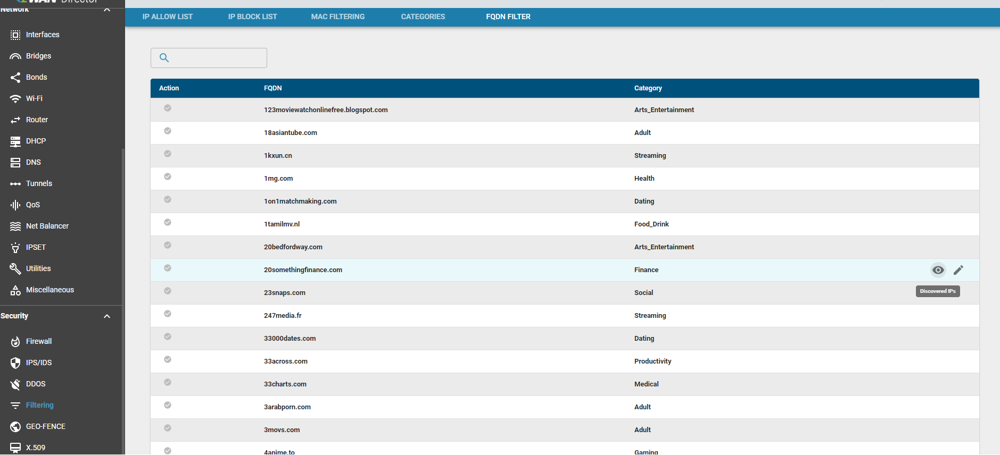
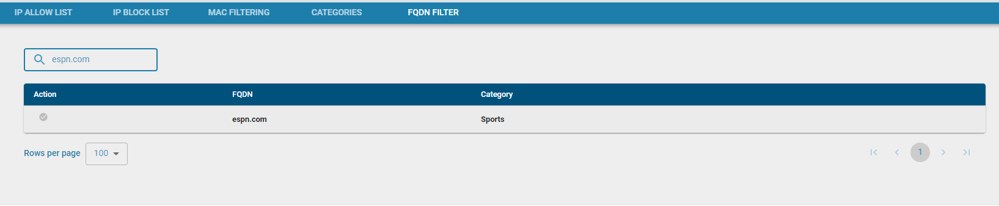
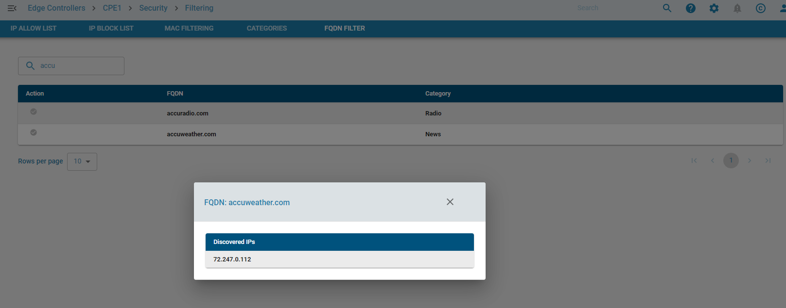
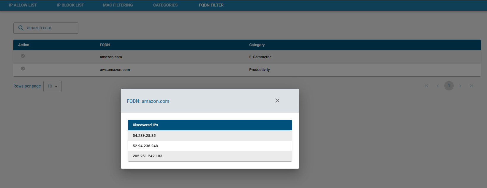
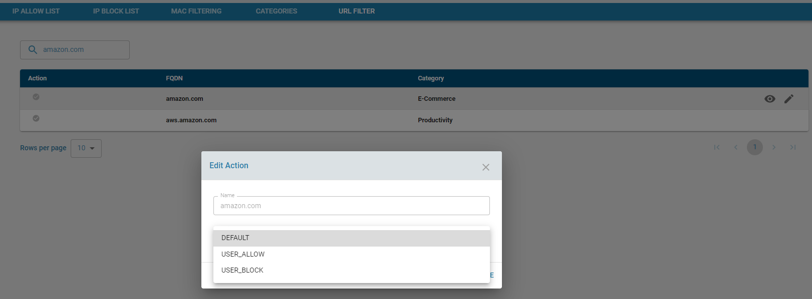
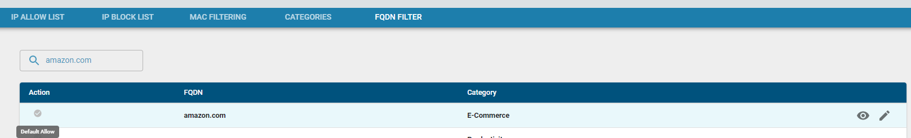
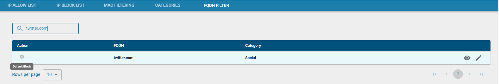
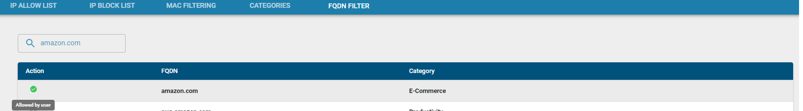
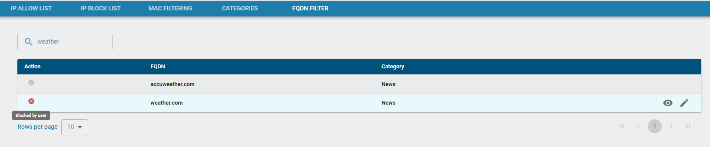

**Overview** 

zWAN edge devices support FQDN filtering. Currently it has a list of over 3100 websites that are categorized into various web categories.

**Functionality**

Users can override category based blocklist or allowlist by induvidually allowing a FQDN to be either accepted or blocked respectively. The FQDN can be part of only 1 category to avoid the overlap of a category being allowed and another category be denied and the FQDN bing part of both categories. 

The FQDNs can be view under the FQDN filter section as shown below.

Searching for a custom FQDN can be performed by entering the text in the search window. Sorting is not supported as the list is rather large.

When a FQDN is accessed, the IPs related to that FQDN are discovered and added to a list. These IPs are then shown under the Discovered IPs sections. This can be further used in packet steering and QoS by specifying the FQDN in the Destination Address.

Packet Steering depends on first packet detection and routing the packet via the correct WAN interface.

FQDN Actions

The FQDN actions are defined into 3 types

        DEFAULT -> Defaults to the action of the category which the FQDN is part of.
        USER_ALLOW -> User overrides to allow the access to the FQDN/IP
        USER_BLOCK -> User overrides to block the access to the FQDN/IP

Display icons for actions

