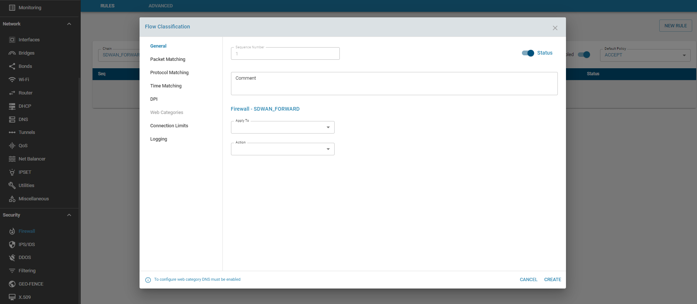

# Overview

ZWAN offers a basic stateful firewall for basic packet filtering. Packets can be filtered based on multiple rules/conditions such as tuple, app, time, fqdn, web-categories etc. 
 
## Functionality

The flow classifier module is used to configure the firewall rules and determining whether to ACCEPT, DROP, REJECT, RETURN or jump to a user defined chain.

Refer flow Classification module for how to set rules. Rules can be added to the chains. 

Rules can be configured for 2 types of traffic

Each chain is a list of rules for packets (traffic) that are followed in order.
1. SDWAN_INPUT - rules to determine which inbound traffic will be accepted or denied.
3. SDWAN_FORWARD - rules to determine which traffic to be forwarded will be accepted or denied.

Note:
*  SDWAN_INPUT chain - packets designated to Edge Controller will be checked against INPUT chain
*  SDWAN_FORWARD chain - packets routed through the Edge Controller will be checked against FORWARD chain
*  User can create Custom chain and add rules to it. Custom chain can be linked with the default Chain mentioned above.

Based on the filter, incoming and outgoing packets are either accepted or dropped. It can jump to a custom chain (which has further rules) before it is accepted or dropped.

### Add Chain

### Add rule

### Action

* ACCEPT – This rule accepts the packets which matches the filter. The packet is not matched against subsequent rules.
* DROP   – This rule drops the packets which matches the filter. The packet is not matched against subsequent rules. The system that is trying to initiate the connection would not receive an error.
* RETURN – This rule sends the packet back to the originating chain so that it can be matched further against other rules.
* REJECT – The firewall rejects a packet and sends an error to the connecting device.
* CHAIN  - Jump to a Chain which has further rules to check

## Default Policy

If the packet does not match any of the firewall rules configured, the sytem will apply the default policy for that chain, which is either ACCEPT or DROP. If the target is not set explicitly for a rule, the rule will take the default policy for that chain. 

## Established / Related

The Established / Related State leverages the stateful nature of the firewall. What this means is that it remembers the information of connections flowing through the firewall. Once a traffic is determined as established, those packets are automatically allowed through the firewall by matching it against the state table rather than having to check it against all the firewall rules. This is very useful from a performance perspective. This feature can be enabled / disabled for both EC directed traffic or LAN traffic.

- Established: The incoming packets are associated with an already existing connection.
- Related: The incoming packets are new, but associated with an already existing connection.

## Advanced 

There are a few options that be Enabled/Disabled on a global level such as block http traffic, block ICMP ping on WAN interfaces, and allowing the Local user interface traffic on WAN interfaces.

## Usage

Firewall is designed to prevent unauthorized access to or from any external network. 

## Known Limitation

