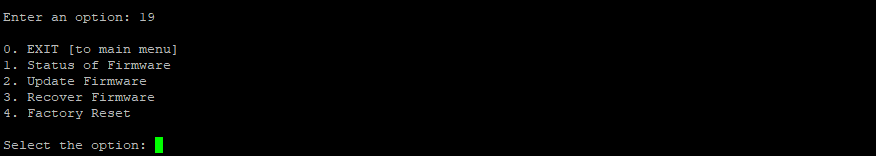
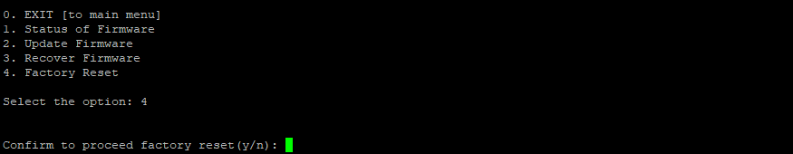

**PROCEDURE FOR FACTORY RESET:**

To perform a factory reset, follow the steps outlined below, choosing
the method that best suits your requirements:

**Factory Reset via amz_Secureshell:**

1.  Open amz_Secureshell and log in using the appropriate credentials to
    gain access to the device.

2.  Once logged in, enter \'19\' and press \'Enter\' to select the
    option that leads to the factory reset within the amz_Secureshell
    interface.

3.  Within the factory reset options, choose \'4\' and press \'Enter\'
    to confirm the reset action. This step initiates the process of
    resetting the device to its factory settings..

4.  As a final confirmation, you will be prompted to press \'y\' to
    proceed with the factory reset. Press \'y\' to execute the action.

**Note:** Ensure that you have backed up any essential data before
proceeding with the factory reset, as this action will erase all
existing settings and configurations on the device.\"

**Factory Reset via Hardware Reset Button:**

1.  Locate the hardware reset button on the device.

2.  Press and hold the reset button continuously for 5 seconds;
    simultaneously, the LED will start blinking.

3.  Do not release the button for the next 3 seconds to confirm and
    initiate the factory reset action.

**Note:** If you release the button anywhere between the 8 seconds, the
factory reset action will be terminated.

4.  Release the button once the reset process initiates, and the device
    will reset to its factory defaults.

**Note:** Ensure that you have backed up any essential data before
proceeding with the factory reset, as this action will erase all
existing settings and configurations on the device.

**Factory Reset via Local Web UI:**

1.  Open a web browser and enter the device\'s local Web IP address.
    (Ex: 192.168.64.1)

2.  Log in to the device\'s web-based user interface using the provided
    credentials.

3.  Click the **firmware** option to navigate to the factory reset
    option within the UI.

4.  Click the **Factory Reset** option. Subsequently, a prompt window
    will appear, asking you to choose the **Reset** button to confirm
    the action. Proceed by selecting the reset button, and the device
    will undergo a factory reset.

**Note:** Ensure that you have backed up any essential data before
proceeding with the factory reset, as this action will erase all
existing settings and configurations on the device.
