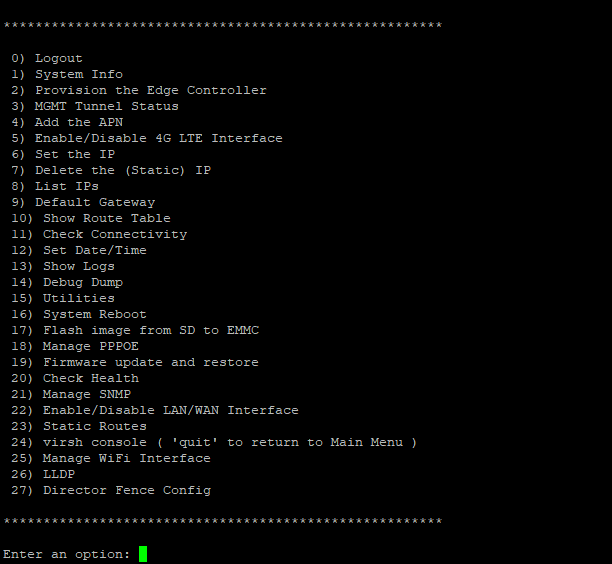
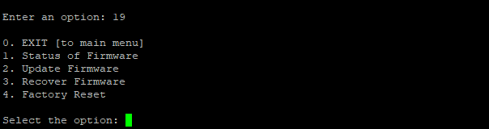
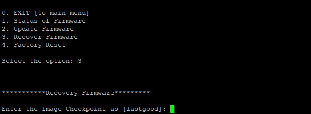
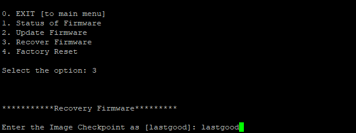

**OVERVIEW**:

If a BIOS/UEFI update fails or if the firmware becomes corrupted, you
may need to perform a recovery using tools provided by the motherboard
or system manufacturer.

In our configuration, if you have version 1.3-\*\*.\*\*\*4 and encounter
firmware corruption or failure, you would need the firmware recovery
option to revert to the previously functioning firmware, such as version
1.3-\*\*.\*\*\*1 or an earlier version, to ensure proper operation.

**STEPS TO BE FOLLOWED TO PERFORM FIRMWARE RECOVERY:**

1.  Begin by opening **amz_secureshell**, providing the appropriate
    login credentials. Upon successful login, a window with a list of
    options will be prompted.

2.  Select option 19 to access the frimwarerecovery functionality within
    the **amz_secureshell** interface.

3.  Navigate further by selecting option 3, which initiates the firmware
    recovery process displayed within the **amz_secureshell**.

4.  Follow the on-screen instructions to enter all the required
    information for the firmware recovery.

5.  Type lastgood and press enter then the firmware recovery process
    will begin.

**Note**: After entering the \'lastgood\' input, the recovery will
start; otherwise, if the input is empty or incorrect, a failed recovery
message will be displayed.\"
