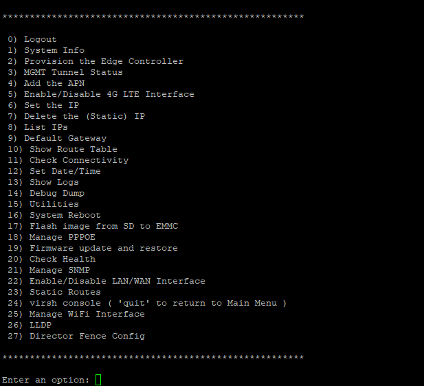
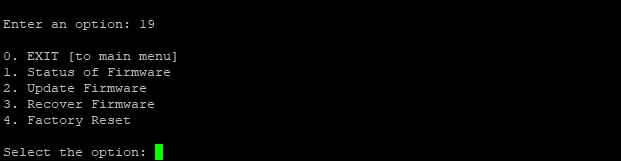
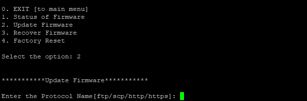
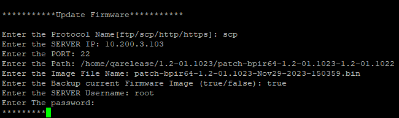

**OVERVIEW:**

A **firmware patch update** involves the process of applying
modifications, fixes, or enhancements to the software components of the
Operating system. These updates, presented as patches, encompass
security enhancements, bug corrections, and the introduction of new
features.

The update procedure is typically overseen through the system\'s package
management system, ensuring that the software maintains a secure,
stable, and current state.

**STEPS TO BE FOLLOWED TO PERFORM PATCH UPDATE:**

1.  Begin by opening **amz_secureshell**, providing the appropriate
    login credentials. Upon successful login, a window with a list of
    options will be prompted.

2.  Select option 19 to access the patch update functionality within the
    **amz_secureshell** interface.

3.  Navigate further by selecting option 2, which initiates the firmware
    update process displayed within the **amz_secureshell**.

4.  Follow the on-screen instructions to enter all the required
    information for the firmware update.

To configure the firmware update, please provide the following
information:

-   **Protocol Name:** Choose a protocol for the update
    \[ftp/scp/http/https\]. For example, enter \'scp\'.

-   **Server IP**: Enter the IP address of the server where the firmware
    is located. For example, enter \'10.200.3.103\'.

-   **Port**: Specify the port number for the connection. For example,
    enter \'22\'.

-   **Path**: Enter the path to the firmware on the server. For example,
    enter
    \'/home/qarelease/1.2-01.1023/patch-bpir64-1.2-01.1023-1.2-01.1022\'.

-   **Image File Name**: Provide the name of the firmware image file.
    For example, enter
    \'patch-bpir64-1.2-01.1023-Nov29-2023-150359.bin\'.

-   **Backup Current Firmware**: Indicate whether to back up the current
    firmware (true/false). For example, enter \'true\' if you want to
    backup.

-   **Server Username**: Enter the username for accessing the server.
    For example, enter \'root\'.

-   **Server Password**: Enter the password for accessing the server.
    (Your input will not be visible.)

After providing each piece of information, press **Enter** to proceed to
the next prompt. The patch file will start downloading, and once the
patch file is downloaded, the patch update process will begin.

**Note:** It is crucial to perform firmware updates with caution,
ensuring that all necessary information is accurately provided during
the process to prevent any disruptions or errors.
