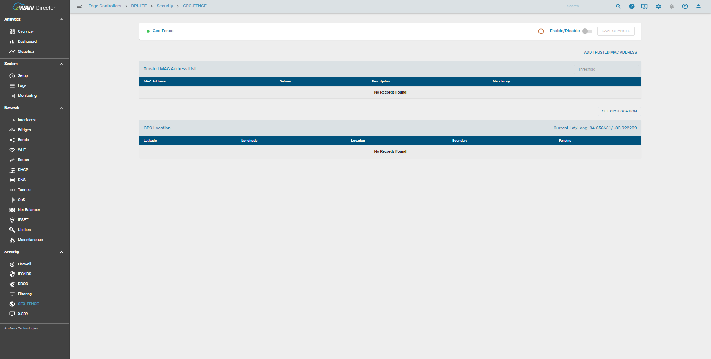
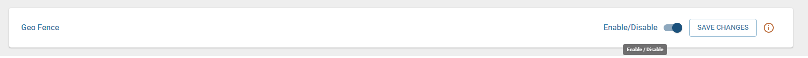
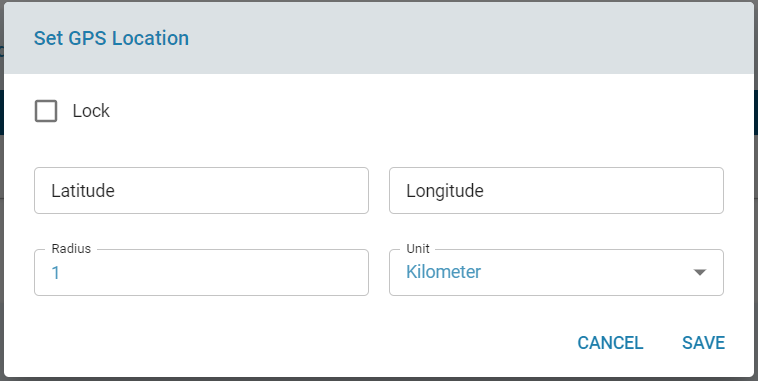
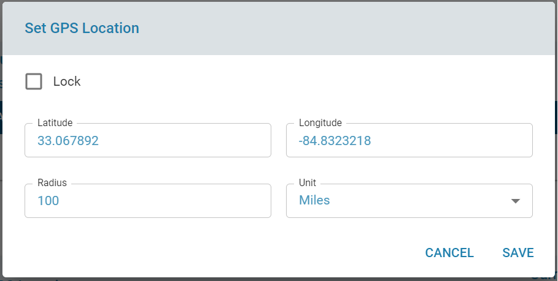
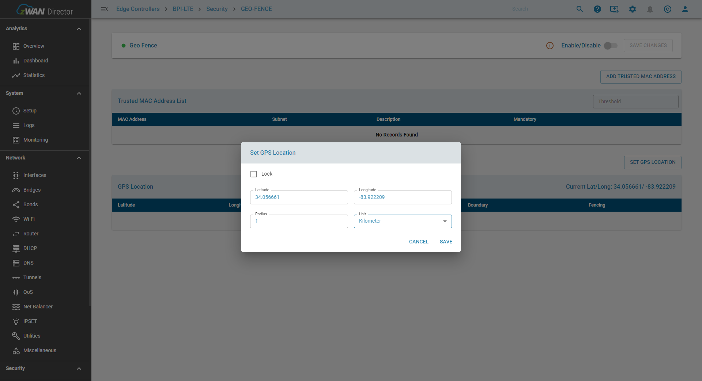
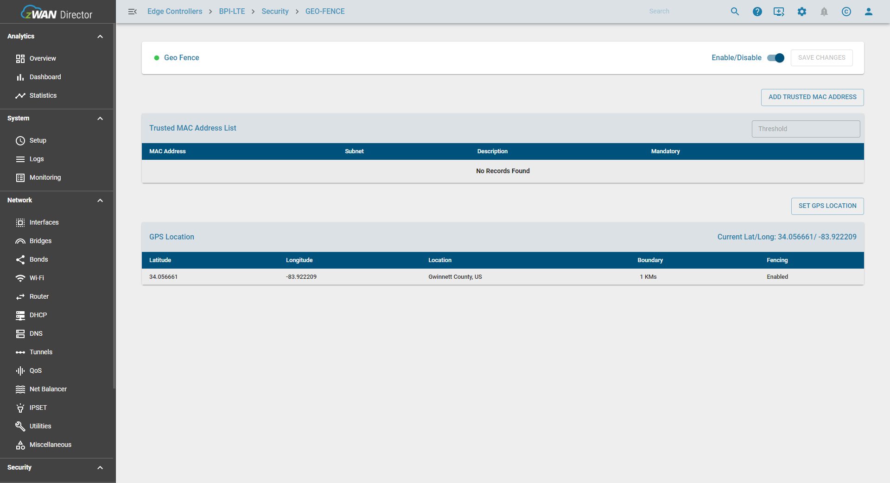

## Overview

This document covers GPS Location based Geofence. This feature comes under the Security section and currently is only exercised during boot up of the edge controller.

GPS Location based geo-fencing is triggered based on the following condition(s) during boot up time.
1) If the current location co-ordinates are not in configured GPS Location boundary

## Functionality

For any changes in GPS Location config, "SAVE CHANGES" to be executed.

The main functionalities include

   ### Enable/Disable Geo-Fence

   Enabling Geo-fence functionality can be done by using enable button. This enables the geo-fence function, but under one condition. There should atleast one geo-fencing feature mode configured. So either atleast one trusted mac address should be added or GPS Location should be added to the configuration.
   
   

   ###  Set GPS Location

   GPS Location can be added by clicking on the Set GPS Location button. A new dialog box opens up as follows.

 
   
   Two options are currently available to add GPS Loction

   1) Manual Entry of GPS Location Longitude , Latitude and Radius in Kilometers/Miles
         
   The required fileds are Longitude, Latitude and Radius. An optional field of Lock is added.

   

   2) Populate Current GPS Location ( LTE Connection Provide the information, if available ) and List the Location Longitude and Latitude values. When clicked on the Set GPS Location button, it auto populates the currrent location Longitude and Latitude values in respective fields in the Set GPS Location dailog. Radius default value is 1 and units are in Kilometers.
   User can edit any of the fields and units. Lock option check box is selected then only GPS Location based fencing is enforced.
   If the Lock option is not-selected ( deafault ), GPS Location based fencing is NOT enforced.

Once the user configure the GPS Location fields, user need to click on the Save to save the configuration. Then Enable and click SAVE CHANGES button which is on the top right corner.

Only once save changes is clicked, the config will be applied on the edge controller. A warning icon will be displayed to denote that changes are not saved and prompting user to apply/save the changes.

  ## Result

Once the GPS Location is configured the page will resemble the below screenshot.

After a reboot if GPS Location boundary condition is not met, the system will generate an alert if alert is configured and also notified in ELK dashboard. The CPE log will also log the following messages.

## Known Limitations

GPS Location based Fencing will be enforced only if the Current Location is information is available to check with configured GPS Location.
Feature will be only executed across reboot.

