# DC-HA

## Overview: 

In any SDWAN solutions, availability of DC is always more critical.
As an interim solution, we support only ACTIVE-PASSIVE mode in DC.
In this design, there will be only two DC's per tenant in the HA cluster and there will be a Gateway node through which both the DC's reach their LAN network.

All the DC's will have public IP [WAN] as an endpoint through which all the branches will establish their IPSEC tunnels.
And the tunnels are usually one to many from DC.  So, if the ACTIVE DC fails that failure needs to be informed to all of their branches and reestabilish the connection from the PASSIVE DC.

As of today, topology has the all the details about both the branches and their DCs w.r.t tunnels.

So, we have created a new micro-service named __*dc-monitor*__, that checks the livelyness of ACTIVE DC and collects the topology for every few [*say 20*] seconds.  If the __*dc-monitor*__ detects any failure, then it checks for any passive DC is available to takeover.  If that is available, then the __*dc-monitor*__ informs all the branches to connect to the PASSIVE DC and change its state to new ACTIVE.

During these switchover, the LAN behind the DC's should reach the branches through new ACTIVE DC.  Someone needs to inject the reverse route here, we are achieving this by having our vCPE as Gateway node that connects both the ACTIVE and PASSIVE DCs and all the DC-LAN traffic is reached through that Gateway.  Also OSPF is configured between DC-ACTIVE, DC-PASSIVE and Gateway node, so that the reverse routed is injected seamlessly without any isuses even during DC failover and failback.

Please see the overview of our setup as shown in the *figure* below:

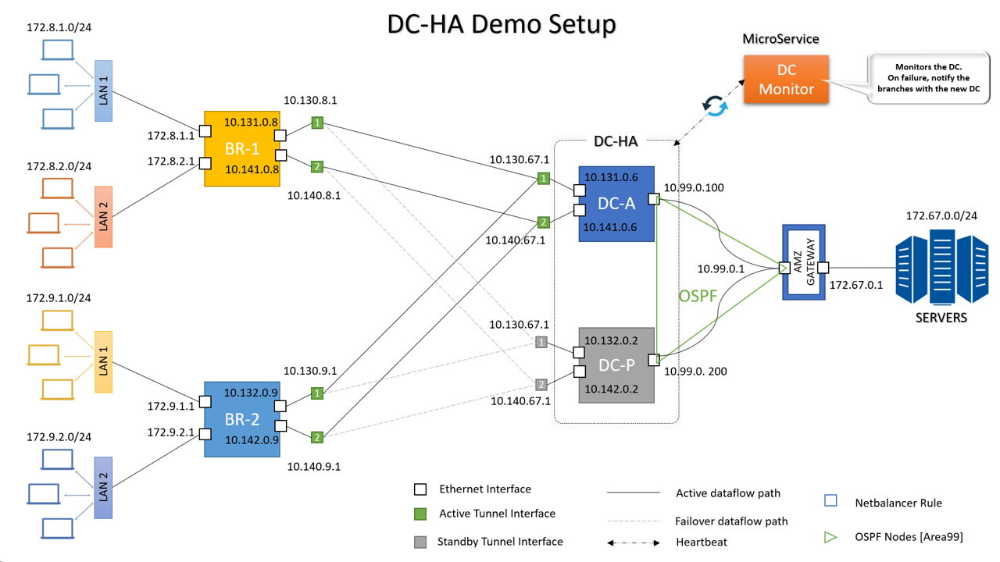

## Setup Configuration:

To configure this setup in demo-in-a-box, we modified the yaml and script files accordingly.  Below is the yaml used to configure this setup:

[HA_DIAB YAML](scripts/ha_diab.yml)

This yaml file will refer the below scripts to configure each CPE VM's and their LAN VM's:

- [AMZ GATEWAY](scripts/AMZ_LAN_GW.sh)
- [HA ACTIVE DC](scripts/HA_DC1.sh)
- [HA PASSIVE DC](scripts/HA_DC2.sh)
- [BR-1](scripts/BR1.sh)
- [BR-2](scripts/BR2.sh)

1) Clone the demoinabox repository in your server [that has all the prerequisites needed by demoinabox setup]

    ```
    # git clone https://gitlab.amzetta.com/sdwan/demoinabox.git
    # git checkout verifiedboot
    ```
    __NOTE:__
    *It is recommended to install __cpe with lanpc__ deployment once, to make sure that all the necessary packages needed for demoinabox setup is there.  If this setup already have installed this config before, skip this and go to next step.*
     ```
    # cd demoinabox
    # ./sdwan_demo_signed.sh development cpewithlanpc
    # cd ..
    ```

2) Clone the zwan-doc repo and copy the required yaml and scripts into the demoinabox repository
    ```
    # git clone https://gitlab.amzetta.com/sdwan/zwan-doc.git
    # git checkout DC-HA

    # cp -f zwan-doc/HA/scripts/*  demoinabox/deploy/default-setup/
    ```

3) Start the deployment
    ```
    # cd demoinabox/deploy/default-setup/
    # dos2unix *.sh
    # dos2unix *.yml
    # chmod +x *.sh
    # chmod +x *.yml
    # yarn
    # yarn start ha_diab.yml
    ```

4) After completion, below VM's should be listed in your setup:
    ```
    # virsh list

    Id    Name                           State
    ----------------------------------------------------
    1     ISP_R1                         running
    2     ISP_R2                         running
    3     AMZ_LAN_GW                     running
    4     HA_DC1                         running
    5     HA_DC2                         running
    6     BR1                            running
    7     BR2                            running
    8     DC_LAN1                        running
    9     DC_LAN2                        running
    10    DC_LAN3                        running
    11    DC_LAN4                        running
    12    BR1_LAN1                       running
    13    BR1_LAN2                       running
    14    BR1_LAN3                       running
    15    BR1_LAN4                       running
    16    BR2_LAN1                       running
    17    BR2_LAN2                       running
    18    BR2_LAN3                       running
    19    BR2_LAN4                       running
    ```

5) Onboard AMZ_LAN_GW, HA_DC1, HA_DC2, BR1 & BR2 CPE's from secure shell. After onboarded, the Alpsee UI should list like shown below:

    __NOTE:__
    *Make sure that __dc_monitor__ micro-service is running in the onboarding provider, without that HA will not function.*

    - While onboarding, add the __metadata__ to differentiate DC and BR CPE's.

    ```
    For HA_DC1 --> CPE_TYPE = DC, CPE_MODE = HA, HA_STATE = ACTIVE
    For HA_DC2 --> CPE_TYPE = DC, CPE_MODE = HA, HA_STATE = PASSIVE
    ```

    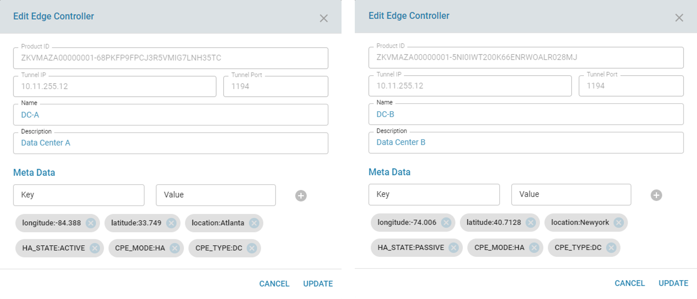

    ```
    For both BR --> CPE_TYPE = BR
    ```

    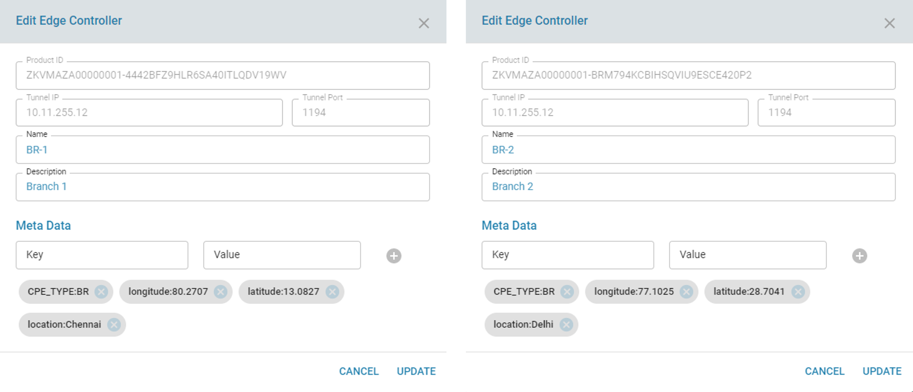

    - After onboarding everything, __list__ all the edge controllers

    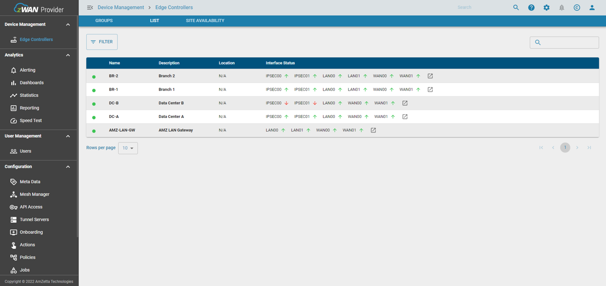

6) Now configure the OSPF in AMZ_LAN_GW, HA_DC1 & HA_DC2 CPE's [*for reverse route injection*]

## OSPF Configuration

```
Please Configure OSPF on AMZ_GATEWAY with the below mentioned steps:
```

1) Enable OSPF

    

2) Add the RouterID

    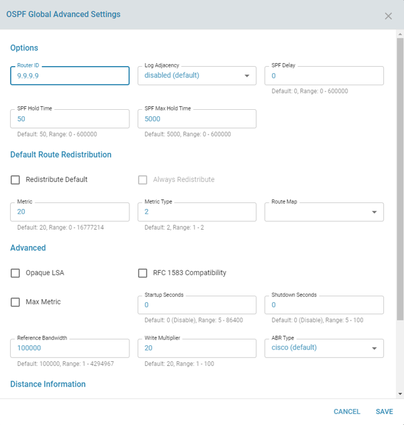

3) Add new area

    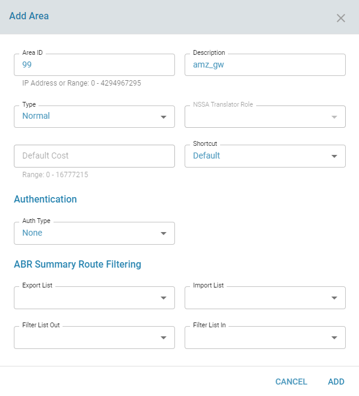

4) Add active interface through which the routes are learned and select the network type as __*point_to_multicast*__

    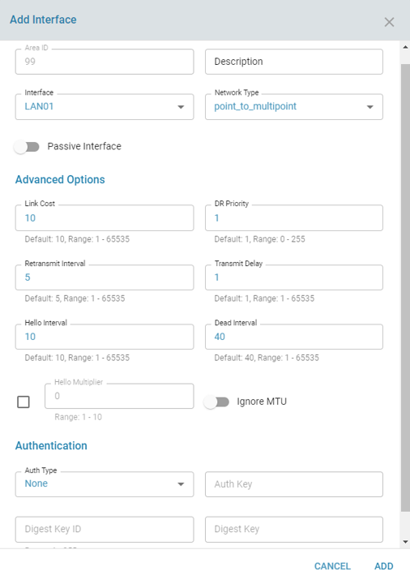

5) Add passive interface through which the DC LAN servers are reachable and select the network type as __*broadcast*__

    


```
Please Configure OSPF on DC-A with the below mentioned steps:
```

1) Enable OSPF

    

2) Add the RouterID

    

3) Add the redistribution for all kernel routes

    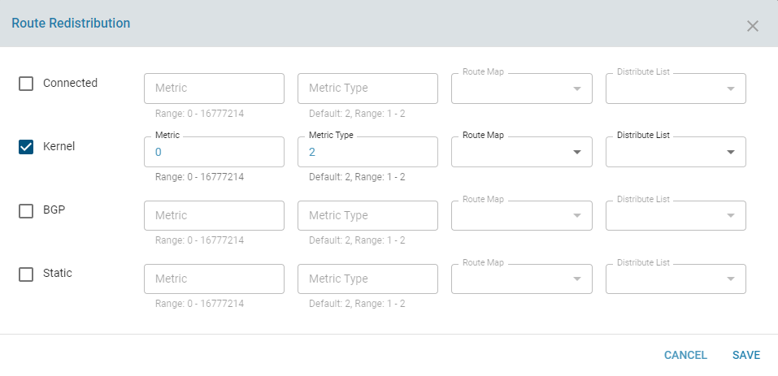

4) Add new area

    

4) Add active interface through which the routes are learned and select the network type as __*point_to_multicast*__

    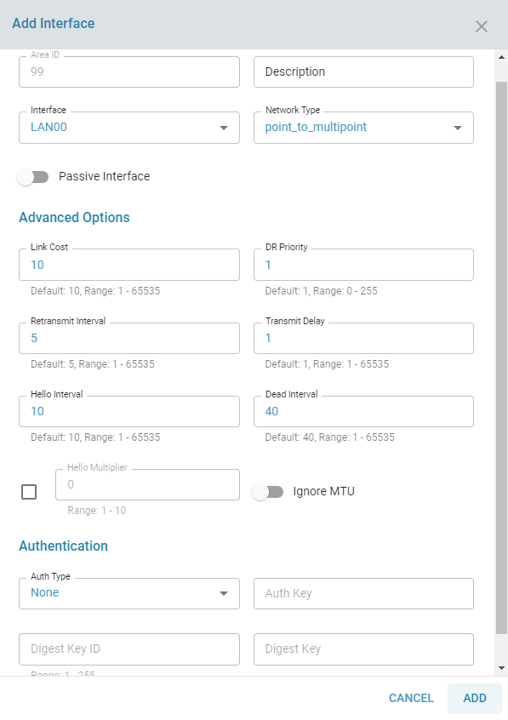


```
Please Configure OSPF on DC-P with the below mentioned steps:
```

1) Enable OSPF

    

2) Add the RouterID

    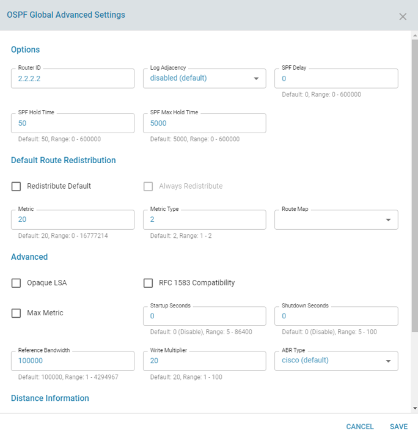

3) Add the redistribution for all kernel routes

    

4) Add new area

    

4) Add active interface through which the routes are learned and select the network type as __*point_to_multicast*__

    


## Verify the OSPF config

As shown in the overview, both the branches connects to DC-A, so all the DC Servers should go through DC-A to reach any branch or branch lans.

- OSPF route in AMZ_GATEWAY [External routes are learned from DC-A]

    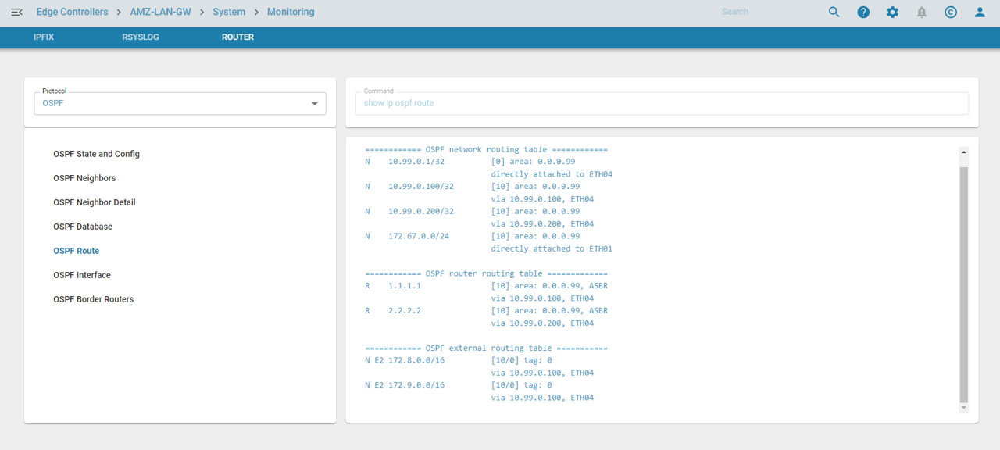

- OSPF route in DC-A [External routes will be empty, as DC-A is active right now]

    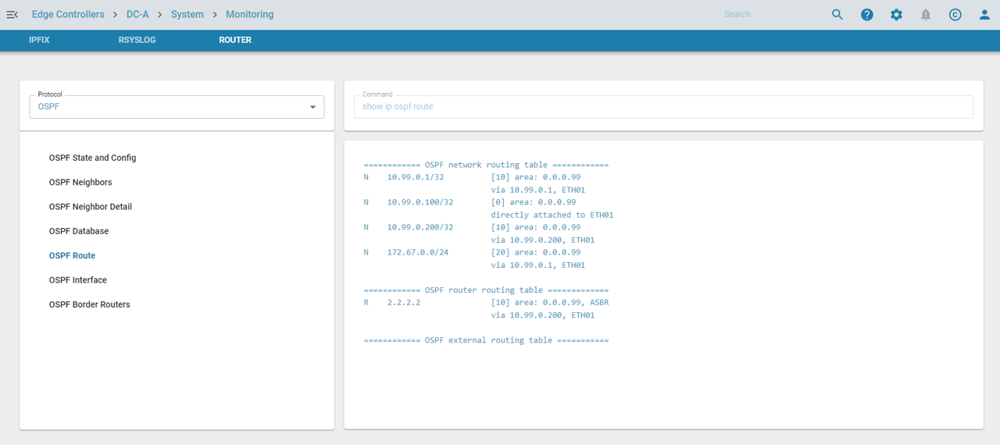

- OSPF route in DC-B [External routes are learned from DC-A]

    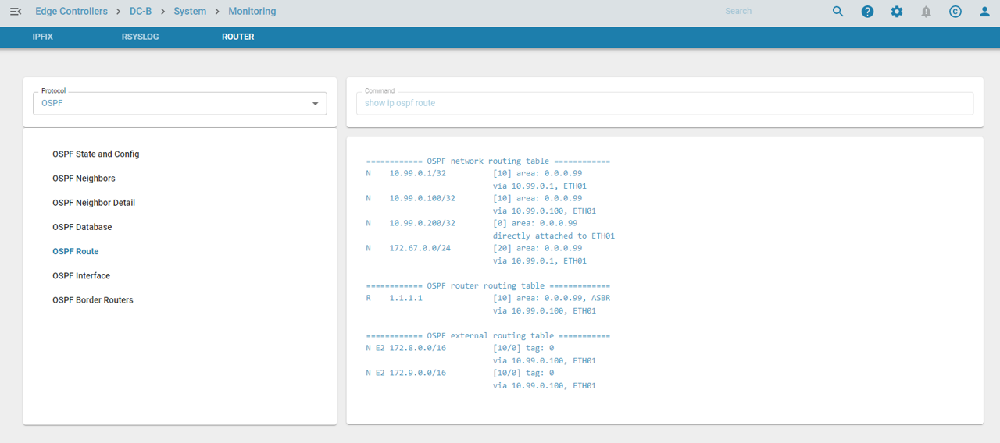


## Make sure the routes are fine by running IOs

- Check the routes in all the CPEs [AMZ_GATEWAY, DC-A, DC-B, BR-1 & BR-2]

    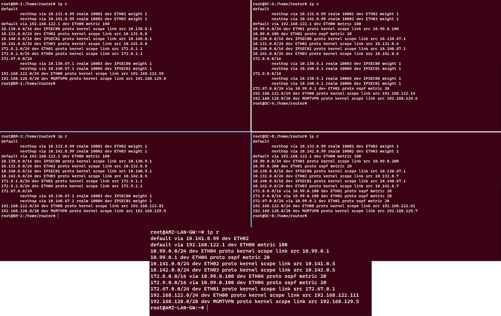

- Login to each LAN-PCs and make sure that all got the IPS leased from CPEs

    __BR-1 LAN PCs:__

    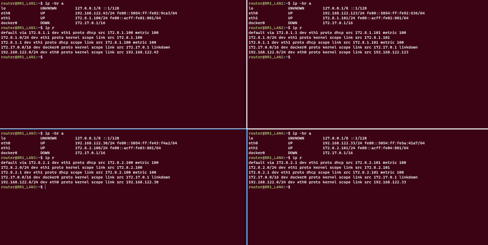

    __BR-2 LAN PCs:__

    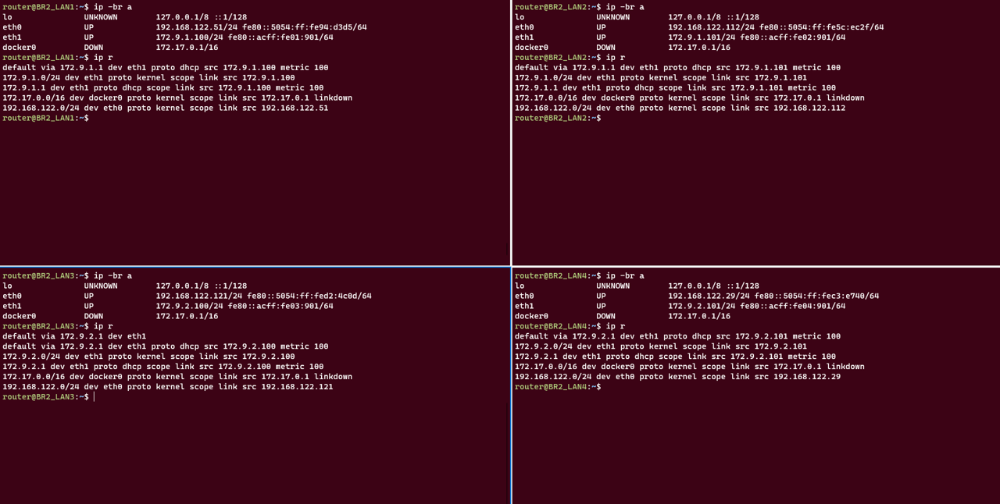

    __DC LAN Servers:__

    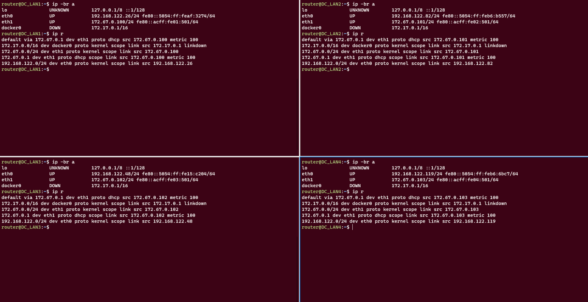

- Start the IOs from all the branch lan pcs and monitor the same using tcpdump in dc lan servers

    __BR-1 LAN running IOs:__

    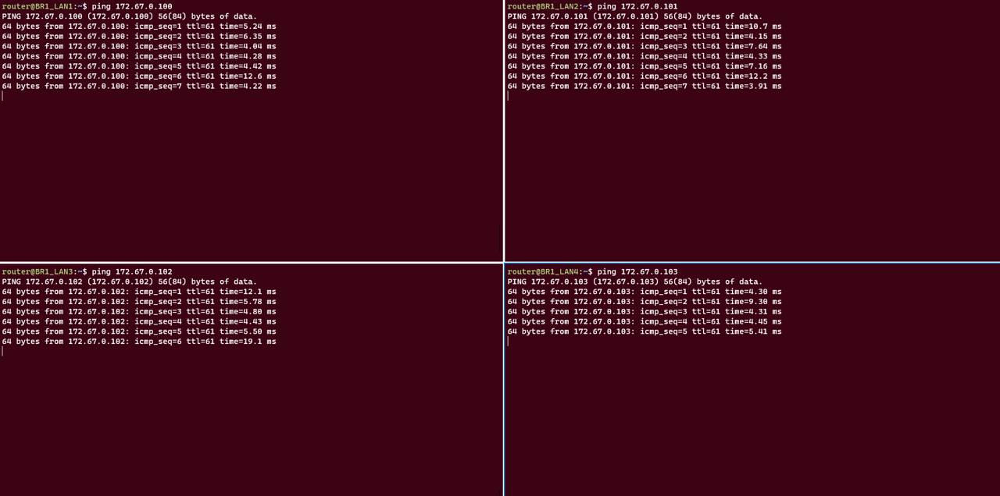

    __BR-2 LAN running IOs:__

    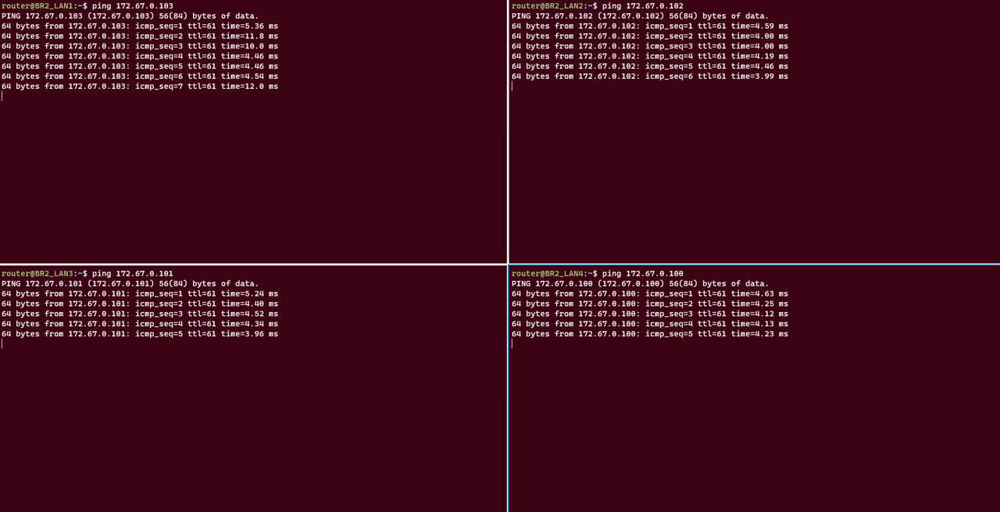


    __DC LAN running tcpdumps:__

    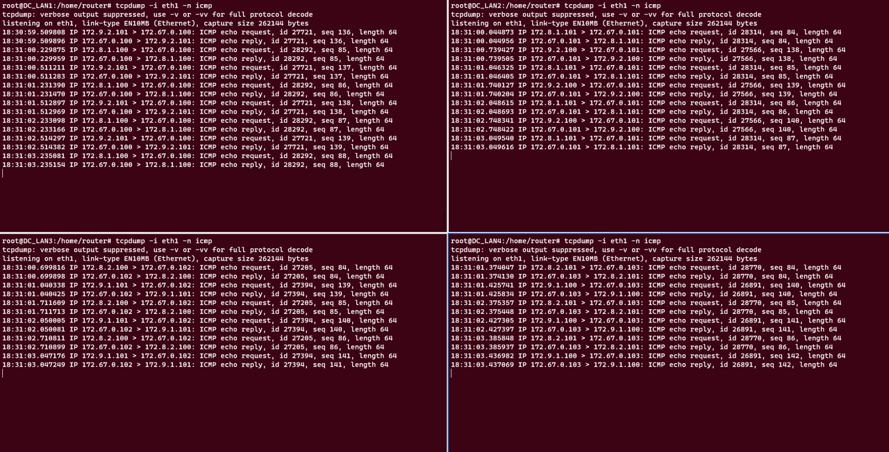

## Verify the HA functionality

Create all different use cases and make sure that the IOs continues on all the branches after *FAILOVER* and *FAILBACK*.
