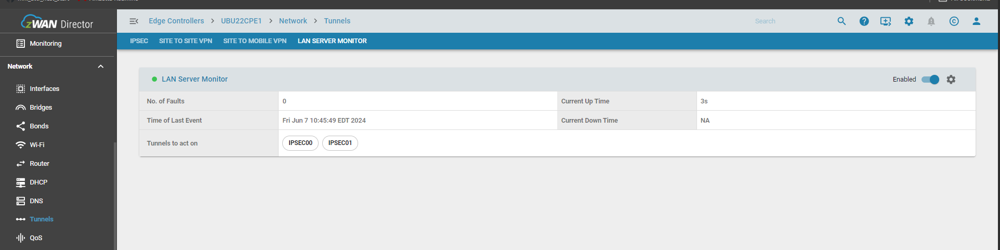
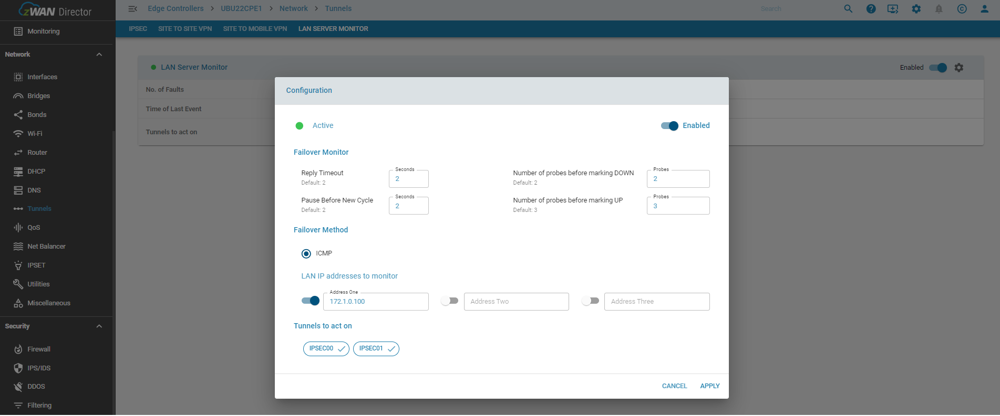

# LAN Server Monitor

## Overview:

This functionality monitors the liveliness of the LAN connectivity using the ICMP protocol and enables/disables the configured tunnels. This is useful to trigger an automatic failover at the branch from a DC to a DR location.

## Functionality

Monitoring is done by either monitoring the liveliness of manually configured LAN IPs. The reliability of the LAN can be influenced by the network level congestion and their response times. So proper calibration is required for the same. There are multiple parameters which are used to avoid transiet failure detection like 

- Number of probes before marking DOWN
- Number of probes before marking UP
- Pause Before New Cycle
- Reply Timeout

Failover Method defaults to ICMP. In future, application specific custom monitoring methods will be provided.

## Configuration Parameters

