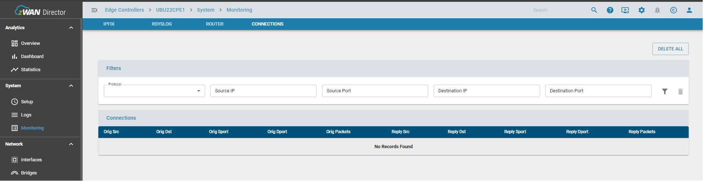
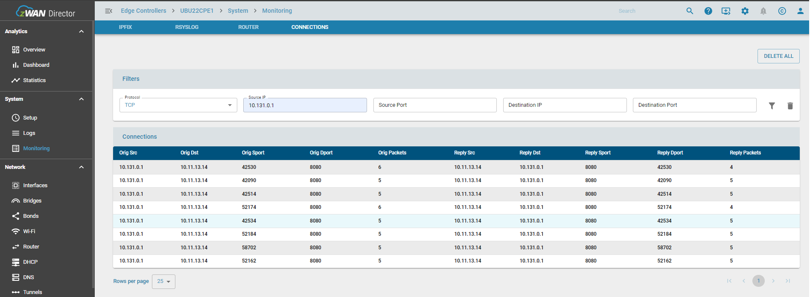

# Connections

## Functionality

This view shows the connection table of the EC for existing or ongoing connections on the EC by filtering them based on protocol, source ipaddress / port and destination ipadress / port. The administrator can also choose to delete/clear the existing connections on the EC, thereby resetting the state table. 

Certain situations call for resetting the connection table to force all existing connections to reestablish, in thise case a delete all option is provided to achieve the same.

- Resetting the connection table is disruptive but clients may immediately reconnect provided they are still passed by the current firewall rules

Atleast 2 filters protocol or source / destination ipaddress need to be specified to view / delete the connections. 

