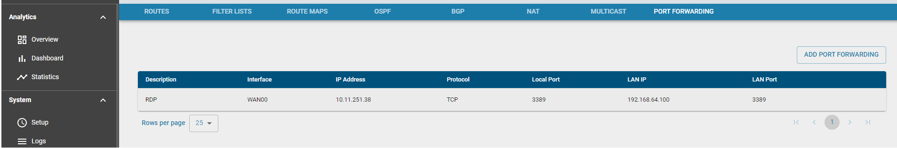
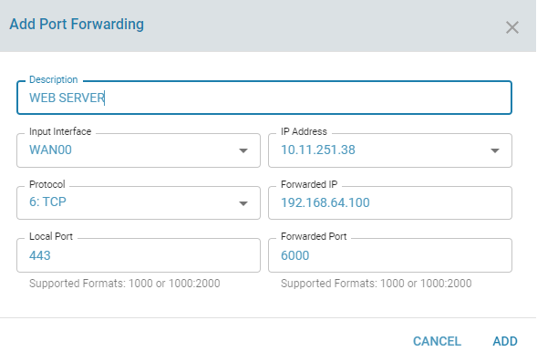

# PAT

## Overview: 

Port address translation (PAT) is a method by which multiple devices on a LAN can be mapped to a single public IP address. PAT is similar to port forwarding except that an incoming packet with destination port (external port) is translated to a packet different destination port or same port (an internal port). 

## Functionality:

PAT entries can be added and deleted

## Configuration Parameters

Configure PAT

## Use Cases:

A webserver is hosted internally in the LAN network and users need to access it from the public network. 

## Known Limitations:

- For any WAN IP changes, please update the rules manually.

## Future:

