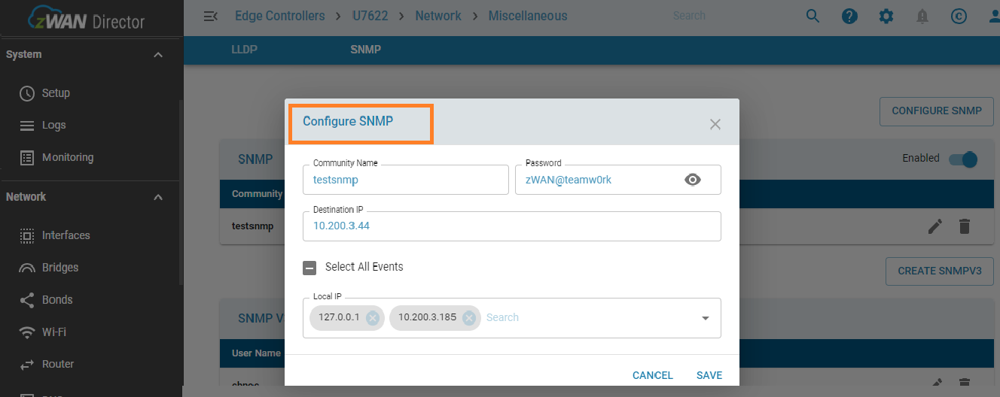
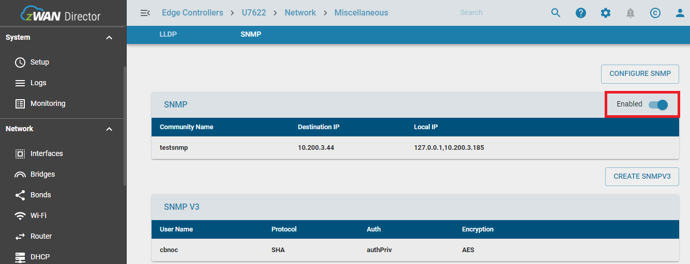
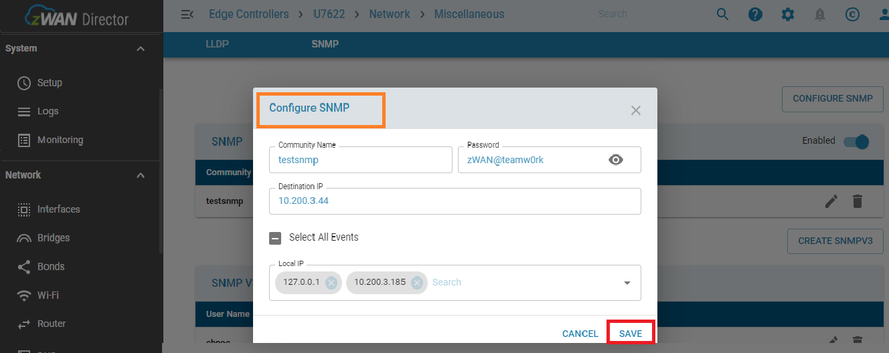
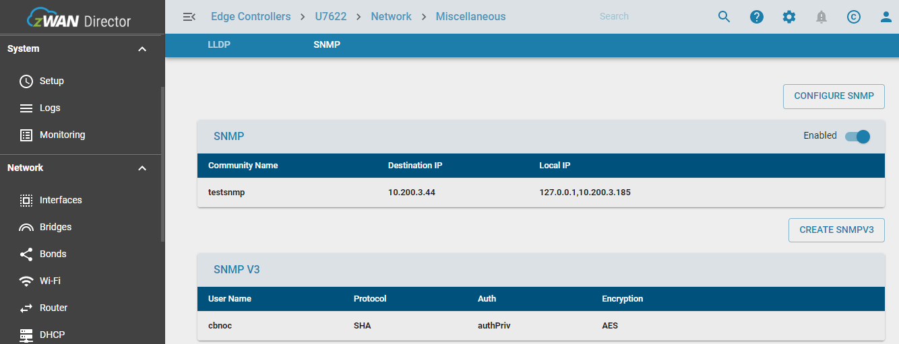
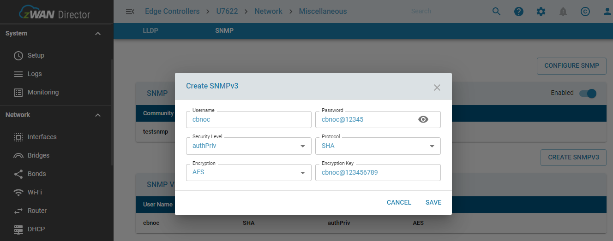
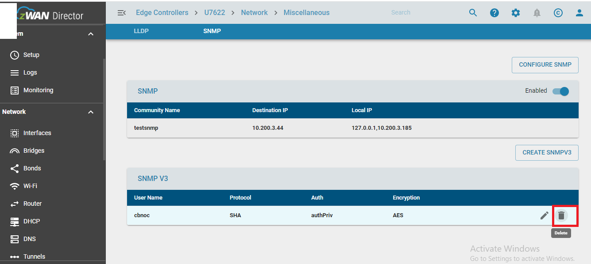

# SNMP
- SNMP (Simple Network Management Protocol) is an internet standard protocol used remotely retrieve the operational statistics (current status) of the servers and infrastructure components. Devices that typically support SNMP include routers, switches, workstations, firewalls, and more.
### Installed Packages:
```
 $sudo apt-get install -y snmpd snmp
 $sudo apt-get install -y snmp-mibs-downloader
 $sudo apt-get install -y snmptrapd
```
### Mib Browser Installation Steps:

 - Download mibbrowser_linux_x64.zip file from https://www.ireasoning.com/download.shtml
 - Copy downloaded zip file into linux server system
 - Use below commands to extract zip file and run browser code in linux

``` 
 $sudo su
 $unzip mibbrowser_linux_x64.zip
 $cd Downloads/ireasoning/mibbrowser/
 $bash browser.sh
```

### OBJECT Name And Trap Oid,s Of MIB File
| NAME | OID |
| ------ | ------ |
| myCompanyMIB | ``` .1.3.6.1.4.1.54848  ``` |
| interfaceAlertNotifications | ``` .1.3.6.1.4.1.54848.0  ``` |
| systeminfo | ``` .1.3.6.1.4.1.54848.1 ``` |
| info | ``` .1.3.6.1.4.1.54848.1.2 ``` |
| hostname | ``` .1.3.6.1.4.1.54848.1.2.1 ``` |
| ip | ``` .1.3.6.1.4.1.54848.1.2.2 ```|
| hostProductID | ``` .1.3.6.1.4.1.54848.1.2.3 ``` |
| hwType | ``` .1.3.6.1.4.1.54848.1.2.4 ``` |
| dateTime | ``` .1.3.6.1.4.1.54848.1.2.5 ``` |
|interfaceName | ``` .1.3.6.1.4.1.54848.1.2.6 ``` |
|interfaceStatus | ``` .1.3.6.1.4.1.54848.1.2.7 ``` |
|fwVersion| ``` .1.3.6.1.4.1.54848.1.2.8 ``` |
|description| ``` .1.3.6.1.4.1.54848.1.2.9 ``` |
|diskName| ``` .1.3.6.1.4.1.54848.1.2.10 ``` |
|diskUsage| ``` .1.3.6.1.4.1.54848.1.2.11 ``` |
|memoryUsage| ``` .1.3.6.1.4.1.54848.1.2.12 ``` |
|temperature| ``` .1.3.6.1.4.1.54848.1.2.13 ``` |
|cpuUsage| ``` .1.3.6.1.4.1.54848.1.2.14 ``` |
## SNMP AGENT
### Configuration Of SNMP AGENT:

-  Go to the secureshell SNMP option/WEBUI/ProviderUI.
-  Enter the community name (eg zwantest) default will be public
-  Enter the Destination Ip (SNMP server IP (WAN IP))
-  Enter the AGENT IP(WAN IP as well as LAN IP of CPE)
-  Enter the Password(SNMP Server CPE Password)



### Enable SNMP:
- Enable the snmp.



### Disable SNMP
- Disable the snmp.


### Enable/Restart/status Snmp Service.
````
$systemctl start snmpd
$systemctl disable snmpd
$systemctl status snmpd
````
### Edit SNMP:

 - If user want to edit the configuration and update.
### LIST SNMP/SNMPV3:
- It will show the status of SNMP service.
- will give configured details of SNMP.
- It will show SNMPV3 user info details.



### SNMPV3 Configuration:

- For SNMP V3 Configuration need to configure the SNMP and status should be enable then configure SNMPV3
- Enter the username of snmpv3
- Enter the password for snmpv3 user
- Enter the authentication Protocol[MD5/SHA]
- Enter the autentication privacy[AuthPriv/AuthNoPriv]
- Enter the Encryption Protocol[AES/DES]
- Enter the Encryption Key



- authPriv - Communication with authentication and privacy. The protocols used for Authentication are MD5 and SHA ; and for Privacy, DES (Data Encryption Standard) and AES (Advanced Encryption Standard) protocols can be used.
- authNoPriv - Communication with authentication and without privacy. The protocols used for Authentication are MD5 and SHA
### SNMPV3 Delete:

- Enter the username for deletion.


## SNMP SERVER
### Prerequirement:
- Install the 18.04 Ubuntu in a system.
- Check internet access is available to your system
###  Command For Installation Mib Browser And Java:
    $apt -y install snmp-mibs-downloader
    $sudo apt install default-jre
- Or install above deb packages in ubuntu
- Become root user
### Configuration SNMP Server:
    $cd Downloads/ireasoning/mibbrowser
    $./browser.sh
### Custom MIB File Loading In MIB Browser:
- Download the custom MIB from git to the SNMP server.
https://gitlab.amzetta.com/sdwan/zwan-cpe/-/blob/1.2_QABUGFIX/common/schliersee/snmp/MY-AMZ-MIB.txt
- Go to the MIB browser click on file -> load MIB's file > select MIB file -> click on  open
### Configuration Of SNMP Server:
- Go to the address field and enter  AGENT address ip [WAN CPE IP]
- Set operation field as GET/GETBULK
- ON left side of MIB browser our custom mib file loaded in browser 
- Click on + icon  so it will show the MIB File arrangement .
- Keep on click on + icon all the MIB file content able to see all content.
- Click on info object of MIB file,once click info OID will come in OID field of MIB browser
- Set operation as GETBULK after that at right most go option is there so once click
- All the basic information it will list .

### OBSERVATION OF TRAP:
- Go to the MIB browser->Click on Tools-> click trap reciver -> trap reciver window will open 
- Once trap generate from agent it will send to server ,trap will come with OID.
- Click on trap ->more info about trap will get.

> Note: 
- We can use server  across many different agent , but each agent  only supports one server.
- SNMP Server should be accessible from agent. 
- We  can follow above doc for webui/ProviderUi as well as Secureshell
