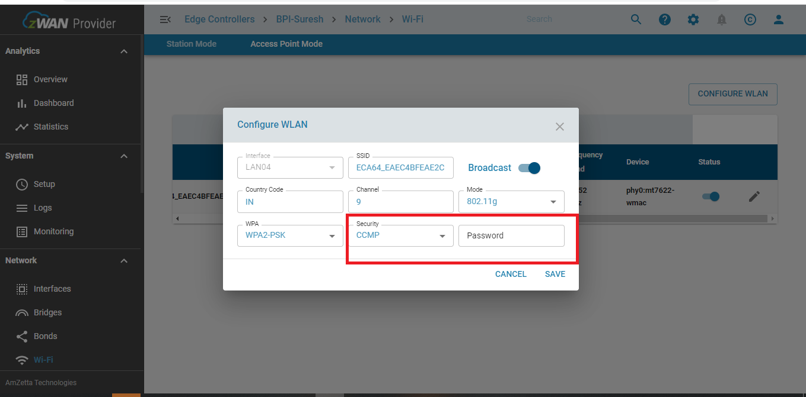
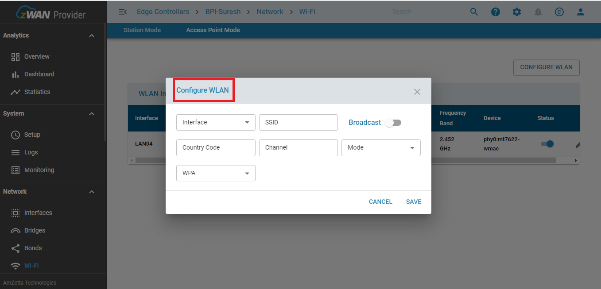
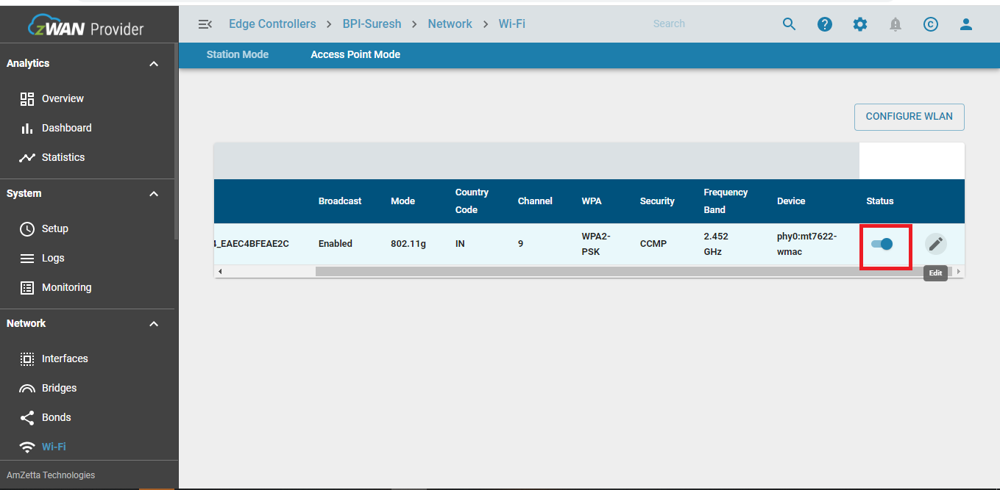
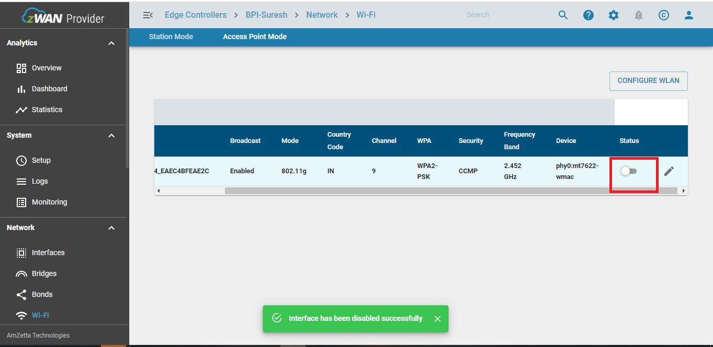
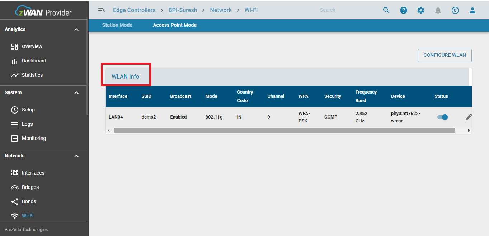
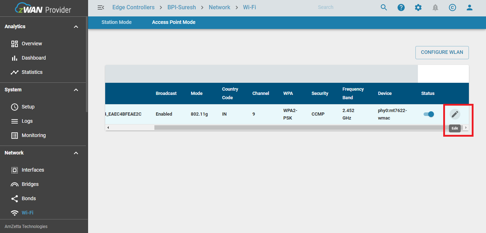
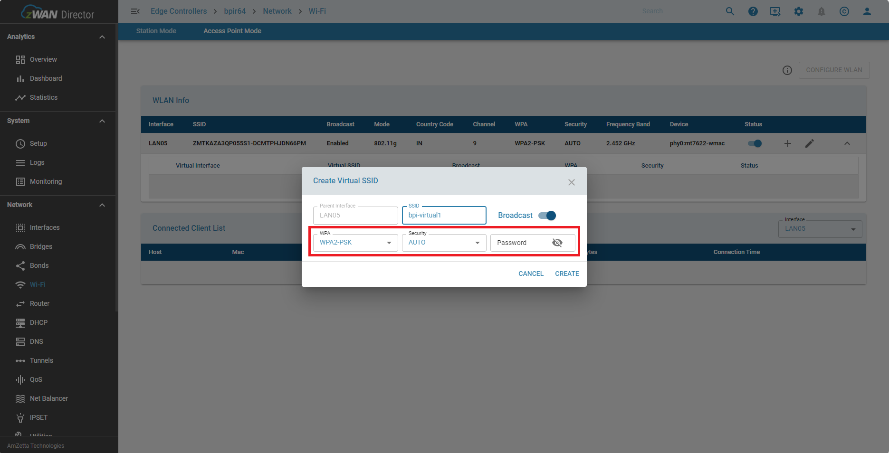
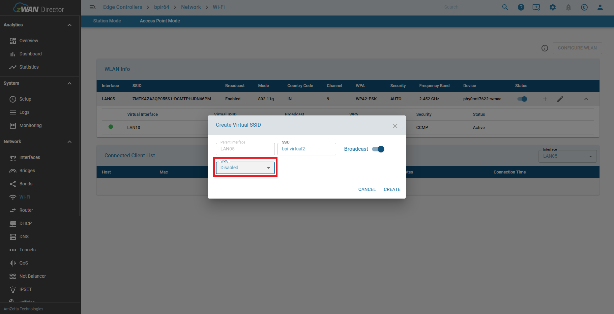
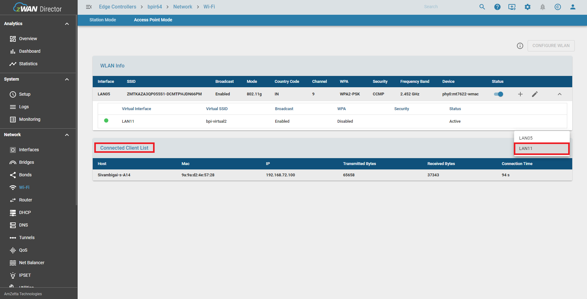
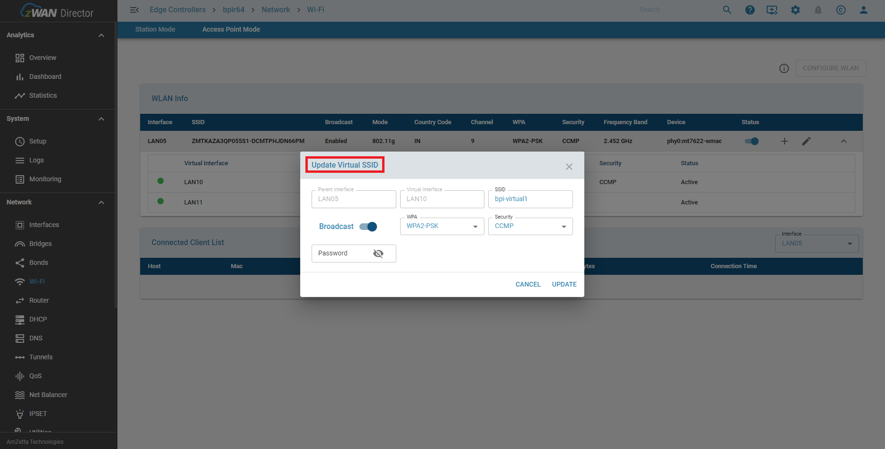

# Wi-Fi ACESS POINT MODE (AP mode)
 zWAN stack creates Wi-Fi AP mode interface WLANXX for every supported Wi-Fi hardware device {phyX/wlanX} enumerated in startup. 
 It exposes EC's LAN network functionality to wireless so that clients/workstations could connect to it and form a wireless LAN in adjacent to wired LAN. 

 On supported hardware, Wi-Fi AP mode is enabled by default with an uniqueue SSID and password for security, password is same as SSID.   

# Multiple SSID 
The zWAN stack creates multiple SSID interfaces using WLANXX for every supported Wi-Fi hardware device (phyX/wlanX) enumerated at startup.
This functionality exposes the WLANXX interface for the creation of multiple Access Points (APs),
allowing clients and workstations to connect to multiple APs through a single interface.

 On supported hardware, We need to enable the Multiple SSID and set the unique SSID and password for security.

### Wi-Fi AP MODE & Multiple SSID SUPPORTED FUNCTIONALITY

- Configure Wi-Fi Acces Point Interface
- Enable Wi-Fi Acces Point [Hostapd] service
- Disable Wi-Fi Acces Point [Hostapd] service
- Edit Wi-Fi Acces Point Interface Configuration
- List Wi-Fi Acces Point Interface Configuration
- Delete Wi-Fi Access Point Interface Configuration


##### Wi-fi Functionality can be managed via Provider , LocalWebUI and secureshell

### CONFIGURE Wi-Fi AP MODE
###### 1) WITH PASSWORD


###### 2) WITHOUT PASSWORD


- We can configure Wi-Fi AP mode with/without password.
- For configuration of Wi-Fi AP mode we need to enter Interface name, SSID, broadcast/unicast type, Driver name, country code, WPA, Security and  password .
##### Example 
Enter the Wi-Fi Acces Point Interface Name : WLANxx
Enter the SSID of the Wi-Fi Network[max 32 Alpha char] : bpir64-acess-123
Enter the Broadcast/Unicast [0/1]: 0
Enter the Driver Name [802.11n] : 
Enter the Mode [a/g] By default [g]  :
Enter the Country Code [eg IN/US] : IN
Enter the Channel number [eg 1 upto 14 / auto] : 9
Enter the WPA [0/1/2/3]  : 2
Enter the Security [TKIP/CCMP]   : CCMP
Enter the Password [min 8 Char]  : bpir64-acess-123

### Enable Wi-Fi Acces Point [Hostapd] service


- Enable Hostapd Service  device will act as  Acess point(server)

```
systemctl enable hostapd
```
### Disable Wi-Fi Acces Point [Hostapd] service


- Disable AP point service will stop device acting as Acess point.

```
systemctl disable hostapd
```

### List Wi-Fi Acces Point Interface Configuration


- We can list configured Wi-Fi AP mode details like interface name , ssid, security, driver details , broadcast details, frequency, state, security and channel.

### Edit Wi-Fi Acces Point Interface Configuration


- We can edit configured Wi-Fi AP mode details like interface name , ssid, security, driver details , broadcast details, frequency, state, security and channel.


### CONFIGURE Multiple SSID
###### 1) WITH PASSWORD


###### 2) WITHOUT PASSWORD


- We can configure Multiple SSID with/without password.
- For configuration of Multiple SSID we need to enter SSID, broadcast/unicast type, WPA, Security and  password .
##### Example 
Enter the SSID of the Wi-Fi Network[max 32 Alpha char] : bpi-virtual1
Enter the Broadcast/Unicast [0/1]: 0
Enter the WPA [0/1/2/3]  : 2
Enter the Security [TKIP/CCMP/AUTO]   : AUTO
Enter the Password [min 8 Char]  : bpi-acess-123

### Enable Wi-Fi Multiple SSID interface


- Enable interface  device will act as virtual Wi-Fi( virtual server)

```
systemctl enable hostapd
```
### Disable Multiple SSID interface


- Disable interface will stop device acting as virtual Wi-Fi.

```
systemctl disable hostapd
```

### List Multiple SSID Interface Configuration


- We can list configured multiple SSID details like virtual interface, virtual ssid, status, security and broadcast details.

### Edit Multiple SSID Interface Configuration


- We can edit Multiple SSID details like ssid, security and broadcast details.

> Note:
- The Multiple SSID feature does not have a dedicated interface. It operates as a sub-interface of the WLAN interface.
- The properties [Country code, Channel, Mode] are applicable only to the Wi-Fi Access Point interface.
- In Multiple SSID, the properties [Country code, Channel, Mode] are common for all SSIDs and cannot be individually set, as they are based on the dedicated interface.


# DEV Notes
### Installed Packages
```
 $sudo apt-get install -y hostapd
```
- hostapd is a user space daemon for access point and authentication servers.  It implements IEEE 802.11 access point management, IEEE 802.1X/WPA/WPA2/EAP  Authenticators  and  RADIUS authentication  server

### UTILITY USED
```
hostapd_cli --help
```

- Hostapd_cli is a command-line interface for the hostapd daemon.


### CONFIGUARTION FILE RELATED TO Wi-Fi AP MODE
```
/etc/hostapd/hostapdWLAN00.conf
```

### INTERFACE RELATED TO Wi-Fi AP MODE
```
WLAN00
```
### Wi-Fi GET CONFIG DETAILS RELATED TO INTERFACE
```
 hostapd_cli get_config
```
- This will list all configuration set for AP mode interface.
- key_mgmt field will define opwn or password protected(WPA/WPA2).
- ssid field will define NAME related to acess point.

> Note: 

- You can refer the  hostapd utility for more commands to manage Wi-Fi acess point mode.
- You should not use these character in SSID (?, ", $, [, \, ], and +).
- 

### KNOWN HARDWARE LIMITATIONS - MT7622 SOC -802.11agn 2.4 GHz channels (1- 11/14)
- If AP mode enabled on a particular frequency channel and Station mode wants to connect to a particular Wi-Fi network with different frequency channel, this hardware does not support such combination, both AP and Station mode should work on same channel all the time. 
  To work around this limitation, whenever stations mode configure/connect API is called, AP mode is temporarily stopped and restarted with same channel selected by the Station.

   
