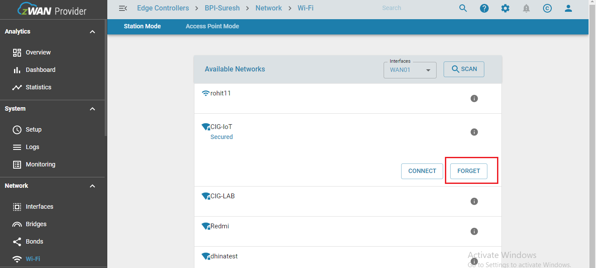

# Wi-Fi STATION MODE

zWAN stack creates Wi-Fi Station mode interface SWANXX for every supported Wi-Fi hardware device {phyX/wlanX} enumerated in the startup. 
Station Mode (STA) is the normal mode for a Wi-Fi device, EC device uses Station Mode to join a wireless network that already exists and provides WAN/Internet connectivity to the EC along with Ethernet and LTE. 

#### Interface Related To Wi-Fi Station Mode
Station mode Wi-Fi interface SWANXX is mapped to the WANXX alias name on the interface list. 

### Wi-Fi STATION MANAGEMENT FUNCTIONALITY
###### Scan Wi-Fi Networks
###### Configure Wi-Fi Network
###### Connect to Wi-Fi Network
###### Disconnect from Wi-Fi Network
###### Delete/Forget Wi-Fi Network

###### 1)Scan Wi-Fi Networks


###### 2)Configure Wi-Fi Network


###### 3)Connect to Wi-Fi Network


###### 4)Disconnect from Wi-Fi Network

 

###### 5)Delete/Forget Wi-Fi Network
 

# Dev Notes
#### INSTALLED PACKAGES
````
 $apt -y install wpasupplicant
````
#### UTILITY USED
```
wpa_cli --help
```
#### CONFIGURATION FILE RELATED TO Wi-Fi STATION MODE
````
 /var/register/system/net/interfaces/SWAN00/wpa_supplicant.conf
````

### WPA CLI COMMAND TO MANAGE Wi-Fi STATION MODE
````
$wpa_cli --help
```` 
- To get all command list
#####
SCAN AVAILABLE Wi-Fi
`````
$wpa_cli scan_results
`````
- This will scan all available Wi-Fi with more info like essid,wpa securied,frequency and many more info.
###### 
LIST CONFIGURED Wi-Fi
`````
$wpa_cli list_networks
`````
- Above command  will list all configured Wi-Fi with network id , wpa security , essid and current status.
#####
ENABLE CONFIGURED Wi-Fi
`````
$wpa_cli select_network $NWID
`````
- network id will get once Wi-Fi configuration done success after that you can check via (list configured Wi-Fi) command as well as this command will enable the Wi-Fi.
#####
DISABLE Wi-Fi
`````
$wpa_cli disable_network $NWID
`````
- This command will disable the Wi-Fi related to perticular network id
###### 
Wi-Fi CONNECTION STATUS
`````
$wpa_cli status
`````
- It will give information about connection status as well as if it connected then listing connected  Wi-Fi network info.
######
RELOAD CONFIGURED Wi-Fi
`````
$wpa_cli reconfigure 
`````
- It will force wpa_supplicant to re-read its configuration file and bydefault it will enable first Wi-Fi network.
> Note: 
- You can refer the  wpa_cli utility for more commands to manage Wi-Fi station mode.
- You should have minimum one antenna connected to hardware for good range . 

### KNOWN HARDWARE LIMITATIONS - MT7622 SOC -802.11agn 2.4 GHz channels (1- 11/14)
- If AP mode enabled on a particular frequency channel and Station mode wants to connect to a particular Wi-Fi network with different frequency channel, this hardware does not support such combination, both AP and Station mode should work on same channel all the time. 
  To work around this limitation, whenever stations mode configure/connect API is called, AP mode is temporarily stopped and restarted with same channel selected by the Station.


