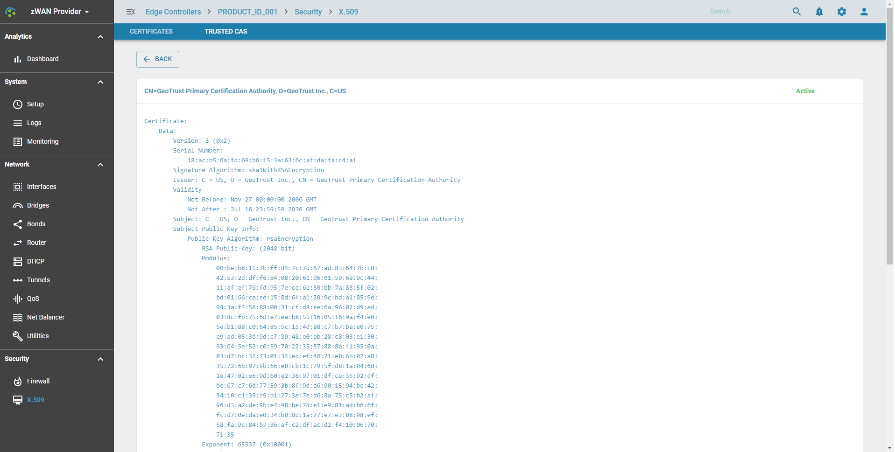
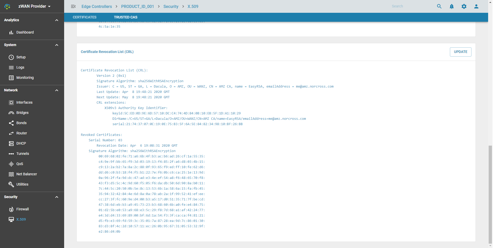
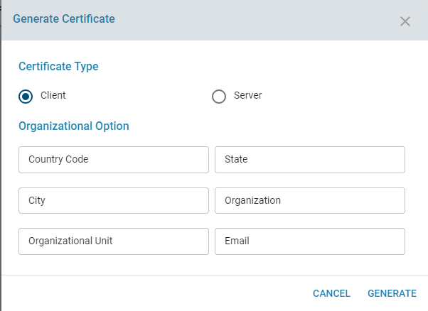
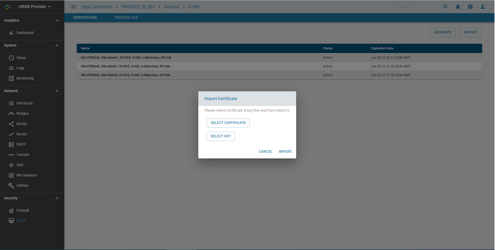
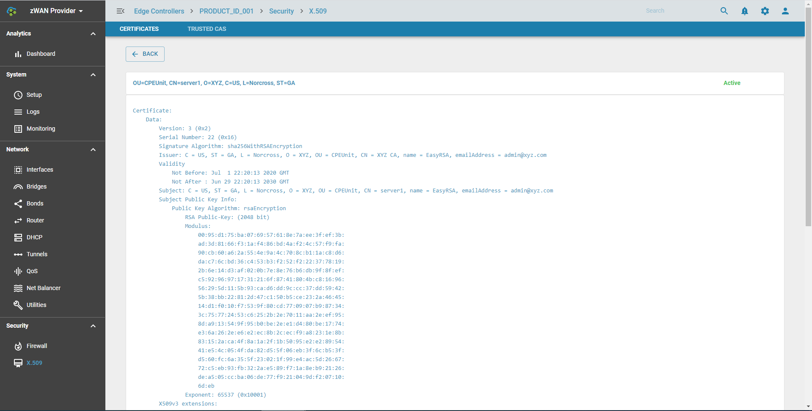
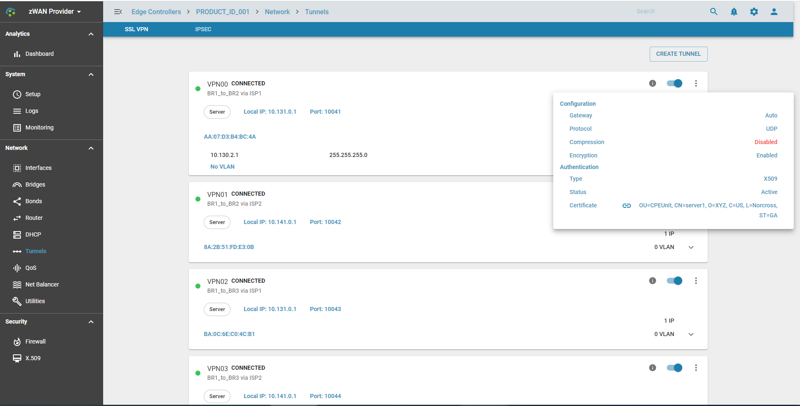

# x509 Certificates

## Overview: 

A Secure Socket Layer (SSL) certificate is a security protocol which secures data between two computers by using encryption. Typically, SSL certificates are used on web pages that transmit and receive end-user sensitive data. SSL certificates ensure the identity of a remote computer, most commonly a server, but also confirms your computer’s identity to the remote computer to establish a safe connection.

## Functionality:

1) Importing of Host and trusted CA certificates are supported. 
2) Multiple CA certificates are supported. 
3) Certificates and Private keys should be provided in .pem format
4) Manual CRL import is supported for Multiple CAs
5) Generating a new certificate with the Provider being the CA

Supported Certificate, Private Key and CRL are to be provided in .pem format.  

```
PEM files use ASCII encoding, so you can open them in any text editor such as notepad, MS word etc. 

Each certificate in the PEM file is contained between the ---- BEGIN CERTIFICATE---- and ----END CERTIFICATE---- statements. 

The private key is contained between the ---- BEGIN RSA PRIVATE KEY----- and -----END RSA PRIVATE KEY----- statements
```

## Configuration Parameters

Import CA Certificate


View CA Certificate



View CRL



CRL Status


Generate a Host Certificate



Import Host Certificate



View Host Certificate



SSLVPN Certificate Use



 
## Use Cases:

IPSec and SSL VPN Tunnel Authentication.

## Known Limitations:

- Only **99** CA Certificates can be imported per ZWAN controller
- Only **99** HOST Certificates can be imported per ZWAN controller

## Future:


