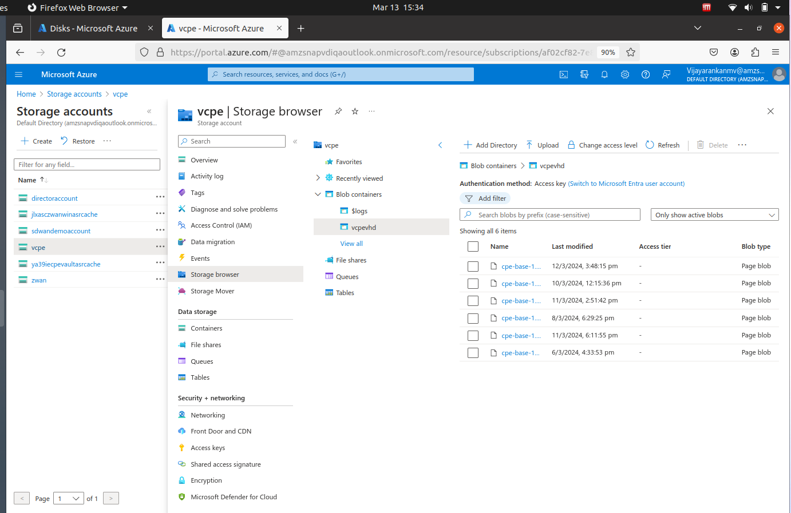
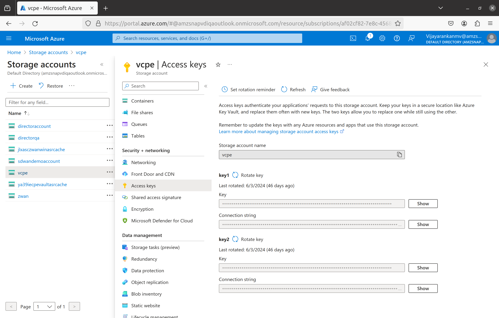
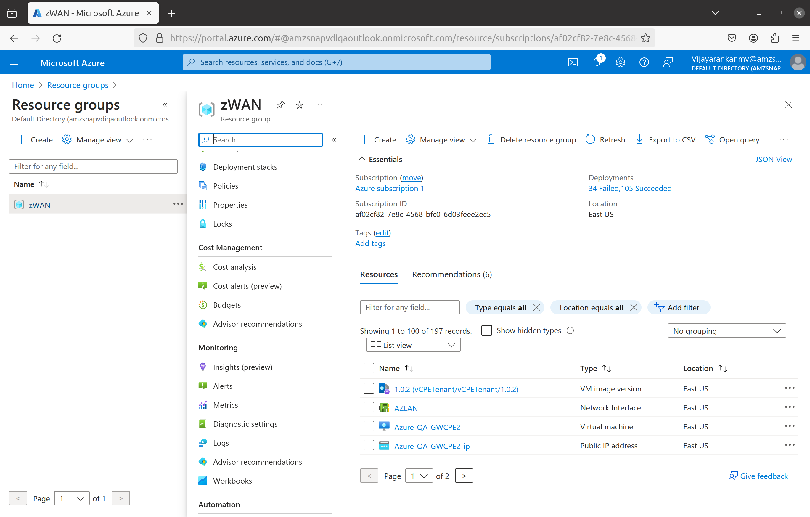
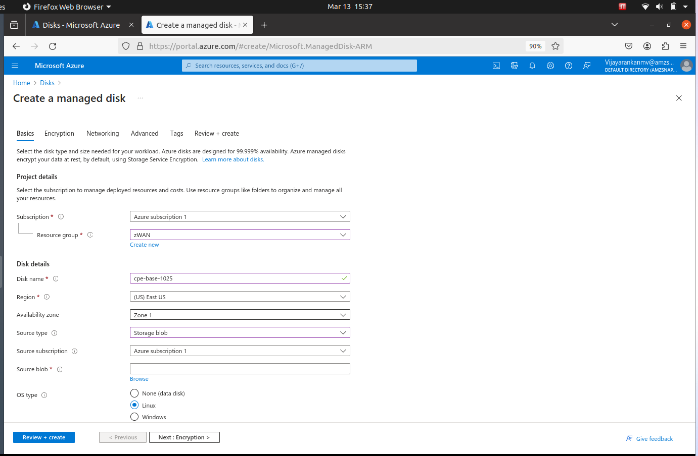
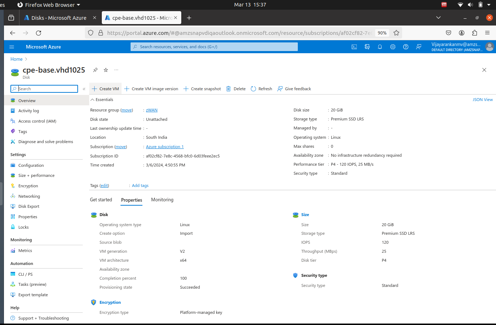
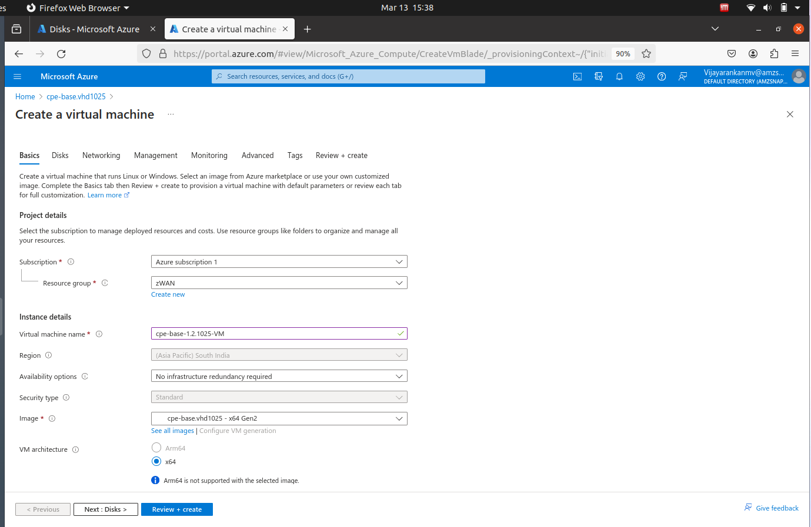
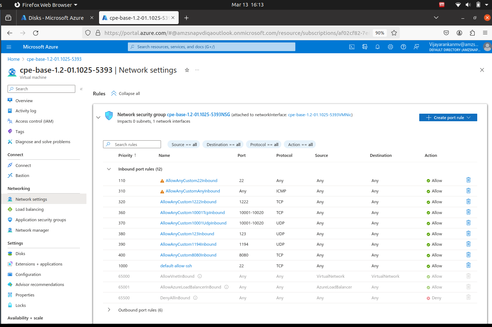

`				`**Create vcpe in Azure cloud** 

Install azure client in ubuntu machine using any one of the command.

curl -sL https://aka.ms/InstallAzureCLIDeb | sudo bash 

sudo apt install azure-cli 

**1. Uploading vhd image using script:**

The below script will convert qcow2 image to vhd image and upload to provided azure storage account of provided azure container.

\# bash -x azure\_upload\_img.sh <cpe qcow2 image> <cpe vhd name to be uploaded> <model override> hardwareModel=<hardware model name>

Provide Azure storage account name, Azure storage container name and storage account key

Storage account name can be taken from Storage accounts-> <Account name> [ In the below pic: vcpe]

Storage container can be taken from Storage accounts-> -> <account name> ->Blob containers

-> <container name> [ In the below pic: vcpevhd ]

Access key can be taken from Storage Accounts -> <account name> ->Access keys -> key 1

Example:

\# bash -x azure\_upload\_img.sh cpe-base-1.2-01.1025-5393.qcow2

\# bash -x azure\_upload\_img.sh cpe-base-1.2-01.1025-5393.qcow2  cpe-base-1.2-01.1025-5393.vhd 

\# bash -x azure\_upload\_img.sh cpe-base-1.2-01.1025-5393.qcow2  cpe-base-1.2-01.1025-5393.vhd 53455366

\# bash -x azure\_upload\_img.sh cpe-base-1.2-01.1025-5393.qcow2  cpe-base-1.2-01.1025-5393.vhd 

53455366 hardwareModel=azure

**2. Creating azure vcpe using script:**

The below script will create managed disk and create vcpe using managed disk.

\# bash -x azure\_create\_vm.sh <cpe vhd name to be uploaded>

Provide Azure storage account name, storage container name, storage account key, resource group, location

Resource group can be taken from Resource groups -> <resource goup name>

[In the below pic: zWAN ]

Example:

\# bash -x azure\_create\_vm.sh cpe-base-1.2-01.1025-5393.vhd 

**Note:**
--------------------------------------------------------------------------------
**For each azure vCPE VM instance, a new vhd should be created using
  step 1 and a new managed disk should be created to have a uniqe product id.**
-------------------------------------------------------------------------------- 

3\.  **Manual steps to create azure vcpe:**

1\. Upload the vcpe vhd image to Storage Accounts->Choose storage account name->Storage browser->Blob containers->Choose container name->Upload vhd image.

2\. Create managed disk using Disks->Create Disk and enter the details as shown below.

3\. Create vcpe using Disks-> select the disk->Create VM

4\. Create VM as shown below image

5\. Add required inbound and outbound ports by selecting the virtual machine->Network Settings-> Create port rule

