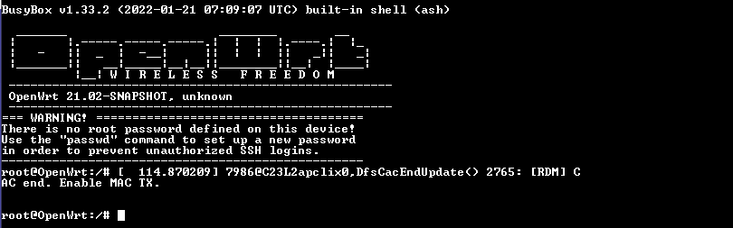

### Flashing Image in BPI-R3 hardware.

Here 2 major steps has been followed to flash the image in a bpi-r3 hardware.

**Step 1:**
Generating the buildxxxx.bin (e.g., build-bpi-r3-1.2-01.1024-Jan31-2024-132532.bin) image in the imagexxxx.img (e.g., image-bpi-r3-1.2-01.1024-Jan31-2024-132532.img) format.

-   Format USB pendrive in ext4 from any linux machine and insert the pendrive into any Ubuntu-based system (flashing machine).

-   Transfer the most recent firmware version of the build image from the build system, residing at (10.200.3.103:/home/qarelease), to the Ubuntu-based flash system. 

        **Ex: $ scp flasher.sh flash_bpi-r3_emmc.sh build-bpi-r3-1.2-01.1024-Jan31-2024-132532.bin root@Ubuntu-System-IP:/yourpath/**

-   Once the image has been copied to the specified path, execute the following command. The argument 2 should be 0 for SD card and 1 for eMMC

        **Ex: $ bash -x flasher.sh image-bpi-r3-1.2-01.1024-Jan31-2024-132532.img 0 build-bpi-r3-1.2-01.1024-Jan31-2024-132532.bin 7456 bpi-r3**
    
        Note: It will take more than one minute to generate the image. 

-   Copy the flash_bpi-r3_emmc.sh file and image-bpi-r3-1.2-01.1024-Jan31-2024-132532.img in mounted ext4 pendrive.

**Step 2:**
Writing the image from the pendrive to the respective BPI-R3 hardware.

-   Connect the Pendrive in BPI-R3 device.

-   Put/make down all 4 flipflops switch (Below wifi antenn side side view). Power on the unit.

-   Now by default the device  will boot in NOR mode with default opwnwrt image.

    

-   Once the devcie booted successfully, navigate to the usb mount location( example: cd /mnt/sda1)  

-   Execute the command

        sh -x flash_emmc.sh filename.img . It will start flashing to internal emmc drive.
        
    
    
-   Once the flash get completed successfully,Power off the unit. 

-   Now in flipflop switch from left side -  down the first and fourth and then UP second and third.

-   Power on the unit, now it will boot our firmware from emmc drive.
