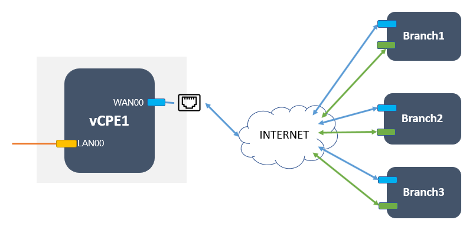
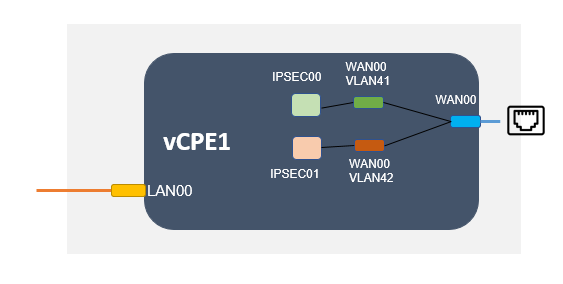
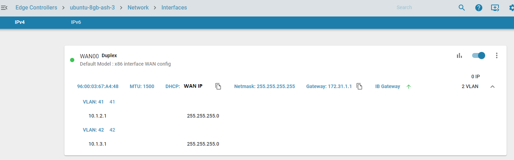
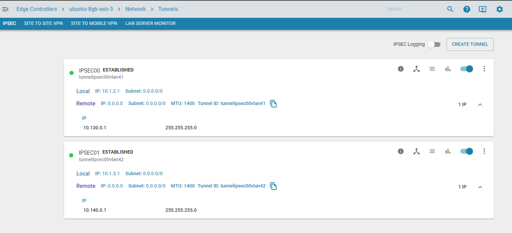
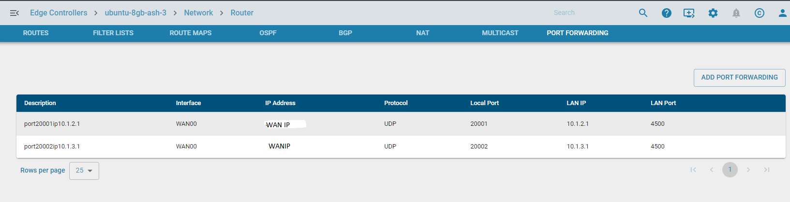
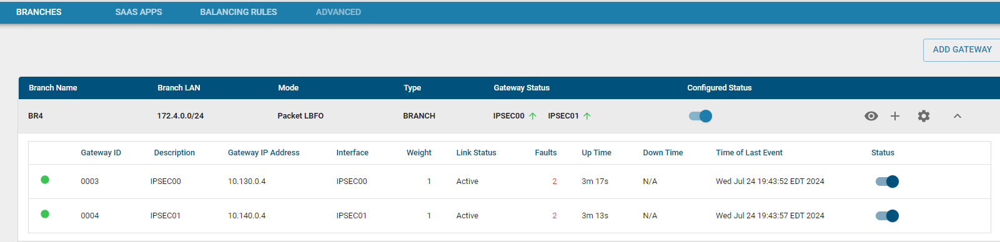
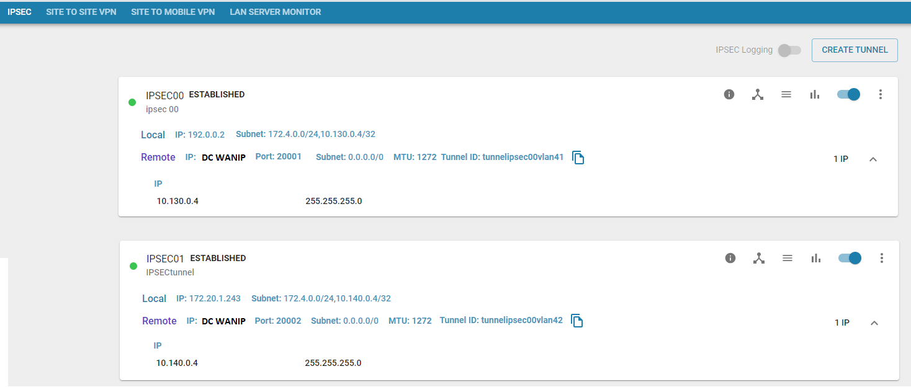
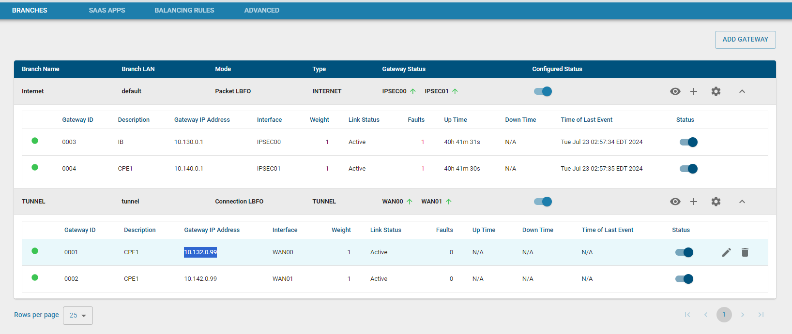

# Single Public IP Multiple IPSEC Tunnels

The traditional configuration of a DC and Branch were that they need to match in IPSEC tunnels, which meant the WAN interfaces on the branch matched the WAN interfaces on the DC. But that may not always be possible every time due to the following
- The cost of adding additional nics increases
- Presence of a single 10G interface vs multiple 1G interfaces
- The configuration of the VM being controlled by the Cloud vendor

So this means the DC should support multiple IPSEC tunnels on a single WAN interface.

This can be achieved by creating VLANs on the WAN interface and applying a port forward configuration. The number of VLANs would be dictated by the maximum number of WAN interfaces present on the branch Edge Controller. 

## Deployment Method

### Scenario 1 : DC - 1 WAN NIC, EC-BRANCH 2 WAN NIC

### DC Configuration

#### VLAN Configuration

Below is the zWAN UI configuration of the same

#### Tunnel configuration

An IPSEC tunnel is created with local ip as each WAN VLAN IP

#### Port forwarded configuration

The branches would connect to different IPSEC tunnel IKE ports which would then be port forwarded locally to the VLAN IP and the IPSEC port 4500. In this example IPSEC00 is attached to port 20001 and IPSEC01 is attached to port 20002 on the WAN IP.

#### Netbalancer configuration

Since we have a single public IP we do not need an Internet breakout. A Netbalancer branch needs to be configured to reach the remote LAN via the IPSEC devices.

### Branch EC Configuration 

#### Tunnel configuration

The IPSEC tunnels on the branch would be created with the respective DC WAN IP and the Right IKE port 20001 and 20002

#### NetBalancer Configuration

