`				`**Create VCPE in Hetzner cloud** 

**1. Preparing the raw image :**

For Hetzner Cloud the raw disk image of the CPE firmware is needed and that image will be written to the disk attached to the Virtual Machine in the Hetzner Cloud VM.

Details about creating a raw disk image.
  * From the firmware release location (x86 folder) download the cpe-base-*.qcow2.xz and 
    the script file vcpe_qcow2_to_x86_verboot_raw_img.sh .
  
  * The following packages should be present in the (Ubuntu 22.04) system xz-utils, qemu_utils, lftp.

  * Set exec permission for the vcpe_qcow2_to_verboot_raw_img.sh file and use the uncompressed
    qcow2 cpe firmware file to create the raw image. 

  * After the raw image is created, compress that image and upload it to the secure ftp server.

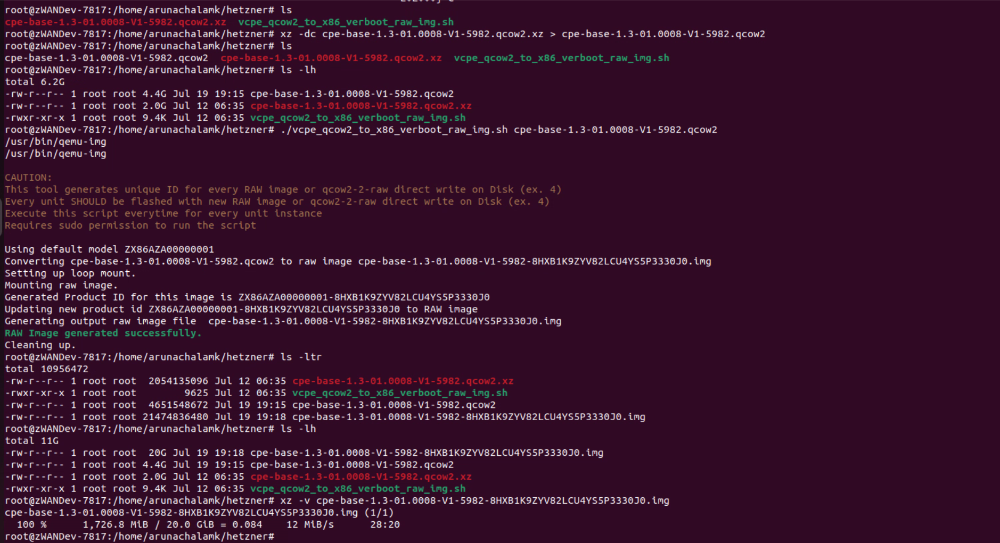

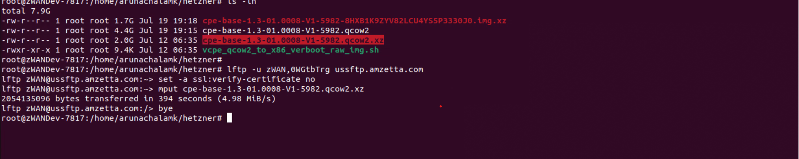

**2. Creating Hetzner Cloud VM with ubuntu image :**

Steps to create Cloud Virtual Machine in the Hetzner Cloud. Choose the default project and Add Server.

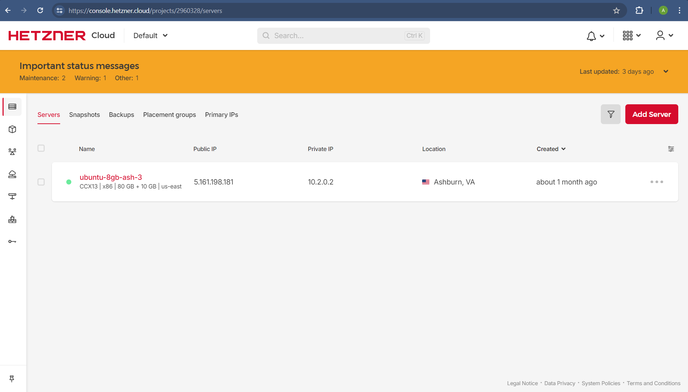

Choose the region and the OS Image needed 

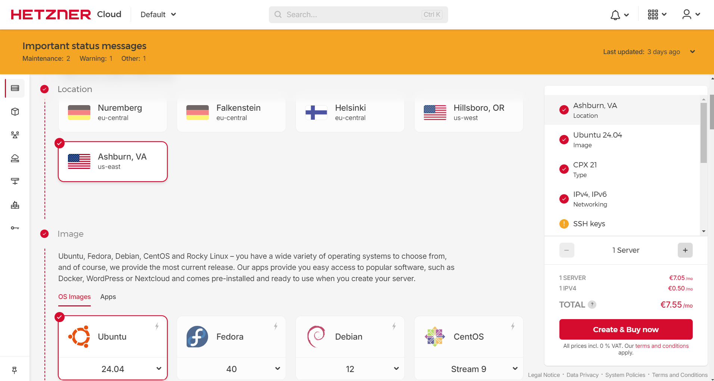

Choose the type of CPU (Shared or dedicated), let the other options be as it is.

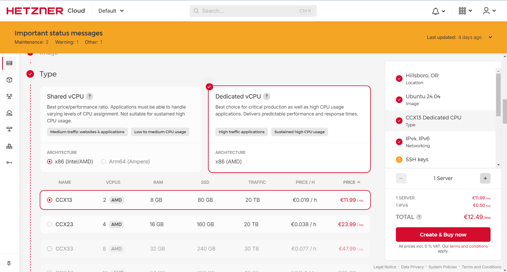

Virtual Machine will be created with in few seconds.

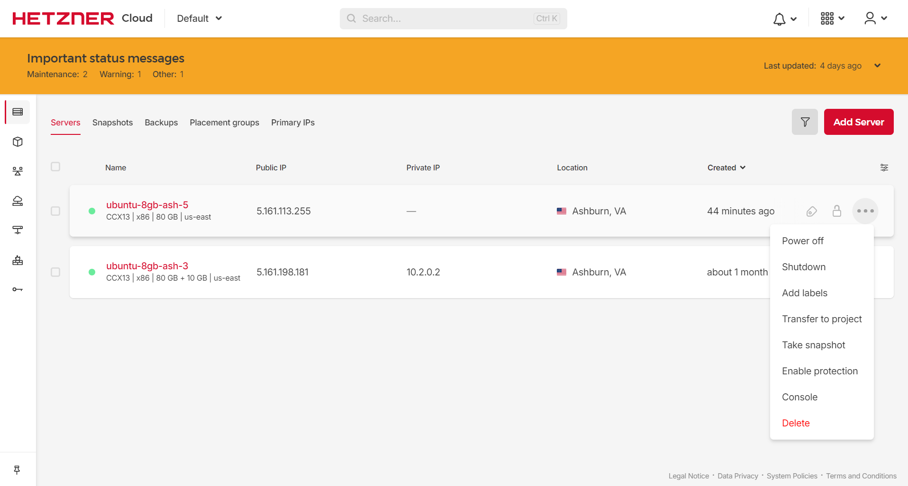

After everything is finished, click on the VM and choose the "Rescue" option in the Virtual Machine overview page. 

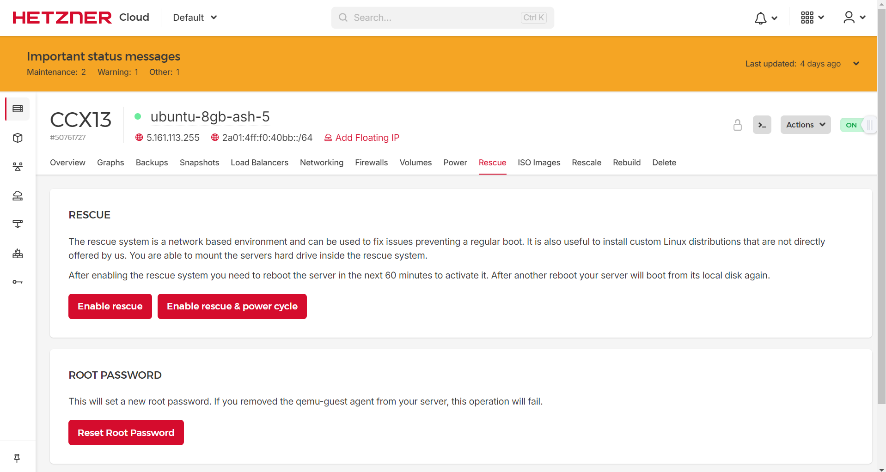

Enable rescue mode and restart the VM, in this page the rescue mode password will be displayed. 

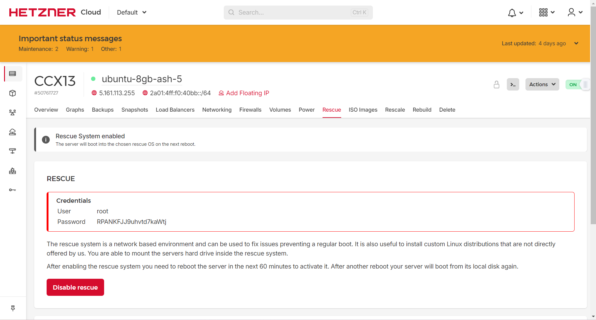

From the Actions Menu , Choose the Console option to login to Rescue mode to install our raw image into this VM. 

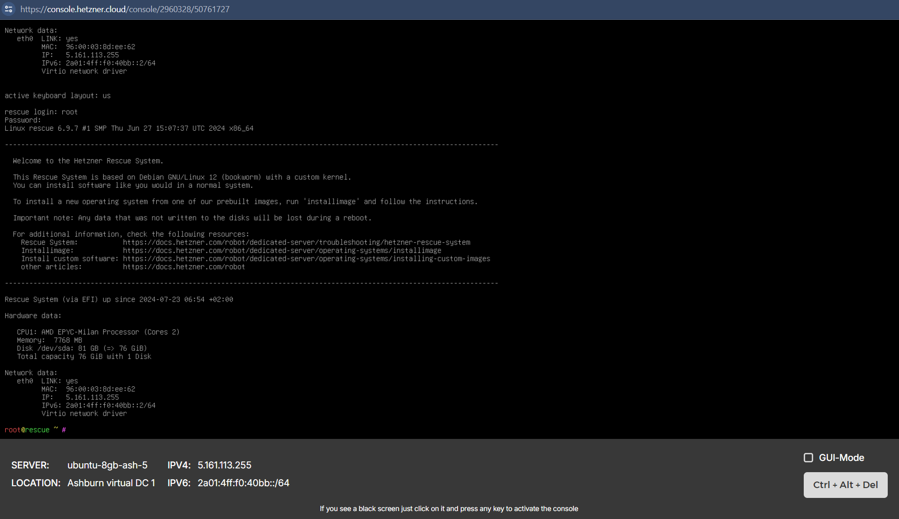

In the Console, down the compressed raw disk image from the secure ftp server, then uncompress and dd the image in the Virtual Machine root disk.

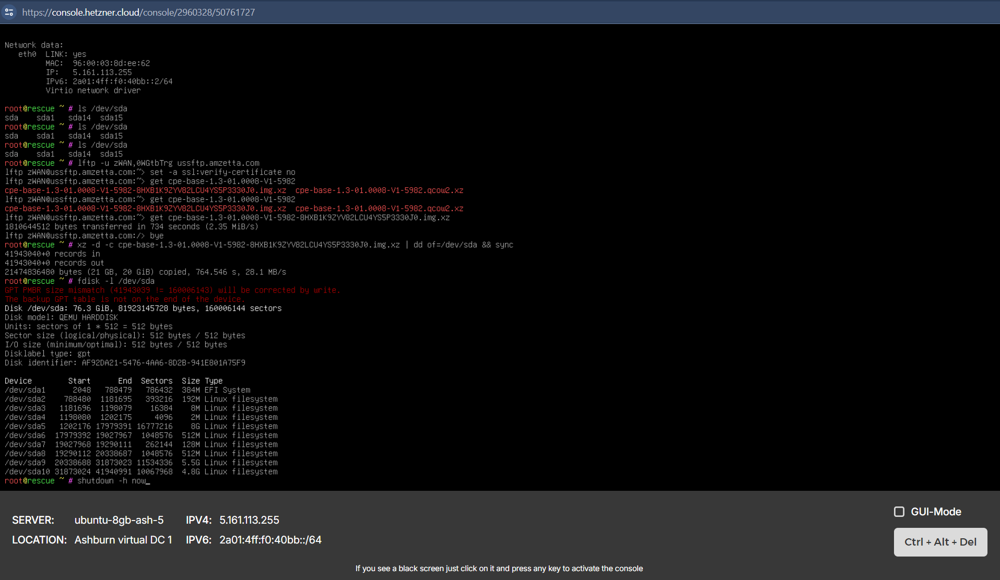

In the Hetzner Cloud GUI disable the Rescue mode for this VM and shutdown the VM from the console. 

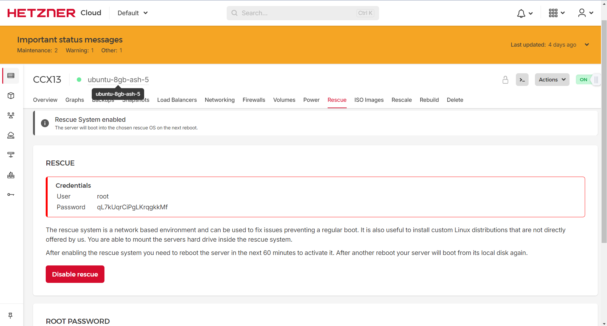

CPE installed in the Hetzner Cloud VM

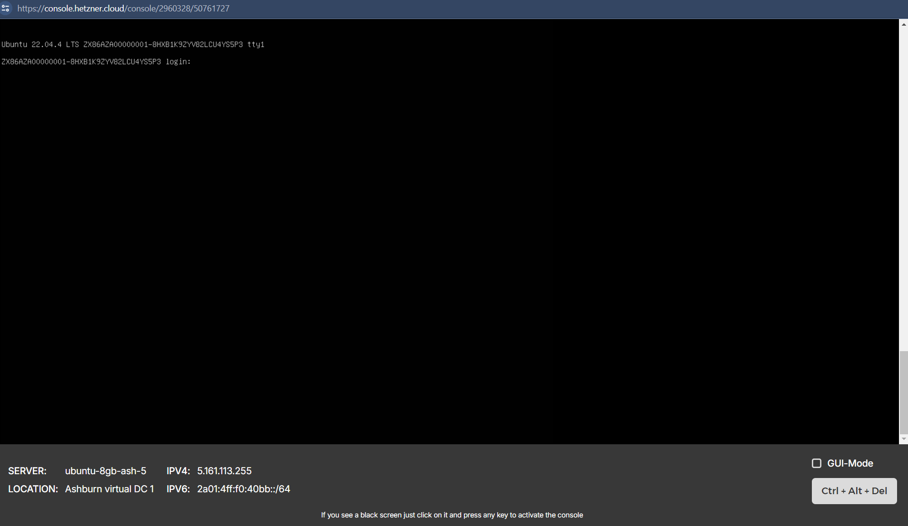

**3. Known Limitations**

While creating the Cloud VM, select the VM type as Dedicated vCPU and the Name CCX13 (2 AMD vCPUs, 8GB RAM)

