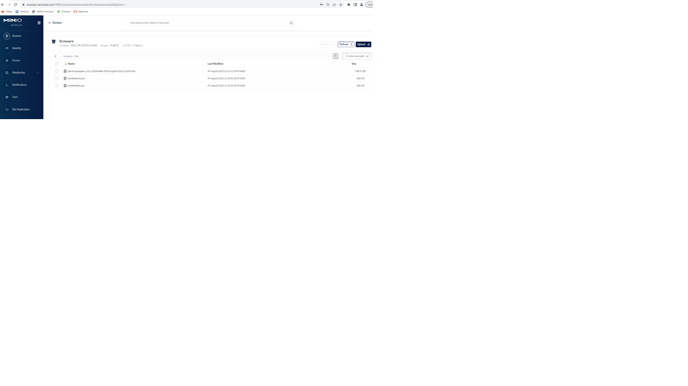
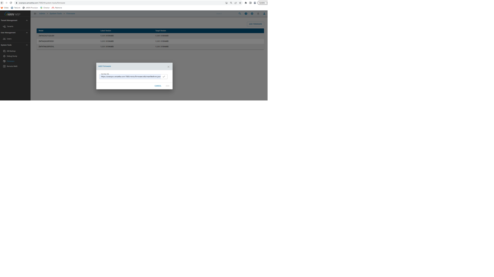
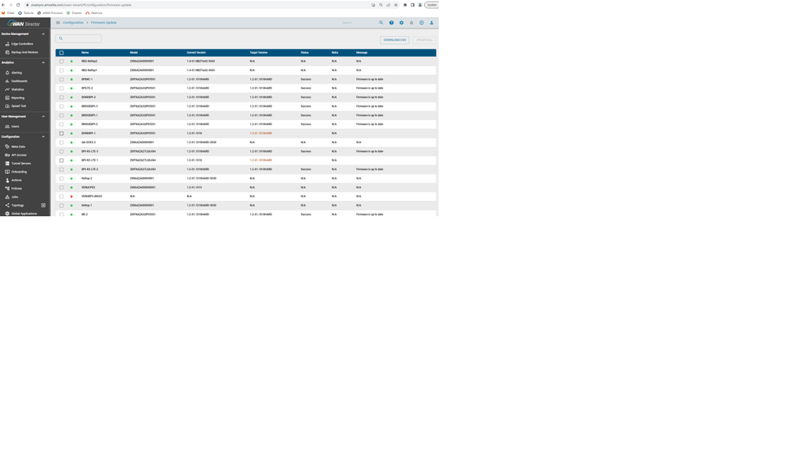

##Process to be followed for firmware patch update from Director[minio]

1.Download the patch file from FTP server and keep it ready in the local machine.

2.Open the minio console of the director and create a bucket named firmware and give public access to it.

**https://zwanpoc.amzetta.com:7080/minioconsole/login

Username: minioadmin

Password: minioadmin**

	    
3.After creating a bucket, create respective platform folder like below.

4.Make the json file ready and upload the josn file and the patch to the respective folder.

   a.Sample json file.
   
**   
{
              "model": "ZKVMAZA00000001",
              "version": "1.2-01.1018HARD-5030",
              "images": [
               
                {
                  "from": "*",
                  "to": "1.2-01.1018HARD-5030",
                  "path": "https://zwanpoc.amzetta.com:7080/minio/firmware/x86/cpe-fw-package-1.2-01.1018HARD-5030-Aug04-2023-161053.bin"
                }
              ]
    }**

            
Here path is the URL where the image we want to download.

5.Once this process is completed login director msp login.

**https://zwanpoc.amzetta.com:7080/#/system-tools/firmware

Username: admin@zwan-msp.com

Password: zWAN@teamw0rk**

6.Go to the firmware section and click add firmware.

7.Give the manifest URL from where the josn file needs to be downloaded.

https://zwanpoc.amzetta.com:7080/minio/firmware/x86/manifestkvm.json
        

8.Once this process is completed login director tenant login

**https://zwanpoc.amzetta.com/zwan-tenant/#/device-management/edge-controllers/list

Username: admin@zwan-tenant.com

Password: zWAN@teamw0rk**

9.Go to Firmware update page and update the device.

