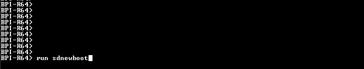
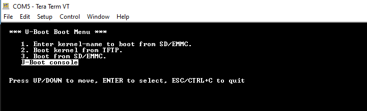
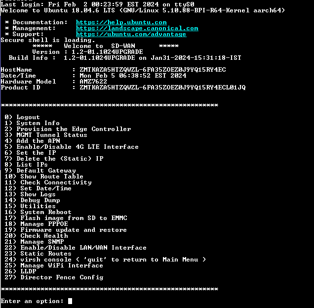

### Flashing Image in BPIR64/AMZ7622/CWAN801 hardware.

Here 2 major steps has been followed to flash the image in a bpir64/amz7622/cwan801 hardware.

**Step 1:**
Flashing the image onto an SD card, which has been copied from the build system.

-   Insert the new sd card into any Ubuntu-based system (flashing machine) using a card reader.

-   Transfer the most recent firmware version of the build image from the build system, residing at (10.200.3.103:/home/qarelease), to the Ubuntu-based flash system.

        **Ex: $ scp flasher.sh build-bpir64-1.2-01.1024-Jan31-2024-132119.bin root@Ubuntu-System-IP:/yourpath/**

-   Once the image has been copied to the specified path, execute the following command.

        **Ex: $ bash -x flasher.sh /dev/sde 0 build-bpir64-1.2-01.1024-Jan31-2024-132119.bin 7456 bpir64**

-   Note: It will take more than one minute to flash the image onto the required SD card. Once the process has been completed.

-   The image is now prepared for flashing onto the BPI-R64 hardware.

**Step 2:**
Writing the image from the SD card to the respective BPI-R64 hardware.

-   Insert the SD card into the corresponding slot on the BPI-R64 hardware.

-   Power on the BPI-R64 board and access the U-Boot console by selecting it from the menu list.

-   Once the U-Boot shell is active, execute the following command:

        Ex: run sdnewboot

    
-   This command initiates the boot process from the SD card image.

-   Upon successful booting, you will be prompted for amz_secureshell. Select option 17 and type (y/yes) to write the SD image to the eMMC memory on the BPI-R64 hardware.

-   The process of writing the image from the SD card to eMMC memory typically takes about a minute.

        Note: A reboot is recommended after the successful completion of the SD to eMMC flashing operation.
