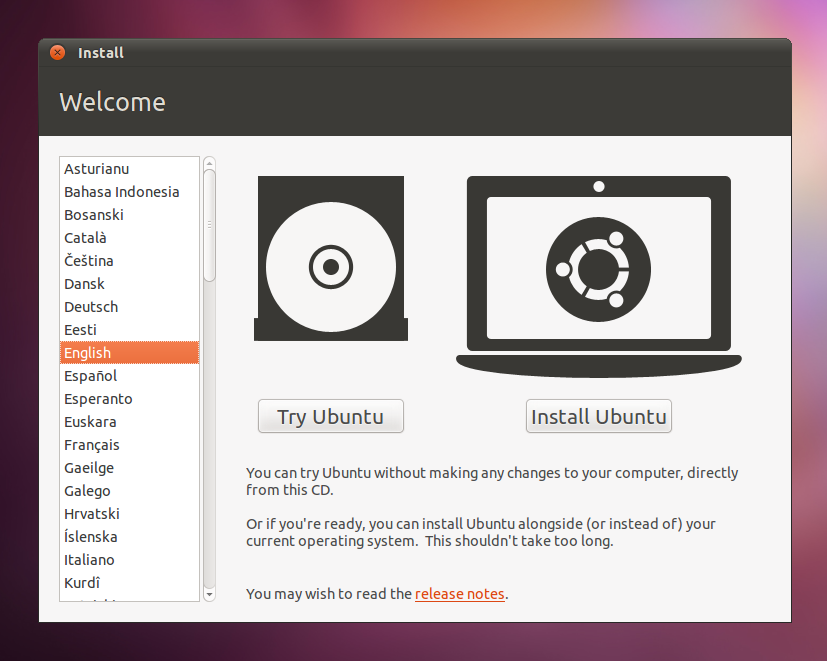
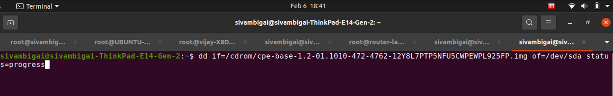

### Flashing Image in x86 physical hardware.

Here 2 major steps has been followed to flash the image in a x86 hardware.

**Step 1:**
Generate the raw image from the cpe-base-1.2-01.1024-5280.qcow2.xz image.

-   Transfer the necessary image from the specified source path to the designated location on the flash machine.

        **Ex: scp vcpe_qcow2_to_x86_verboot_raw_img.sh cpe-base-1.2-01.1010-4728.qcow2.xz  root@root@Ubuntu-System-IP:/yourpath/**

-   Unpack the specified image (e.g., cpe-base-1.2-01.1010-4728.qcow2.xz) using the provided script (e.g., vcpe_qcow2_to_x86_verboot_raw_img.sh) through the following command.

        **Ex: bash -x vcpe_qcow2_to_x86_verboot_raw_img.sh cpe-base-1.0-12.1064-3724.qcow2.xz**
        
        Note: This command extracts the specified file and converts it to an img file (e.g., cpe-base-1.2-01.1010-472-4762-12Y8L7PTP5NFU5CWPEWPL925FP.img), with a size of 20 GB.

-   After the process is complete, transfer the image file to the USB drive. 

        Note that the USB drive must have an Ubuntu 18.04.06 ISO-based image. This transfer can be done using WinSCP.

**Step 2:**
Writing the image from the pendrive to the respective x86 physical hardware.

-   Insert the USB drive into the x86 hardware where the image needs to be installed, then power on the device.

-   Modify the boot sequence in the BIOS console to prioritize the USB drive. Proceed to boot the device by selecting the "Try Ubuntu" installation option.

-   Grant root user permissions by executing the command "sudo su" to facilitate writing the image onto the x86 hardware.

        **Ex: sudo su**

-   Execute this command:

        **dd if=/cdrom/cpe-base-1.2-01.1010-472-4762-12Y8L7PTP5NFU5CWPEWPL925FP.img of=/dev/sda status=progress**

-    Once the writing process is complete, revert to the BIOS menu and adjust the boot order to prioritize the hard disk.

### METHOD 2

-   Transfer the necessary image and script file from the specified source path to the designated location on the your usb pendrive.

    **Ex: scp vcpe_qcow2_to_x86_verboot_raw_img.sh cpe-base-1.2-01.1010-4728.qcow2.xz  /yourusb/**
    
    Note that the USB drive must have an Ubuntu 18.04.06 ISO-based image. This transfer can be done using WinSCP.

-   Insert the USB drive into the x86 hardware where the image needs to be installed, then power on the device.

-   Modify the boot sequence in the BIOS console to prioritize the USB drive. Proceed to boot the device by selecting the "Try Ubuntu" installation option.

-   Grant root user permissions by executing the command "sudo su" to facilitate writing the image onto the x86 hardware.

        **Ex: sudo su**

-   Execute this command:

        **cd /cdrom/**
        **bash -x vcpe_qcow2_to_x86_verboot_raw_img.sh cpe-base-1.2-01.1010-4728.qcow2.xz /dev/sda hardwareModel**
        
        Note: The command line arguments are optional, but mentioning the hard disk is mandatory.
        
        Arg1 - qcow2 file name (Example: cpe-base-1.2-01.1010-4728.qcow2.xz)
        Arg2 - hard disk (Example: /dev/sda..)
        Arg3 - hardwareModel (Your own hardware model)
        

-    Once the writing process is complete, revert to the BIOS menu and adjust the boot order to prioritize the hard disk.