# zWAN Dashboards and Reports
At the heart of any reasonably sized network, should be a solid strategy around flow collection, querying and visualization. Proper use of flow logs is crucial to SecOps/NetOps from triaging attacks to capacity planning and traffic trending. 
zWAN dashboards and reports provide a complete view of the network flows and threats. zWAN displays the flow and log statistics information at two levels, Provider level and Edge Controller level.

## Provider level charts
Dashboard provides network flow data collection in the visualization format. Two types of dashboards are present one is Provider level and another one is Edge controller level. 
Provider level dashboards represents the detailed information of all the EC's and Edge controller level provides the details of single EC netflow details.

### Overview

The Overview dashboard provides a comprehensive hierarchical perspective of WAN, LAN, Tunnel, Client, and Application-level usages, including bandwidth details. It also offers a network overview of client-server interactions.

- Edge Controller - bandwidth
- Client/LAN PC bandwidth
- Network Overview

The Edge Controller and Client/LAN PC bandwidth dashboards include metrics and time-series visuals for their respective datasets.

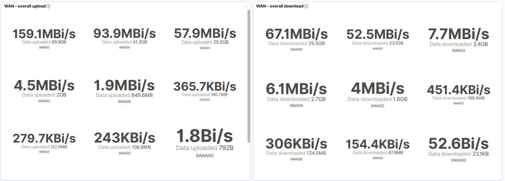
    
Figure 1.0: WAN upload and download mestrics.

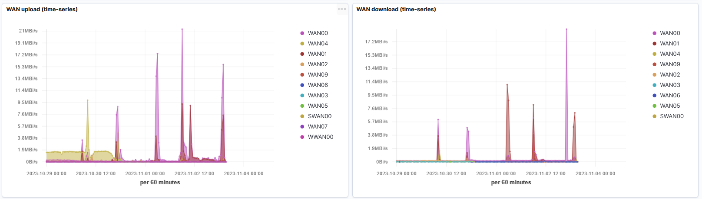
    
Figure 1.1: WAN upload and download timeseries.

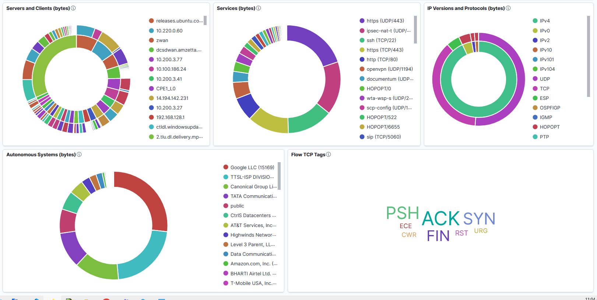
    
Figure 1.2: Network Overview.

### Top Apps/Domain
Its function is to show the top 'n', in our case top 100, active Application domain , services and applications accessed across the server and client and display the data transfer in the form of Bytes presentations.

The dashboard consists of following  dashboards: 
- App/Domain View
- App/Protocol View
- Client/LAN PC View
- Services
- Ingress (Downloads) 
- Egress (Uploads)

#### App/Domain View

The application's name is determined by its domain name, and this information is utilized in the visuals. These visuals provide detailed information about the application, including the bytes and packets used over time. They are organized based on usage, including client and server details. Additionally, the visuals illustrate the bandwidth of the application over time.

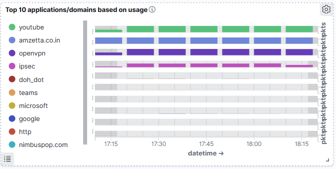
    
Figure 2.0: Top 10 Application/domain

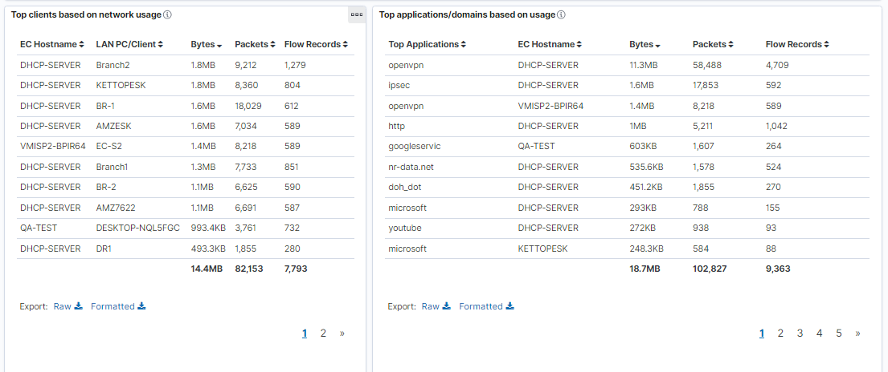
    
Figure 2.1: Application usage over Client/LAN PC and CPE.

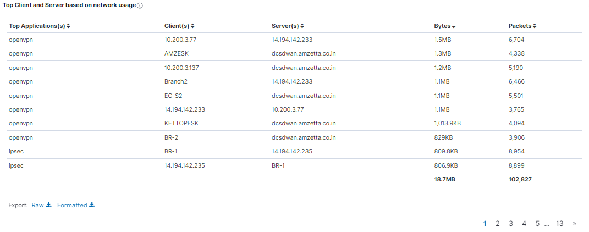
    
Figure 2.2: Application Client and Server usage.

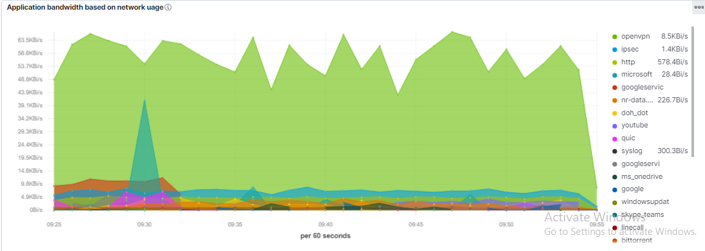
    
Figure 2.3: Application bandwidth.

#### App/Protocol View

The visuals in the dashboard are built around the application name and its corresponding dataset. These visuals closely resemble the App/Domain View, but the dataset is focused on the protocol level.

#### Client/LAN PC View

The Client/LAN PC View dashboard provides detailed information on Client/LAN PC, including ingress and egress network traffic, application utilization, and the flow of data between the client and the server.

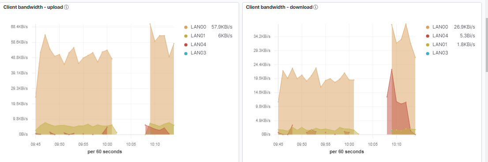
    
Figure 2.4: Application bandwidth.

#### Services

Visualize the clients and server details for each service and application and its data transfer in bytes, packets and number of flow records.

#### Ingress (Downloads) 

The application over ingress traffic is identified by the Fully Qualified Domain Name (FQDN), and the visuals provide detailed information on the FQDN dataset. The applications (FQDN names) are categorized into productivity, social, chat, internet_telecom, etc. The visuals also depict the client-server relationships and the byte and packet usage for each applications(FQDN names). 

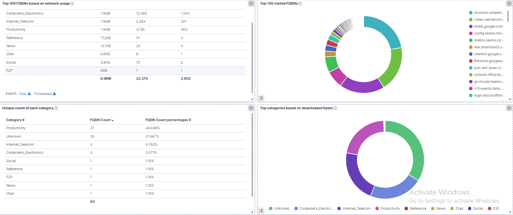
    
Figure 3.0: Ingress visuals .

#### Egress (Upload)

The Egress (Upload) dashboard depicts the visuals in the Ingress dashboard, whleconstructing visuals based on Egress traffic for each Application (FQDN name).

### Threats
This dashboard includes a dictionary of public IP addresses that are known to have a poor reputation. This dictionary is built from many OSINT data sources, normalized to a common taxonomy. The Threats dashboard uses this IP reputation information to highlight three threat/risk types.

- <u> IP Reputations </u> - Number of flows with reputation
- <u> Public Threats </u> - Public clients with a poor IP reputation are reaching private addresses.
- <u> At-Risk Servers </u> - Private Servers that are being reached by clients with a poor IP reputation.
- <u> High-Risk Clients </u> - Private clients that are accessing public servers which have a poor reputation.

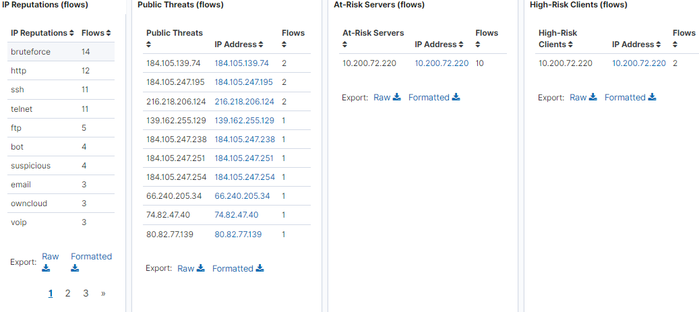
    
Figure 1.3: Threats.

### Geo IP
Geo Location dashboards for Client/Server and Source/Destination perspectives for network flows. It displays the location derived from the IP address of the client, server, source or destination. This service requires internet as it displays the layers of maps by querying the data from the ElasticSearch map engine.

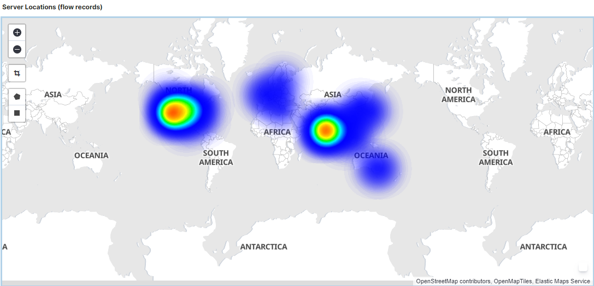
    
Figure 1.4: Geo IP Location in Server

### Traffic Details
Provides more detailed breakdown of various network traffic characteristics. Additionally, it has Servers, Clients, services, and application-based traffic details.

Each traffic details category  contains total counts, and network flows in bits/s and packets/s in the form of table, pie chart and time series.

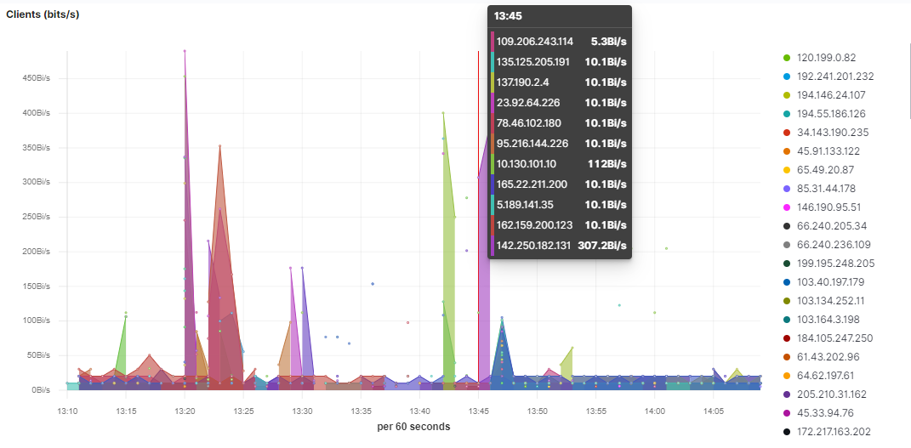
    
Figure 1.5: Traffic details in client[bits/s]

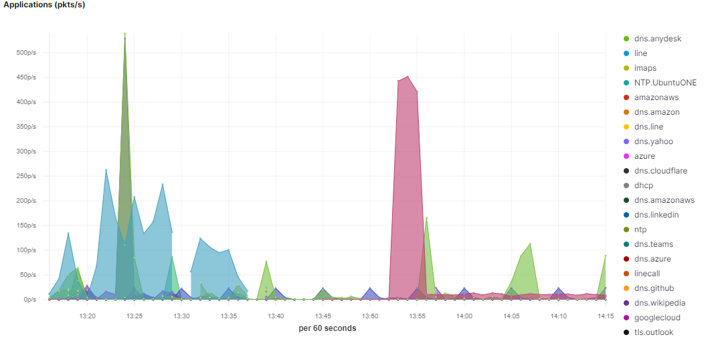
    
Figure 1.6: Traffic details in application[pkts/s]

### Flow Records
Provides a peek into the total flows and several types of flows with a list of service logs. This will be client/server based or source/destination-based logs.

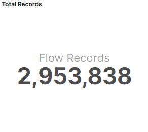
    
Figure 1.7: Total flow records for Netflow

### Bandwidth:
Visualize the traffic details across WAN and tunnel interfaces in bits/sec for both transmitted and received data. It also displays the applications accessed this interface. 

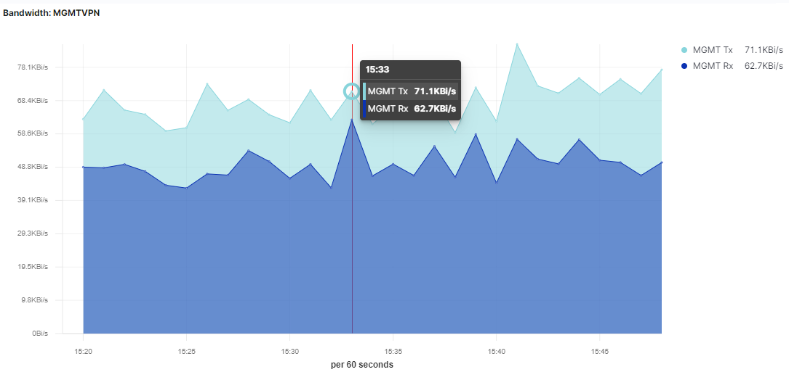
    
Figure 1.8: WAN and Tunnel interface traffic

### Statistics
 Provides network statistics in the form of transmitted/received data, transmitted/received packets, transmitted/received errors for each of the interface in the network. 
 
 Additionally, events, syslog, dc monitor logs and global apps are also listed. The dashboard can be filtered based on selection of the edge controller(EC) list. If EC is not selected, then it displays overall data across all the ECs

 - <u> Overall </u> - Visualizes the data across all the edge controller's for data, packets, errors, logs and global application.
- <u> Edge Controller </u> - Default display the overall data across the EC's. when we select edge controller will display the single EC's details which shows data, packets, errors, link status, dc monitor, flow exporters, signal quality and global application.  
  
## Edge controller level charts  
In addition to the charts mentioned above there are few more dashboards, which are available for edge controller only.  

### Overview, System, Interfaces  

In addition to the CPU and memory utilization statistics for each edge controller this dashboard also displays the total data , packets and errors for each interface.
  
<u> CPU Utilization: </u>
 Defines the CPU utilization of single edge controller across the time range for all the categories like user, system, nice, wait, hard irq, soft irq and steal.

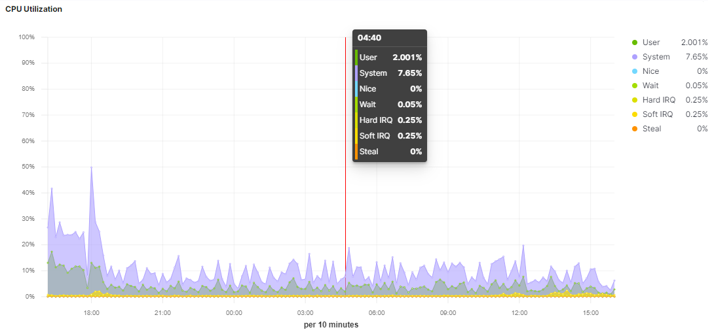
    
Figure 2.0: WAN and Tunnel interface traffic

<u> Memory Utilization: </u>
 Visualizes memory utilization as a gauge type. 

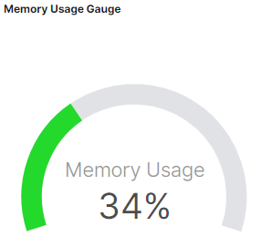
    
Figure 2.1: WAN and Tunnel interface traffic

<u> Total Data: </u>
Tabulates the details of transmitted and received data across all the interfaces in bytes. 

    
Figure 2.2: Total data for interfaces in bytes

<u>Client overview: </u>
Gives the client/LANPC overview from the edgecontroller perspective
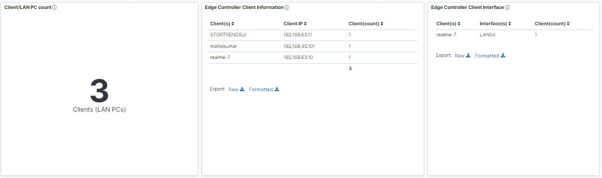
    
Figure 2.3: Total data for interfaces in bytes

<u> Total Packets: </u>
Tabulates the details of transmitted and received packets across all the interfaces.

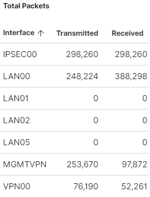
    
Figure 2.4: Total packets for interfaces in packets

<u> Total Errors: </u>
Tabulates the details of transmitted and received errors across all the interfaces.

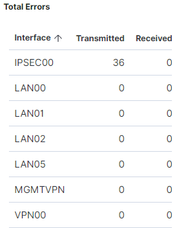
    
Figure 2.5: Total errors for interfaces in number.

<u> Logs and Events: </u>
: <u> Syslog: </u> Display the system related logs for single edge controller.

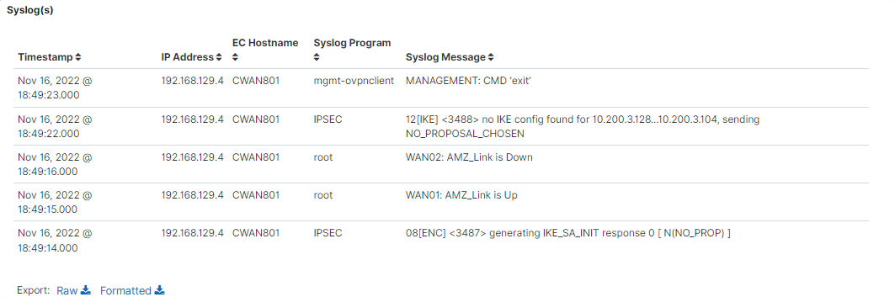
    
Figure 2.6: syslog

* <u> Event Logs: </u> Tabulates the event logs like autoflow controller, net balancer and system events.
  
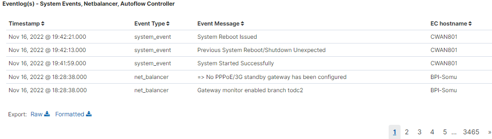
    
Figure 2.7: Event Logs

### Flows
Client/server flows which displays network statistics in bytes for each flow between client and server. 
AS Flow which displays the autonomous system flows between the source and the destination. 

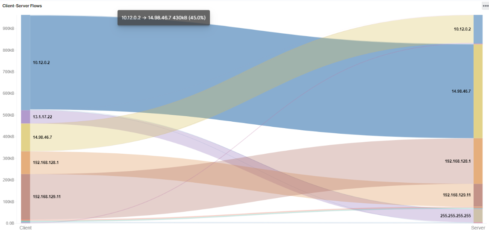
    
Figure 2.8: WAN and Tunnel interface traffic

### AS Traffic
Provides a view of traffic to and from Autonomous Systems (public IP ranges).

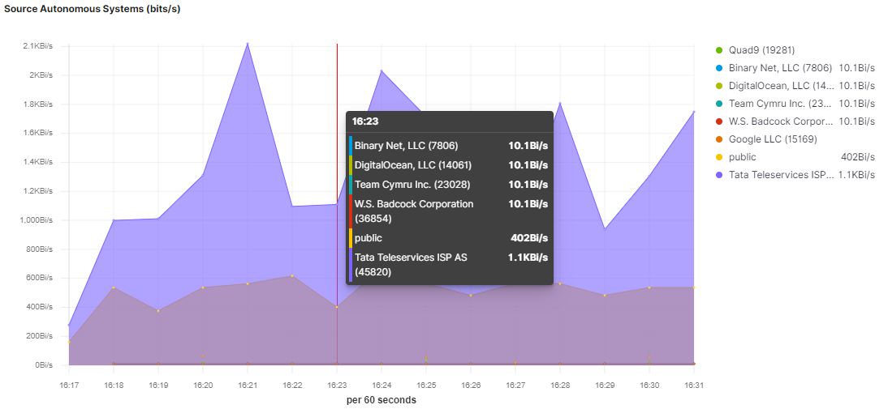
    
Figure 2.9: WAN and Tunnel interface traffic

### Flow Exporters 
Provides egress and ingress data in bytes for each interface in the edge controller 

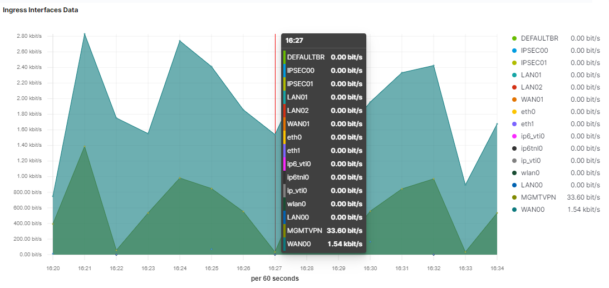
    
Figure 2.10: Ingress traffic

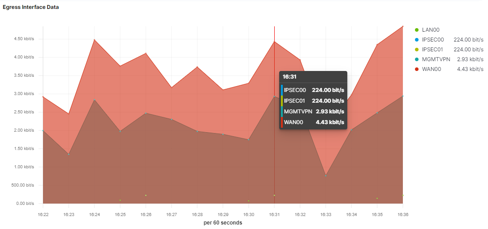
    
Figure 2.11: Egress traffic

### Global Applications
Provides application-based statistics like top applications and usage in bits per second and packets per second. Statistics will be listed only if Global application is configured in the zWAN provider UI.

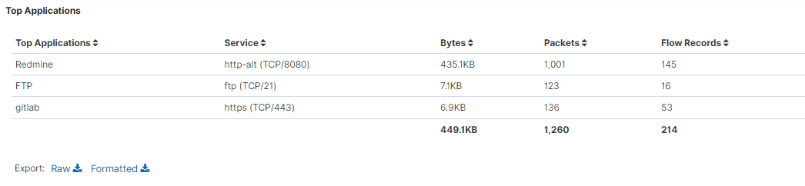
    
Figure 2.12: Global application

### Link Status
Provides the up time and status for each network interface in the edge controller.

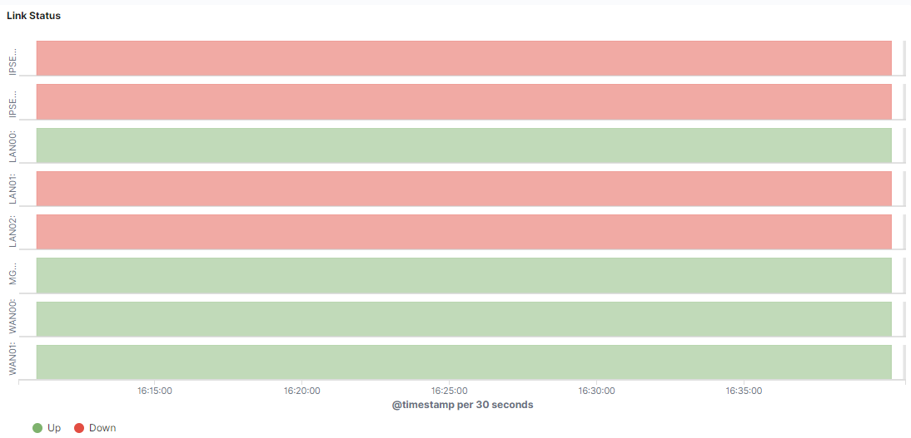
    
Figure 2.13: WAN and Tunnel interface traffic

### Signal Quality
If the edge controller is equipped with a GSM/LTE module then the RSSI (Received Signal Strength Indicator), SNR (Signal to noise ratio), RSRQ (quality of the received signal) and RSRP (average power received from a single Reference signal) statistics will be provided in this dashboard.

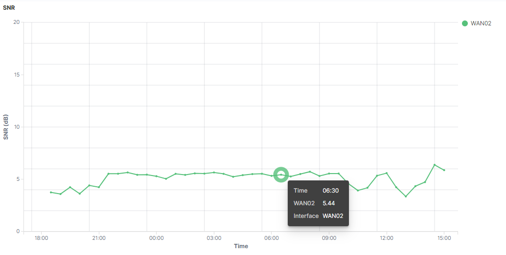
    
Figure 2.14: Signal to noise power ratio in decibel 

### TWAMP
The Two-Way Active Measurement Protocol (TWAMP) is an open protocol for measuring network performance between any two devices in a network that supports the protocols in the TWAMP framework. This dashboard displays the inbound, outbound and roundtrip data based on latency, jitter, and packet loss.  

* <u> Latency: </u>  
  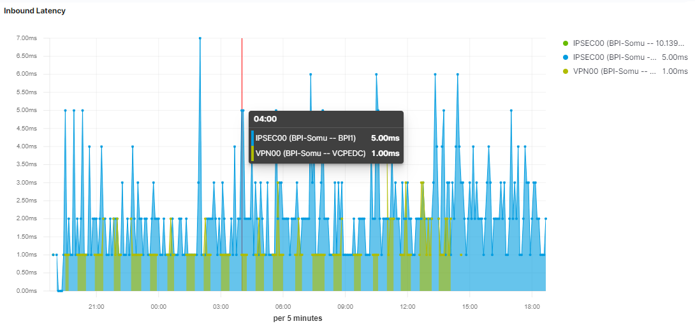  
  
Figure 2.15: Inbound latency in milliseconds
  
* <u> Jitter: </u>  
  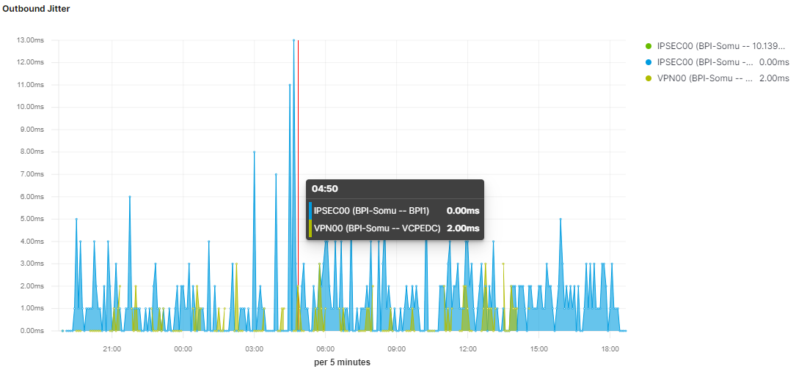  
  
Figure 2.16: Outbound jitter in milliseconds
  
* <u> Packet loss: </u>  
  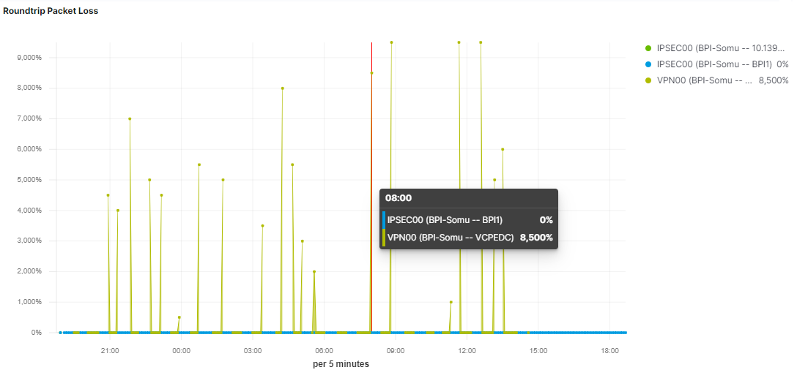  
  
Figure 2.17: Roundtrip packet loss in percentage
  
  
### Logs  
#### Syslogs  
- <u> All Logs </u> - Displays all the system logs.  
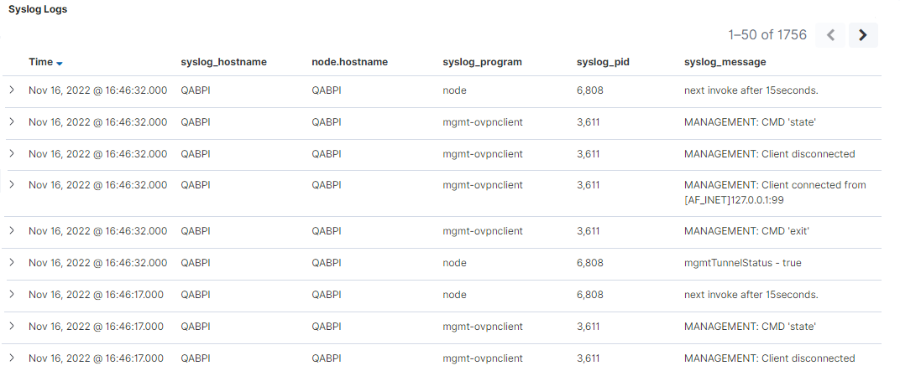    

Figure 3.1: System logs
  
  
- <u> Management </u> -  Tabulates the Management related logs  
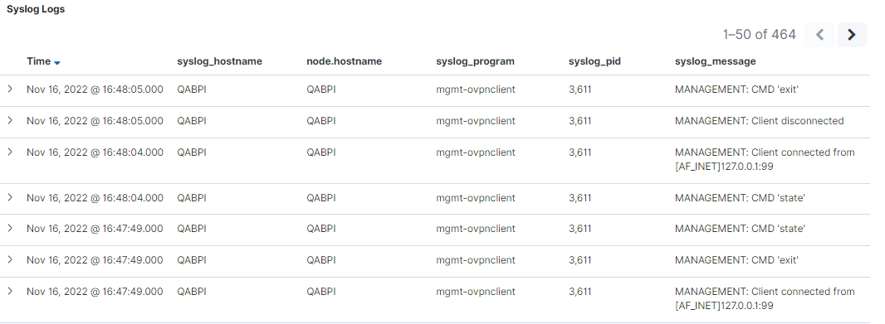  

Figure 3.2: Management logs
  
  
- <u> SSLVPN </u> - Filter and displays all the SSLVPN tunnel logs from syslog.  
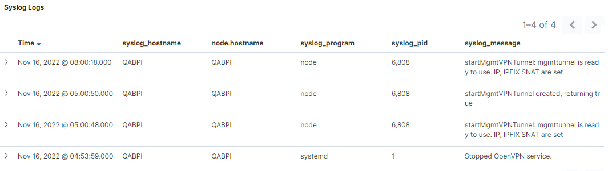  

Figure 3.3: SSLVPN tunnel logs
  
  
- <u> IPSEC </u> -  Displays all the IPSEC tunnel related logs.  
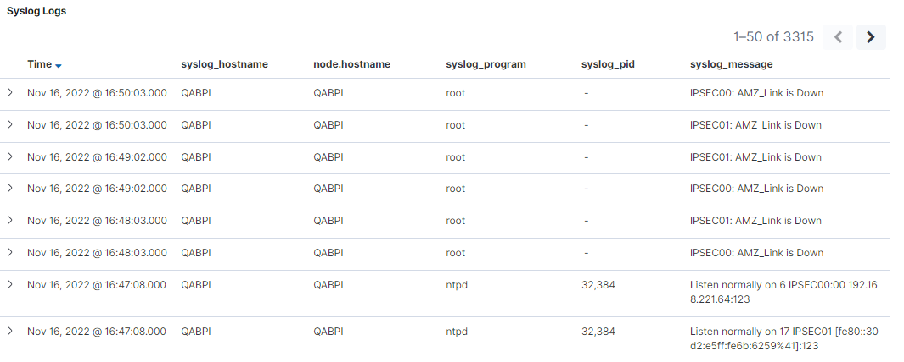  

Figure 3.4: IPSEC tunnel logs
  
  
- <u> LTE </u> - Filter and display the LTE logs from syslog  
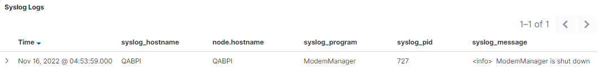  

Figure 3.5: LTE logs 
  
  
- <u> Firmware </u> - Visualize the firmware related logs.  
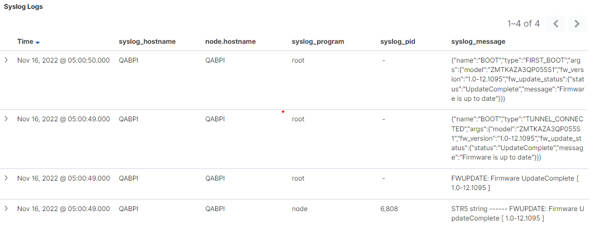  

Figure 3.6: Firmware logs
  
  
- <u> NMAP </u> - Displays the NMAP logs.  
  
  
#### Firewall logs  
Tabulate  the firewall logs  

  

Figure 3.8: Firewall logs
  

#### IPS Alert  
- <u> Alerts by GeoIP </u> – a map showing the distribution of alerts by their country/region of origin based on geographic location (determined by IP address).
- <u> Top Alerts </u> – a summary of the most frequently triggered alerts and their description. Clicking an individual alert filters down the dashboard to the information pertaining to that specific alert.
- <u> Number of Alerts </u> – the total count of alerts triggered by the ruleset.
- Top alerts based on Suricata defined signatures, HTTP, and protocols.
- <u> Top 20 Source/Destination IPs/Ports </u> - pie charts showing the top 20 IPs and ports that alerts were triggered on. You can filter down specific IPs/ports to see how many and what kind of alerts are being triggered.
- Top alerts by TLS certificate issuer distinguish name.
- Top multiple unique alerts by destination IP address.
- Top multiple unique alerts by source IP address.
- Top alerts by TLS Server name indication protocol by which a client indicates which hostname it is attempting to connect to at the start of the handshaking process.
- Alert Summary – a table summarizing specific details of each individual alert. You can customize this table to show other parameters of interest for each alert.

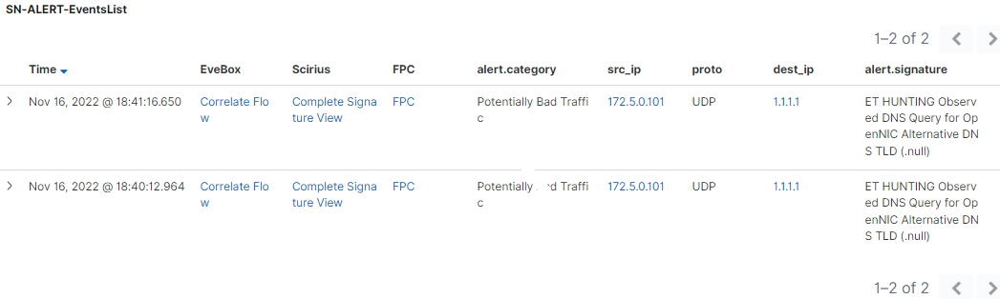  

Figure 3.9: IPS alert logs
  
  
### IPS Flow  
Provides count of flows for various protocols used by the application. It also displays a unique count of source and destination IP addresses, mean flow age and a list of flow events.  
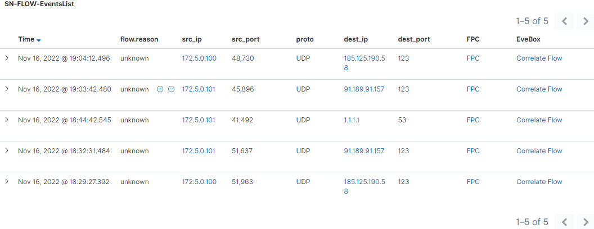  

Figure 3.10: IPS flow logs
  
  
### DNS Alert
Displays various statistics for DNS alerts generated via “Unbound DNS Resolver” in the edge controller. Statistics like overall log count, log count based on return code and event list is provided.  