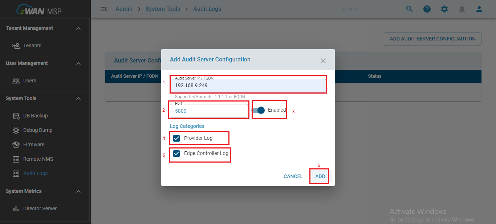

# Configuring Audit logs in the MSP page

- Step 1: Login to the MSP UI page. To configure the Audit-logs.

- Step 2: Select the Audit-logs under the System Tools. In the Audit Logs page select the “ADD AUDIT SERVER CONFIGURATION”.

Figure 1: navigation to Audit Logs in MSP 

 

- Step 3: Add Audit Server Configuration page pops up. Enter the required value in each field  and select ADD (Follow the actions in the screenshot provided)

            Audit Server IP / FQDN    -   192.168.9.249
            Port                      -   5000

Figure 2: Configuring Audit logs in MSP 

 

- Step 4: Login to the director UI to validate the Audit Logs. Follow figure 3 to view the Audit Logs dashboard.  

Figure 3: Audit logs dashboard under Analytics 

 