# CPE Backup and Restore

**Overview**

This feature allow the user to create CPE Back up and Restore.

1. Configuration
2. Backup
3. Restore

**Configure SFTP Server**

1. Login to Director page with the URL https://xxxxx/zwan-tenant with the default credentials admin@zwan-tenant.com
zWAN@teamw0rk

2. Go to Backup and Restore page.

3. Click add SFTP server

4. Give the valid host, port number, path, username, password and add it.

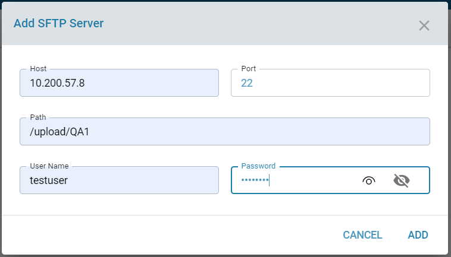

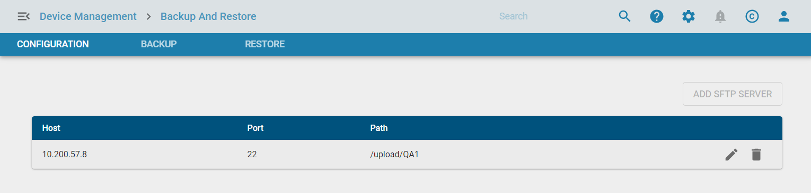

**Modify SFTP Server**
1. Click edit icon to modify sftp server details

2. Modify the values and update it.

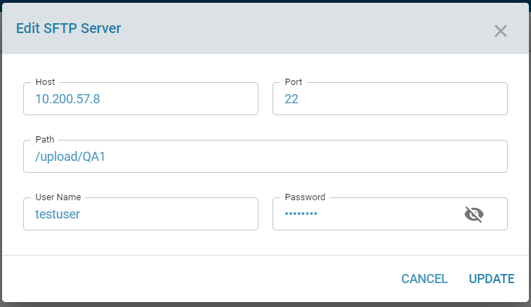

**Delete SFTP Server**

1. Click delete icon and enter DELETE in the confirmation box to delete SFTP details

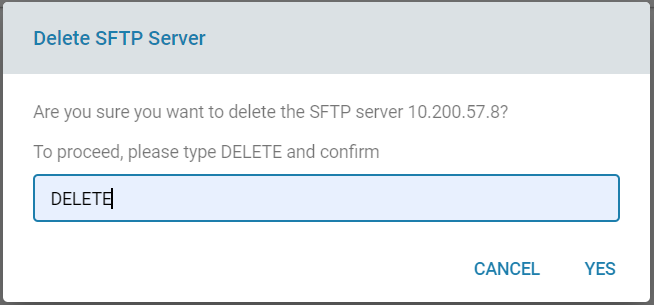

**Backup Configuration**

1. Click Backup configuration under Backup, give the backup name, description, select all edge controllers /groups and add it

Backup Configuration for Edge controllers

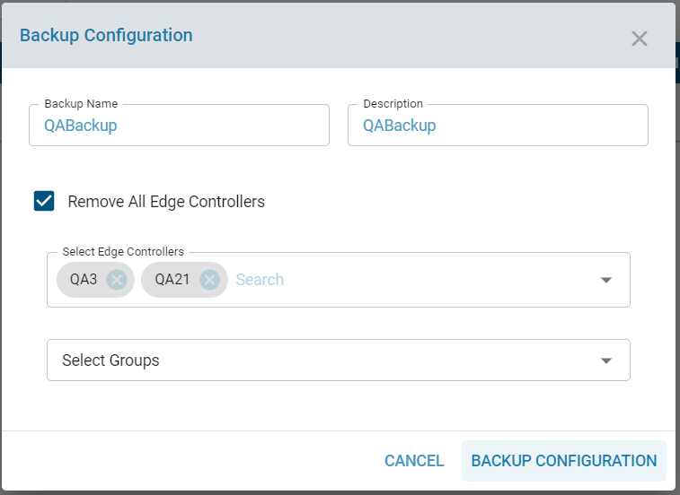

Backup configuration for Group

2. Click the eye icon to check the backup status

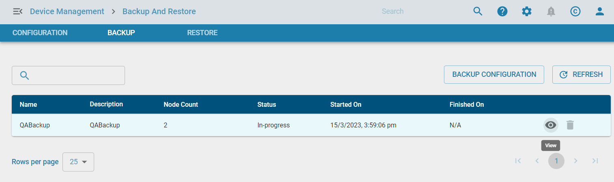

Backup is in progress

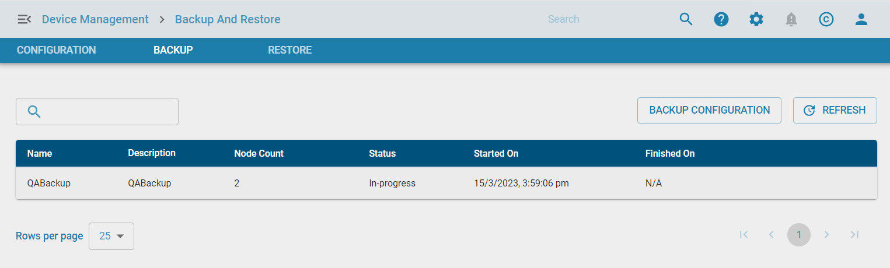

3. Click refresh button to update the staus

Backup list with status

4. Modify SFTP server with invalid details to verify the failure of Backup.

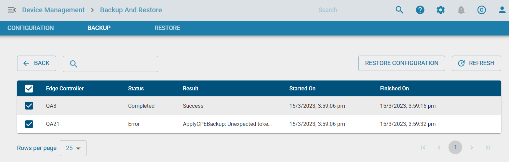

5. Modify SFTP server with valid details and click the retry icon to retry the failed backup

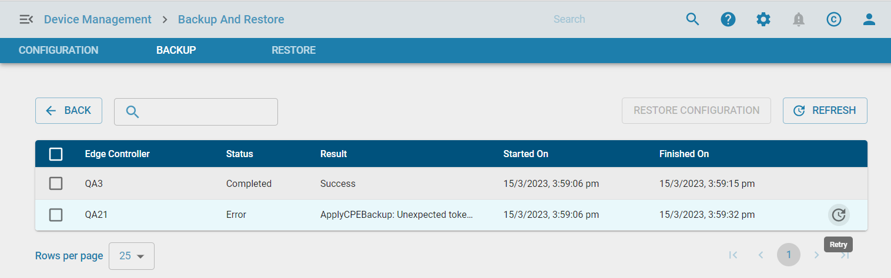

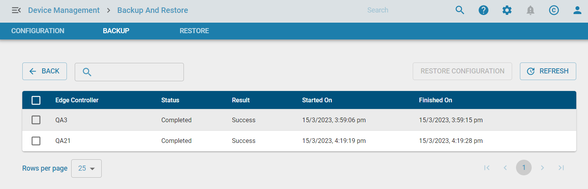

**Delete Backup**

5. Click the delete icon to delete the backup.

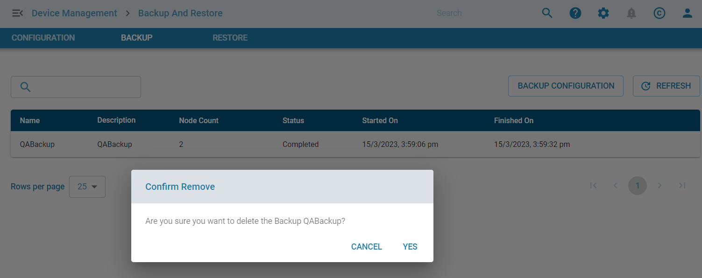

**Restore**

1. Go to Backup list page

2. Select the single or mutliple edge controllers, and click restore restore configuration.

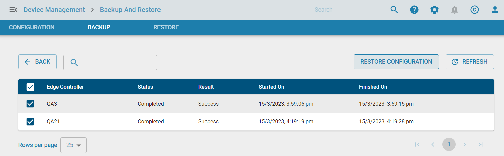

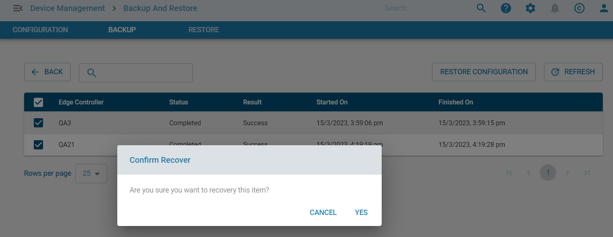

3. Go to Restore page and check the restore status

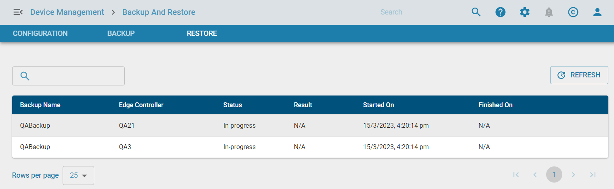

4. Click refresh icon to check the current status

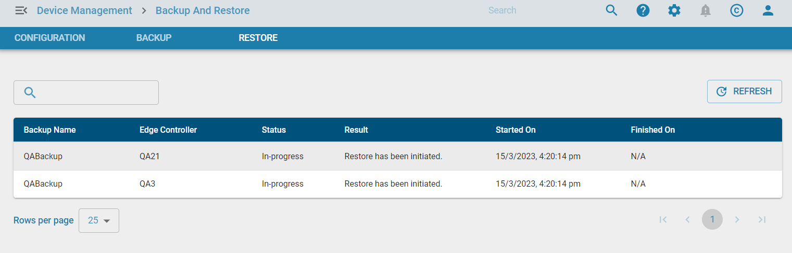

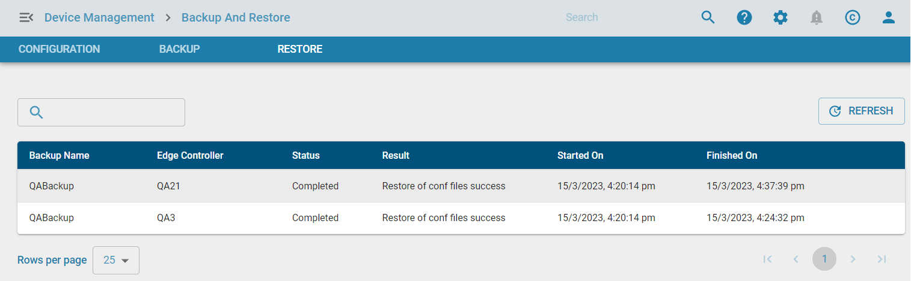

4. Modify the SFTP server with invalid details to verify failure of Restore

5. Modify the SFTP server with valid values and click retry icon to retry Restore configuration.

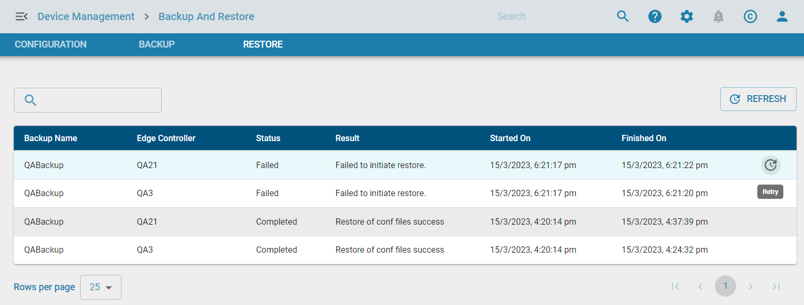

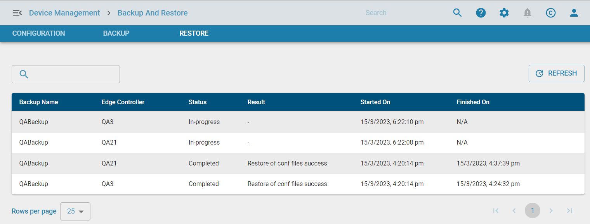

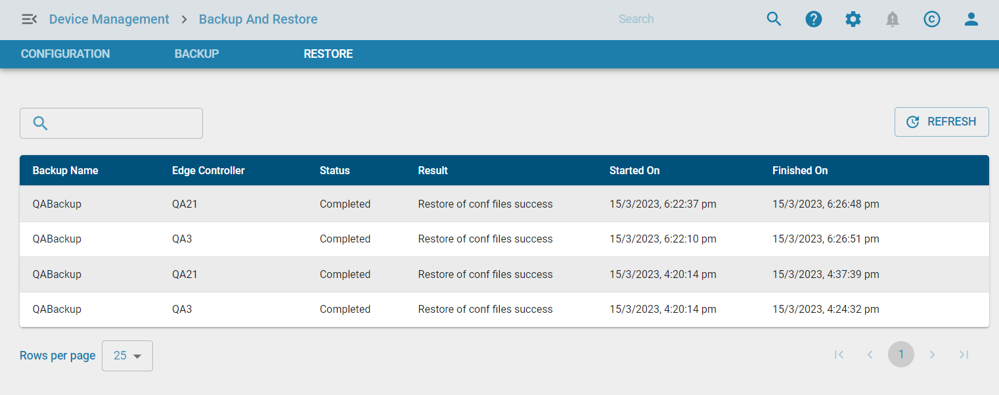

