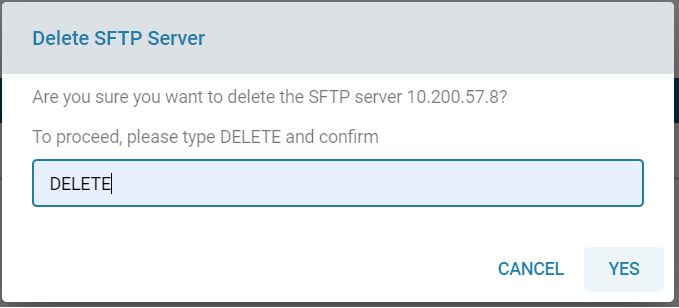
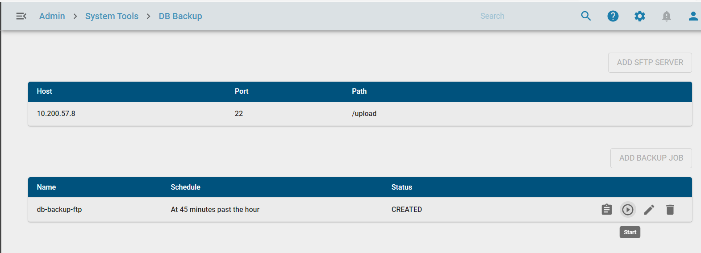
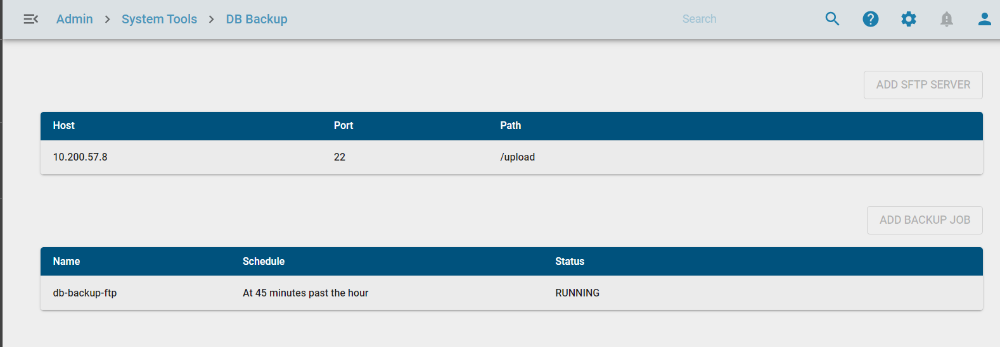

# DB Backup and Restore

**Overview**

This feature allow the admin to create DB Back up for Director and Restore.

1. Configure SFTP Server
2. Add Backup
3. Start Backup
4. Restore from Backup

**Confifgure SFTP Server**

1. Login to MSP page with the URL https://xxxxx:7080 with admin@zwan-msp.com
zWAN@teamw0rk
2. Go to DB Backup page.
3. Click add SFTP server
4. Give the valid host, port number, path, username, password and add it.

**Modify SFTP Server**
1. Click edit icon to modify sftp server details
2. Modify the values and update it.

**Delete SFTP Server**
1. Click delete icon and enter DELETE in the confirmation box to delete SFTP details

**Add Backup**

1. Click Add Backup JOB, select the schedule Hourly/ Daily/ custom cron expression and add it

2. Click the start icon to start it

3. Click the logs to verify the backup status

4. Once backup done check the backup file in SFTP location.

5. Click the stop icon to stop it.

**Edit Backup**

6. Click the edit icon to modify the backup job

**Delete Backup**

7. Click the delete icon to delete it.

**Restore Backup**

1. Deploy standalone or HA Director with External fqdn

2. Manage the BPI's with Director

3. Do Backup as mentioned previously

4. Go to deployment location in controller host machine 

5. Modify SFTP server details and location in restore.yml located in /deployment/setup$

6. execute the command 
**./setup standalone restore** for standalone and **./setup.sh restore** for HA setup.

**Note**

1. Deployemnt should be done with external IP (fqdn)

2. BPI should be managed with external IP (fqdn)

3. Host entry needs to be added in /etc/hosts in k3sVM and BPI if external fqdn is not a public one.
