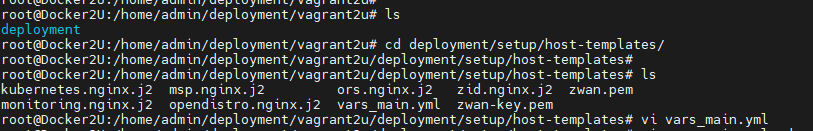
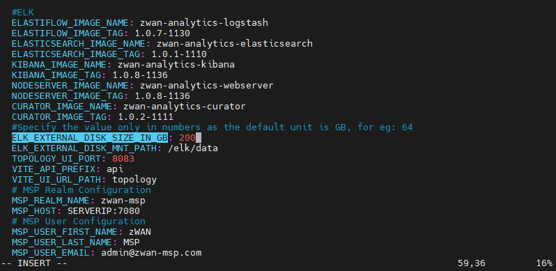

# Specifying ELK External disk space during fresh deployment 

The external ELK disk space is used to create a separate memory partition in the ELK VM therefore the user can specify the required amount of disk space based on the host disk size during a fresh deployment.

    NOTE:
        * External ELK disk space can be specified only during the fresh  deployment and not during updates.
        * The minimum ELK VM disk size to specify is 200GB
        * The External ELK disk will be mounted under the path /elk/data in the ELK VM.
        * In future on the ELK disk size getting filled follow the "Extending ELK VM disk size" documentation

### Procedure to specify the ELK external disk space during deployment:

- Step 1: Clone the tag 1.1.1-tx from gitlab 

      NOTE: External ELk space feature is applicable from TAG 1.1.1-tx 

- Step 2: After cloning the tag, navigate to vars_main.yml (using the following command)

       cd deployment/setup/host-templates/

Figure 1: navigation to vars_main.yml

 

- Step 3: Open the vars_main.yml file using the preferred editor and search for the string 

       “ELK_EXTERNAL_DISK_SIZE_IN_GB”
    

- Step 4: Specify a numeric value for “ELK_EXTERNAL_DISK_SIZE_IN_GB” and save the file.

Figure 2: Specifying the ELK disk space

 

- Step 5: Do the necessary changes and start  the Cleanup

       ./setup.sh standalone cleanup

- Step 6: After cleanup , proceed with deployment

        ./setup.sh standalone

