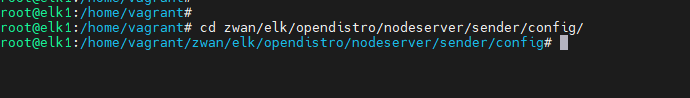
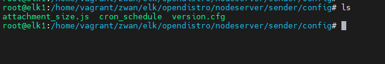

## To change the email attachment size for schedule based report

- Based on the SMTP sender configured, Find the maximum attachment size limit for the sender mail. 

        NOTE: by default the attachment is specified as 23 MB in the attachment_size.js file 

- Login/ssh to the Director and take vagrant ssh for the ELK VM.
- Once logged in ELK VM. Navigate to the attachment_size.js file to specify the email attachment size in MB.   
- Command to navigate attachment_size.js

        cd zwan/elk/opendistro/nodeserver/sender/config/

 

Figure 1: navigation to attachment_size.js

 

- Using the text editor open the attachment_size.js file, enter the email attachment size with less than 3MB  for mailSize in the file . Then save and exit 

        NOTE: 
            
            if the email attachment size is 25MB please specify 22MB in the mailSize

            // size.conf.js
            module.exports = {
            mailSize: 22,
            };

- Need to restart the nodeserver for the value to be updated inside nodeserver container.

        docker  restart nodeserver

- Once nodeserver restarted and nodeserver up configure the schedule report.
