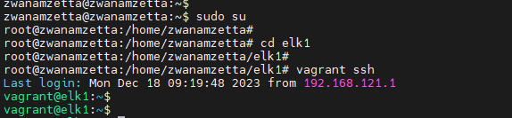

# Extending ELK VM Disk size 

### 1. Identify data disk partiton of ELK VM 

- Identify the ELK VM data Disk partition is under '/' (or) '/elk/data' directories using the following steps:

- Step 1: Take ssh of your director server and connect as root user

- Step 2: Connect to ELK VM from the director host 

        cd elk1
        vagrant ssh

Figure 1: navigation to ELK VM Vagrantfile

 

- Step 3: Once inside the ELK VM use the following command to identify the data partition in the elk VM 

        df -h

   

      NOTE: 
        
        ELK VM data partition may reside in any one of the directories. 
        
                
                /  
                /elk/data    

        If '/elk/data' is present then the data partition will reside in '/elk/data'.

        If '/elk/data' is not present then the data partition is present under '/'

 

Figure 2: ELK VM data partition under '/elk/data'

 

Figure 3: ELK VM data partition under '/ '

 

 | ELK VM data disk partition   |   case/procedure to follow    |
| --------- | -------------------------|
| '/elk/data'   and  vdb1    | case 1                 |
| '/ ' and /dev/mapper/ubuntu--vg-ubuntu--lv |   case 2                    |

## Case : 1 – To Increase the external disk size of '/elk/data' and vdb1 in elk VM follow the bellow procedure: 

- Step 1: Take ssh of your director server and connect as root user

- Step 2: Connect to ELK VM from the director host 

        cd elk1
        vagrant ssh

- Step 3:  Identify the data partition in the ELK VM 

Figure 4: ELK VM data partition under '/elk/data '

 

- Step 4: Give “ exit ” command to comeback to host 

- Step 5: Previously it has 200G , Here adding of 20G

        virsh blockresize elk1 vdb 220G

Figure 5: Resizing from the host

 

       NOTE: To increase the 200GB ELK disk space calculate the size as 124GB + 200GB = 324GB

- Step 6: Login to ELK VM and follow below command:

        sudo su
        cd elk1
        vagrant ssh
        sudo su

- Step 7: Using the following steps the ELK VM disk can be increased

        growpart /dev/vdb 1

Figure 6: Resizing from the ELK VM 

   

- Step 8: Resize the parted vdb1:

        sudo resize2fs /dev/vdb1

- Step 9: Now the external elk data partition is resized successfully.

    To check the size of the external elk data partition :
        
          	df -h

Figure 6: Resized ELK VM 

   

## Case : 2 – To Increase the elk VM mapper partition (/dev/mapper/ubuntu--vg-ubuntu--lv) size follow the bellow procedure: 

- Step 1: Take ssh of your director server and connect as root user

- Step 2: Connect to ELK VM from the director host 

        cd elk1
        vagrant ssh

- Step 3:  Identify the data partition in the ELK VM 

Figure 7: ELK VM data partition under '/ '

 

- Step 4: Give “ exit ” command to comeback to host 

- Step 5: Previously it has 128G , Here increasing the size to 730G

                
        virsh blockresize elk1 vda 730G

Figure 8: Resizing from the host

 

       NOTE: To increase the 200GB ELK disk space calculate the size as 124GB + 200GB = 324GB

- Step 6: Login to ELK VM and follow below command:

        sudo su
        cd elk1
        vagrant ssh
        sudo su

- Step 7: Using the following steps the ELK VM disk can be increased

        growpart /dev/vdb 3

Figure 9: Resizing in ELK VM

 

- Step 8: Extend the lvm using the command:

        lvextend -l +100%FREE /dev/mapper/ubuntu--vg-ubuntu--lv

- Step 9: Resize the mapper using the command:

        resize2fs /dev/mapper/ubuntu--vg-ubuntu--lv

- Step 10: Now the elk VM partition is resized successfully.
      
    To check the size of the external elk data partition :
      	     
        df -h

Figure 10: Resized ELK VM disk

 

