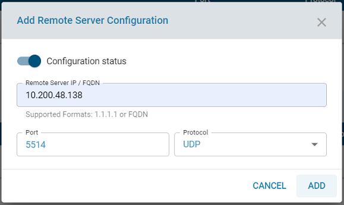
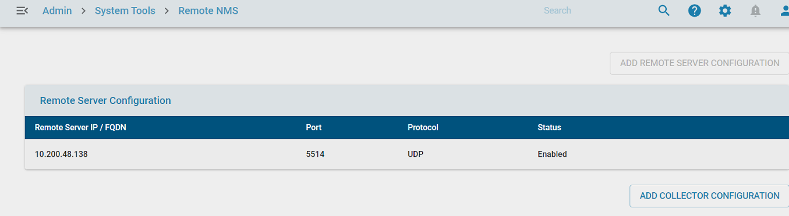
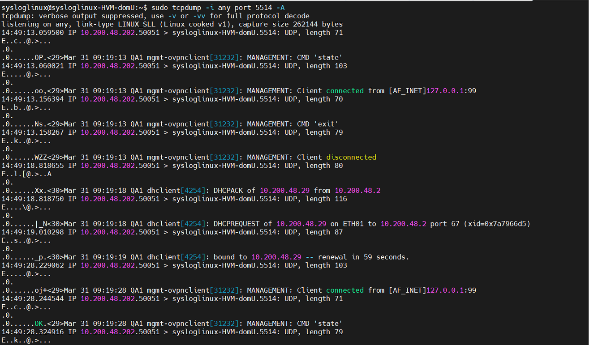
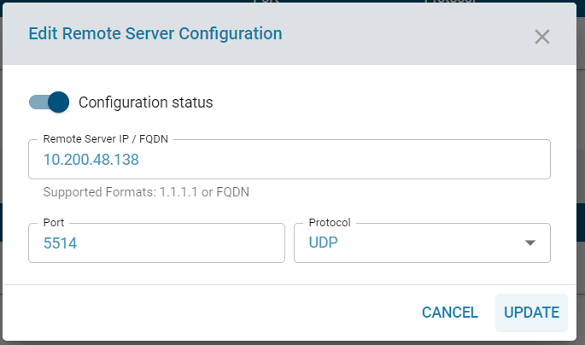
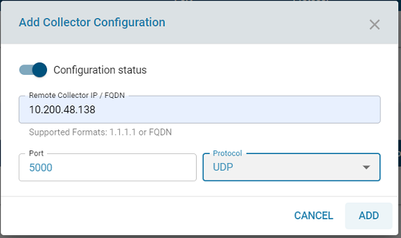
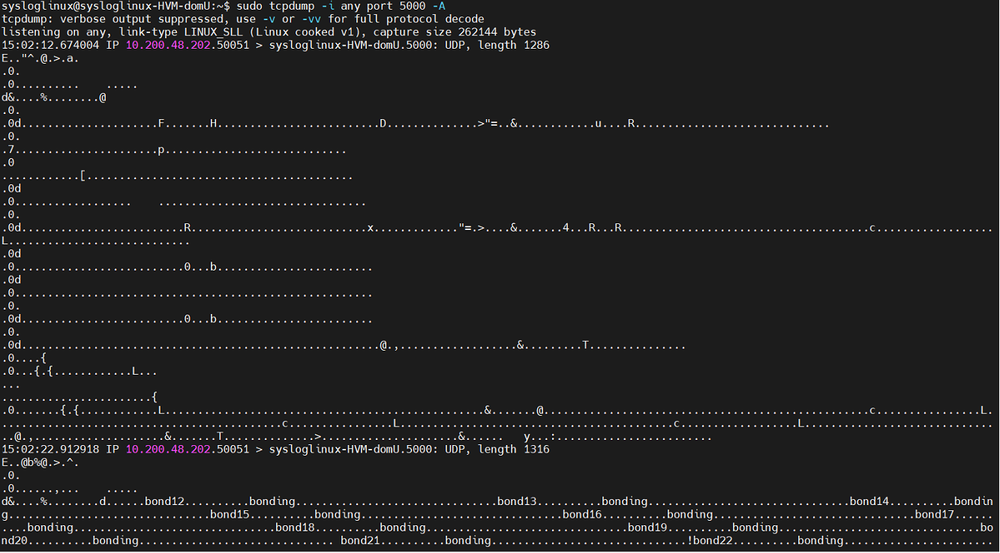
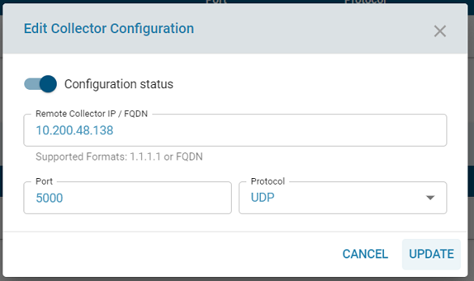

# Remote NMS

**Overview**

This feature allow the user to configure external server to send the RSyslog and IPFIX Netflow events.

1. Remote Server Configuration
2. Collector Configuration

**Prerequisites**
1. RSyslog server or any other server to receive syslog events
2. Server to receive IPFIX Netflow events

**Remote Server Configuration**

**Add Remote Server**

1. Login to MSP page with the URL https://xxxxx:7080/ with the default credentials admin@zwan-msp.com
zWAN@teamw0rk

2. Go to Remote NMS page.

3. Click add Remote Server Configuration.

4. Give the valid Remote Server IP Address host or FQDN name, port number, select protocol TCP or UDP, enable the configuration status and add it.

5. Cross verify the data from remote server by using the below command

**sudo tcpdump -i any port 5514 -A**

**Edit Remote Server**

1. Click edit icon to modify the Remote Server.

2. Modify the valid Remote Server IP Address host or FQDN name, port number, change protocol TCP or UDP, enable/disable the configuration status and update it.

**Delete Remote Server**

1. Click Delete icon to delete the Remote Server.

2. Click yes in the confirmation dialog to delete it.

**Collector Configuration**

**Add Collector Server**

1. Login to MSP page with the URL https://xxxxx:7080/ with the default credentials admin@zwan-msp.com
zWAN@teamw0rk

2. Go to Remote NMS page.

3. Click add Collector Server Configuration.

4. Give the valid Collector Server IP Address host or FQDN name, port number, select protocol TCP or UDP, enable the configuration status and add it.

5. Cross verify the data from  server.

**sudo tcpdump -i any port 5000 -A**

**Edit Collector Server**

1. Click edit icon to modify the Collector Server.

2. Modify the valid Collector Server IP Address host or FQDN name, port number, change protocol TCP or UDP, enable/disable the configuration status and update it.

**Delete Collector Server**

1. Click Delete icon to delete the Collector Server.

2. Click yes in the confirmation dialog to delete it.

