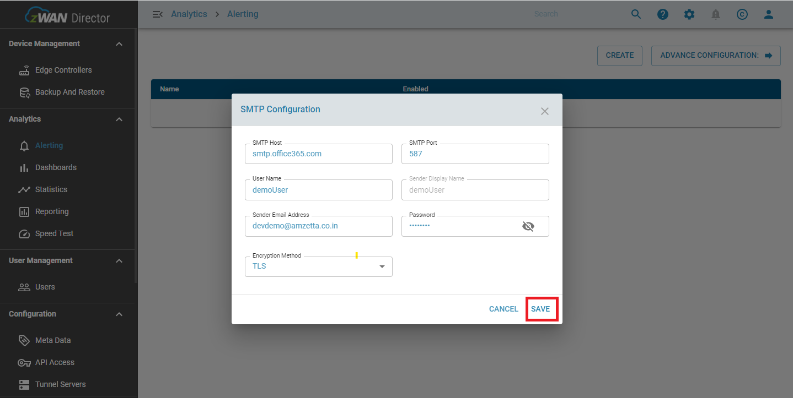

# Schedule Based Report

- Scheduled based reporting, as the name suggests, can automatically generate a report defined by a set schedule.
- The report is generated in the server and sent to configured e-mail addresses as a PDF or CSV attachment. 
- The reports which contains logs are generated in the CSV format and can contain a maximum of 700k logs/entries. The files are then compressed and sent as attachment.

> Note:
> The minimum interval for which the report can be generated is a day. It also supports daily, weekly, and monthly intervals and it does not support hourly, minutely based intervals.

## Reporting categories

We are having 8 different types of reporting categories as explained below;

- System
- Interface
- TWAMP
- Application
- Firewall Log
- Log
- Bandwidth
- Site and Tunnels

### System

Generates system reports for different/group of edge controllers. This includes CPU and memory Utilization and the time series chart for each over a period of time. Measuring the utilization of the hardware resources within each device in your organization is key to evaluate both the efficiency of devices and the impact of resource consumption on end-user experience. Users that perceive their devices as slow usually suffer from scarcity or misuse of two basic system resources: main memory and CPU processing power.

### Interface

Generate the Tx/Rx Bytes report to view the number of bytes and packets that have been sent and received through the interface and also define the status of the interface, either up or down. The data is collected for all the network interfaces in the edge controller and displayed in separate charts which are "bytes" and "packets" specific.

### TWAMP

The Two-Way Active Measurement Protocol (TWAMP) is used to measure network performance parameters such as latency, bandwidth, and packet loss by sending probe packets and measuring their experience in the network.

| Terms       | Definitions                                                                                                                                                                                                                                                         |
| ----------- | ------------------------------------------------------------------------------------------------------------------------------------------------------------------------------------------------------------------------------------------------------------------- |
| Latency     | Latency is a measure of delay. In a network, latency measures the time it takes for some data to get to its destination across the network. It is usually measured as a round trip delay - the time taken for information to get to its destination and back again. |
| Jitter      | Network jitter is congestion generated by millions of internet connections.                                                                                                                                                                                         |
| Packet Loss | When accessing the internet or any network, small units of data called packets are sent and received. When one or more of these packets fails to reach their intended destination, this is called packet loss.                                                      |

### Application

Defines two types of application

- **Custom Business Application** - Add a specific application under the global application menu and analyze the data transfer details between sender and receiver.
- **ISP Application** - Defines the traffic details of all the applications running through the internet service provider cable.

### Firewall Log

Firewall logs contain Interface Status, Firewall log, and Event log.
| Terms | Definitions |
| ------ | ------ |
| Link Status | Link status defines the health conditions of the network interfaces. |
| Firewall Log | Firewall is a network security device that monitors incoming and outgoing network traffic and decides whether to allow or block specific traffic based on a defined set of security rules. The network traffic rules supported in zWAN is input, output, forward, and custom rule chain |

### Bandwidth

Contains two category

- **Bandwidth usage for WAN and MGMT interface** - Allow analyzing the usage of WAN and MGMT interface in the time-series scale. Top Application gives the application usage on a time-series scale.
- **Top Data usage for Client, Server, and EdgeController(s)** - Tabulate the top client, top server, and top edge controller(s) with bytes and packets for the WAN and MGMT interface.

### Logs

Logs contain 10 different Log categories. It will generate the report in CSV format.
| Log category | Definitions |
| ------| ------ |
| Syslog | The report contains syslog logs over the time period. |
| Syslog MGMT | The report contains syslog Management logs over the time period. |
| Syslog VPN | The report contains syslog VPN logs over the time period. |
| Syslog IPSEC | The report contains syslog IPSEC logs over the time period.|
| Syslog LTE | The report contains syslog LTE logs over the time period.|
| Syslog Firmware | The report contains syslog Firmware logs over the time period.|
| Syslog NMAP | The report contains syslog NMAP logs over the time period.|
| Syslog DNS | The report contains syslog DNS logs over the time period.|
| Syslog Firewall | The report contains syslog Firewall logs over the time period.|
| Netflow | The report contains netflow logs over the time period.|
| Netflow Application | The report contains netflow application logs over the time period.|

### Site and Tunnels

Contains two category

- **Sites availability** - Display the total sites in metric at the current timestamp, the total number of sites online and offline in metric at the current timestamp, Tabulates the historical "UP" and historical "DOWN" status of the sites across the time.
- **Tunnel availability** - Display the total tunnel details across the sites, Tabulate the "Up" and "DOWN" status of the tunnel in each site for the respective time period, Overall transmitted and received data to measure the traffic in the tunnels across the sites.

## Sender detail configuration

### Steps to create sender credentials details

#### 1. First, the SMTP configuration has to be created (in case missing to configure SMTP).

Figure 1 - SMTP error.

#### 2. Steps for selecting SMTP configuration.

- Able to configure the SMTP from the UI page from anywhere.

Figure 2 - Navigating SMTP configuration.

#### 3. SMTP configuration dialog appears. Enter the valid details in the following input fields.

- SMTP Host: Specify the SMTP host
- SMTP Port: Specify the SMTP port for the required host.
- User Name: Set the User Name.
- Sender Email Address: Specify a valid email address.
- Password: Enter Email address Password.
- Encryption Method: Select the required encryption method (SSL / TLS / none).
- Click on the SAVE button.

Figure 3 - Saving SMTP configuration.

## Schedule the report

### Steps to create a schedule report

#### 1. Go to reporting menu, under the analytics section in the director UI.

#### 2. Select the "SCHEDULED" tab for scheduled based report.

#### 3. Click on "CREATE SCHEDULE" button in the top right corner of the page.

Figure 4 - Create report schedule.

#### 4. Create Schedule dialog will appear. By default "Enable schedule" is in disable status. Enable it.

#### 5. Schedule Name: Enter any name for the report.

Figure 5 - Name of the schedule.

#### 6. Schedule cron

#### Custom:

- By default custom is selected.

Figure 6 - Cron customisation

- It consists of five fields cron and it is mandatory.

Figure 7 - Cron description.

- cron feature:

Figure 8 - Cron description.

#### Daily:

- If click on daily, it has two fields.
- Select EVERY: if the report needs to generate only on the given number of days once (1-31).
- Select AT: if the report needs to generate only on the given date(1-31) for every month.
  > Note: can select only one field at a time.

Figure 9 - Daily cron schedule.

#### 7. Cron description: Displayed the scheduled cron in text format.

#### 8. Receiver SMTP configuration: Enter the valid details in the following input fields.

- To Email: Enter the valid e-mail address for the receivers
- cc Email: Enter the valid e-mail address for the receivers(optional)
- Email Subject: Enter the content for the mail subject for schedule reporting
- Email Content: Enter the mail body content for schedule reporting.

Figure 10 - Receiver SMTP configuration.

> Note : Click the " + " icon after entered the valid email.

#### 9. Schedule report

Reports can be generated in three different ways,

- Overall
- Edge Controller
- Group

1. Overall:
   Select the type as overall, and select the required reporting category and required time period in days.

Figure 11 - Overall report schedule.

2. Edge controllers:
   Select the type as edge controller, select the required reporting category, edge controller device, and time period in days.

Figure 12 - Edge controller's report schedule.

> Note: In the schedule report type, the edge controller will exist only if the edge controller device has been already onboarded.

3. Group:
   Select the type as a group, and select the required reporting category, group name, and time period in days.

Figure 13 - Group report schedule.

> Note: In the schedule report type, the group will exist only if the group has been already created.

#### 10. Click on CREATE tab to complete a new schedule report.

Figure 14 - Completion of schedule.

- POP up message will appears “schedule has been created successfully”. The newly created schedule is displayed on the scheduled page.

Figure 15 - Success message for create schedule.

## Delete the scheduled report

#### 1. Click on the delete icon from the listed schedule

Figure 16 - Delete the schedule.

#### 2. A confirmation dialog box will appear. Give "yes' to confirm

Figure 17 - Confirmation of delete schedule.

#### 3. POP up message will appears “schedule has been deleted successfully”. The configured schedule is removed from the scheduled page.

Figure 18 - Success message for delete schedule.

## Update the scheduled report

#### 1. Click on the update icon from the listed schedule

Figure 19 - Update the schedule.

#### 2. An update schedule dialog will appear. By default "Schedule Name" is in disable status apart from this you can able to update everything. Click on the UPDATE tab.

Figure 20 - Completion of update schedule.

