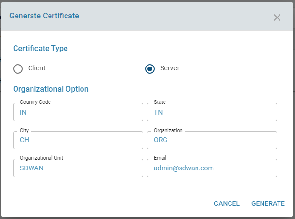
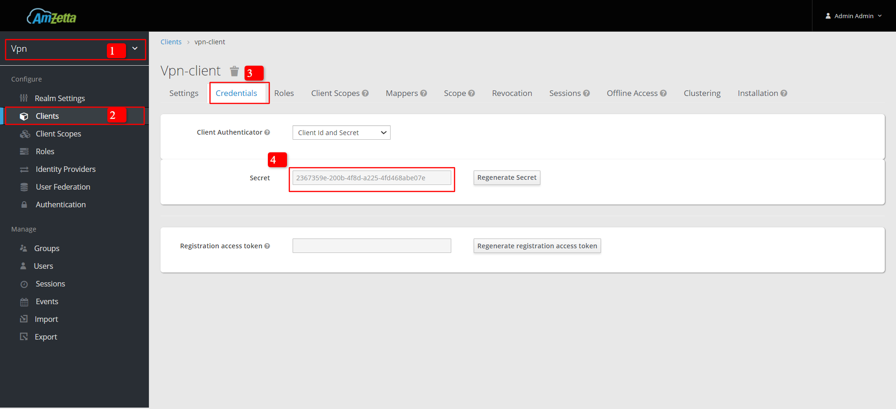

# Site to Mobile configuration guide
- Create a VPN realm in zID
    -  Login in to zID
        ``` 
            Email : admin
            Password : zWAN@teamw0rk
        ```
        - `https://<domainname>:8082/`
        
    - Create vpn realm
        - Click on Add realm
        
        - Provide realm name as vpn and click Create button.
        
    - Create vpn client
        - Go to Clients(realms -> vpn -> clients) and click the Create button
            
        - Provide client ID as vpn-client and click save button.
            
        - In client setting change the configuration as below and click Save button
             ``` 
                Access Type     : confidential
                Standard Flow Enabled  : off
                Direct Access Grant Enabled : on
            ```
            
    - Create/Import VPN users 
        - We can create users manually, or we can use a script to create a bulk of users in zID
            * Refer the document for [***Import bulk users***](./import_user.md) (Refer to the import_user document)
        - The below are the steps to create Users Manually **(Skip this step if users created via script.)**
            - Go to the Users page under ( realms -> vpn -> users ) and click "Add User" and provider user information and click save button.
                
                
            - Provide a password and confirm password. Ensure that the 'Temporary' option is turned off, then click the 'Set Password' button.
                    
                    
        ### SMTP Configuration in zID
        * Refer the document [***SMTP Configuration***](./smtp_configuration.md) (Refer to smtp_configuration document)
    - Steps to Reset password of an user (If required)
        - Login to vpn realm like **https://<director_ip>:8082/auth/admin/vpn/console** and click on Forgot Password link, Provide emailId and click submit.
             
             
        - Click on “Link to reset credential’s” , Provide new and confirm password and click Submit button.
            
            
- On the DC CPE, Create server certificate and Tunnel
    - Generate server certificate under ( edge-controller -> cpe_id -> security -> x509 -> certificates ) and provide required data and click GENERATE button
            

    - Create Tunnel in DC CPE
        - To create tunnel in DC CPE with OAUTH, We should get the client ID, secret, and token URL from zID
            - Login in to zID and select vpn realm and go to vpn-client ( realms -> vpn -> clients -> <vpn_client_id> -> credentials ) and go to credentials tab and copy the secret.
            
        - Go to the Tunnel page under ( edge-controller -> cpe_id -> network -> tunnels -> siteToMobileVPN ) and provide valid data and click create tunnel button.
            ``` 
                Description: VPN00
                Tunnel ID: Generate the tunnel id
                Remote port: <Remote port for VPN eg: 10001>
                Protocol: UDP - Only UDP protocol is supported
                Local IP: WANxx IP of the CPE
                Gateway: WANxx Gateway
                DHCP Pool: DHCP pool for the Mobile clients Eg: 10.130.101.0/24
                Advertise Networks: LAN subnet that needs to be advertised for the Mobile clients Eg: 172.5.0.0/24
            ```
            
        - In Authrization, Select type should be OAUTH and select the server certificate, ClientID, Client Secret, Token URL and click CREATE button.
        ``` 
            {
                "client ID": "vpn-client",
                "Client Secret": "ec5c6637-1df8-4cbc-8eb4-2de1e76bc86f",
                "token_endpoint": "https://<domainname>:8082/auth/realms/vpn/protocol/openid-connect/token"
            }
        ```
        - Copy the above sample token_endpoint url and udpate with your domainname Or Ip in End point token Url.
        

        - Update DC CPE MetaData as like below 
            ```
                WAN1_PUB_IP :  203.199.x.x  
                WAN1_PUB_PORT : 10001
                
                WAN2_PUB_IP :  14.194.x.x  
                WAN2_PUB_PORT : 10002
                
                Site-2-Mobile : Site-2-Mobile
            ```
            
        - Create Mobile client in tenant account.
            - We can create clients manually, or we can use a script to create clients for bulk users.
                * Refer the document for [***Create client and download ovpn files***](./create_client_download_ovpn.md)
            
            - The client's name is user-friendly-name. You can give the mobile device (client) a name.**(Skip this step if client created via script.)**
                - Go to the CREATE CLIENT configuration tab under (device-management -> edge-controllers -> mobile-devices) and provide the required data, then click the CREATE button.
                
                    
                - Download the openvpn conf file.
                    

    - Install OpenVPN Client and upload OVPN conf file and connect.
    
        
        
        
        
        