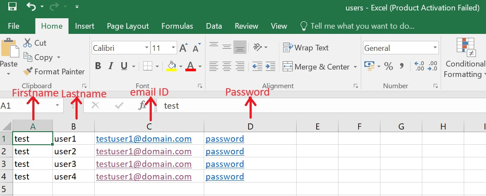
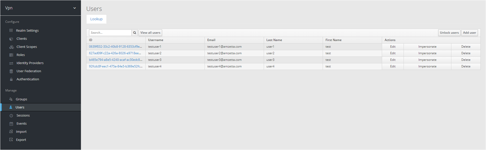

# Import bulk users guide
 - Download the files from [Scripts](https://gitlab.amzetta.com/sdwan/zwan-doc/-/tree/zid-smtp-bulk-user/Director_FSD%2Fsite-to-mobile%2Fscripts)
 - Update DIRECTOR_IP and VPN_REALM_NAME in .env file
 
        ``` 
            DIRECTOR_IP=<director_ip>
            VPN_REALM_NAME=vpn
        ```
 - Go to scripts folder, Add bulk of users in users.xlsx sheet as shown in below
    

 - Run the import-user.sh script on the director host machine. This script reads user details from an Excel sheet and creates them in the VPN realm.
 - Verify the users in vpn realm.
    