# Interface and Application bandwidth Alerting

The WAN bandwidth usage alert and Application bandwidth usage alert can be configured using the “Advanced configuration” in the Alerting. 

### Classification of WAN and Application bandwidth alerts:

1. WAN bandwidth Alert

- WAN overall upload bandwidth: monitors a specific  WAN interface for upload bandwidth across all the CPE.
- WAN overall download bandwidth: monitors a specific  WAN interface for download bandwidth across all the CPE.
- WAN CPE upload bandwidth: monitors a specific  WAN interface for upload bandwidth for a particular CPE.
- WAN CPE download bandwidth: monitors a specific  WAN interface for download bandwidth for a particular CPE.

2. Application bandwidth Alert

- Application overall bandwidth: monitors a specific  Application usage bandwidth across all the CPE.
- Application CPE bandwidth: monitors a specific  Application usage bandwidth for a particular CPE.

        NOTE: In the document have provided the procedure to configure one of the alert(Application CPE bandwidth), one can configure other classified alerts based on the following procedure.

        To use destination mail in the Alerting using advanced configuration  the user should have created a normal alert.
        else wont be able to configure destination mail for Advance config. 

### Procedure to configure Application CPE bandwidth alert:

There are three stages for configuring the Alert
- Monitor
- Trigger
- Action

### MONITOR
1. Navigation to Advanced configuration in the Alerting.

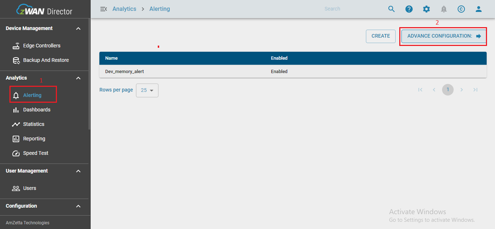

Figure 1: Advance Configuration navigation.

2. Navigate to monitors and select create monitors for configuring monitor.

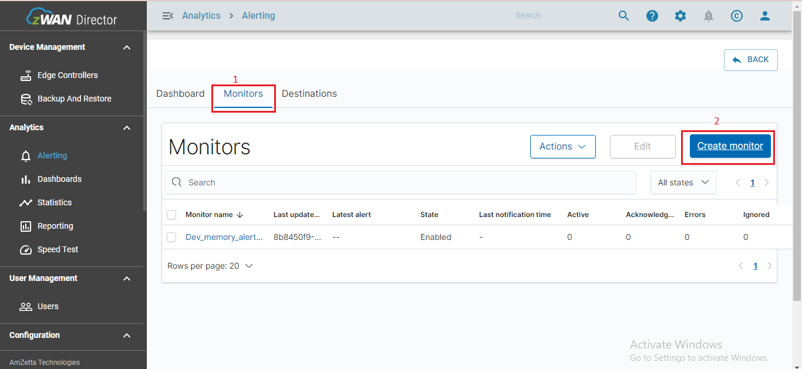

Figure 2: Create monitors navigation.

3. For configuring the monitor. enter the following info.
- Enter a unique and valid monitor name under monitor name.
- From the drop down of "Method of definition" select 

        "Define using extraction query"
- Enter the valid index 
            
        elastiflow-3.5.3-<TENANT_NAME>-*

        example:

        elastiflow-3.5.3-zwan-tenant-*

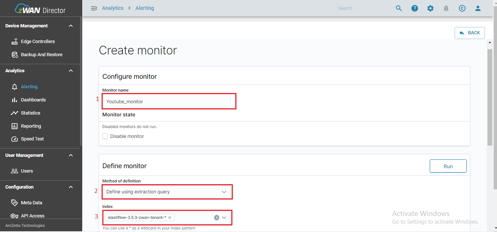

Figure 3: Configuring Monitor.

4. Refer the respective Alerting markdown document to enter the extraction query provided.

(refer the Application CPE bandwidth markdown document for the extraction query input)

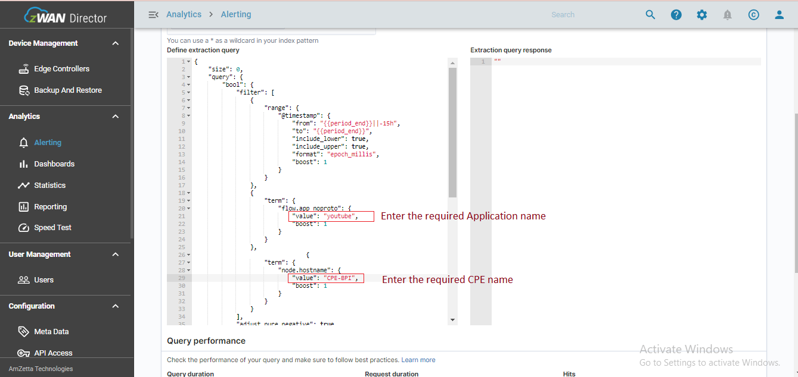

Figure 4: Extration query for Application CPE bandwidth.

5. Monitor schedule time  provides the frequency  for which the alert has to monitored every interval.

- Enter 5 for the every tab and select the minutes
- Save the monitor configurations using the create at the end.

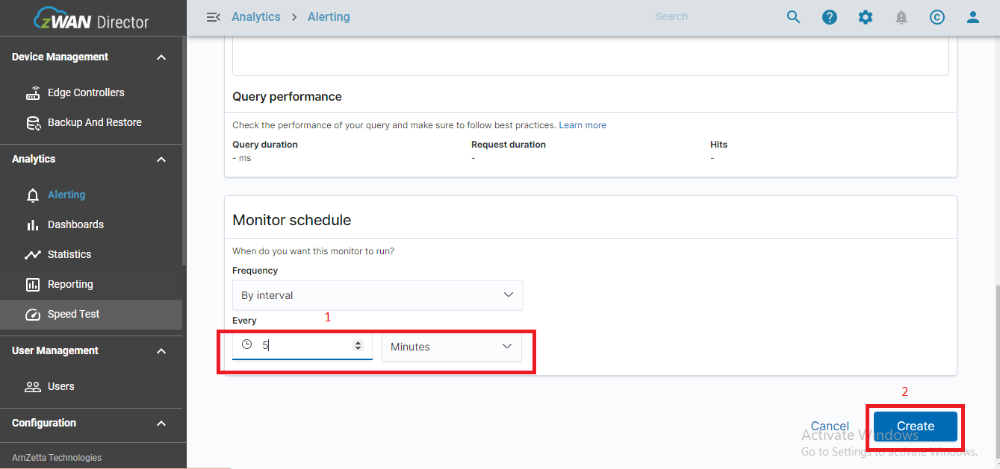

Figure 5: Create Monitors.

### TRIGGER

1. Configure the trigger. enter the following info.
- Enter a unique and a valid trigger name under "Trigger name".
- Select the prefered severity level from the drop down.

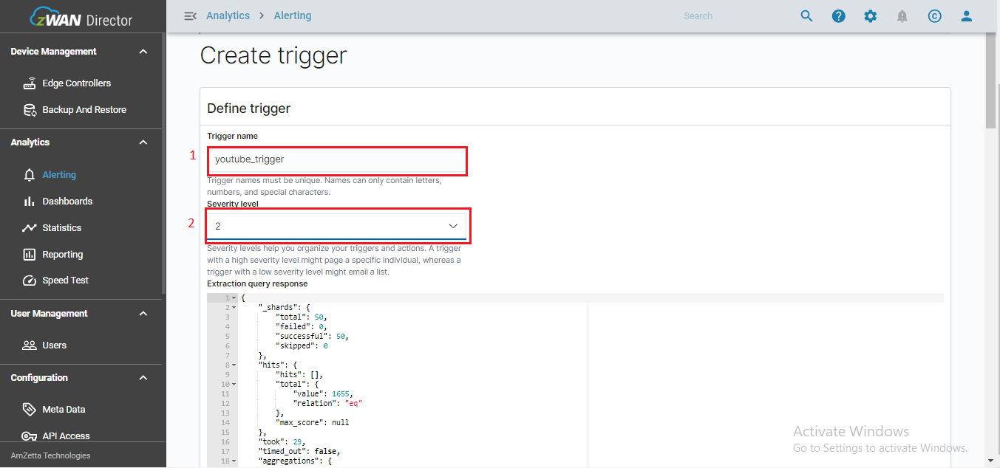

Figure 6: Configure Trigger.

2. Enter the Trigger condition as provided in the respective alert markdown file. (User can provide the application bandwidth threshold in the RHS of the trigger condition which is denoted as Mbps)

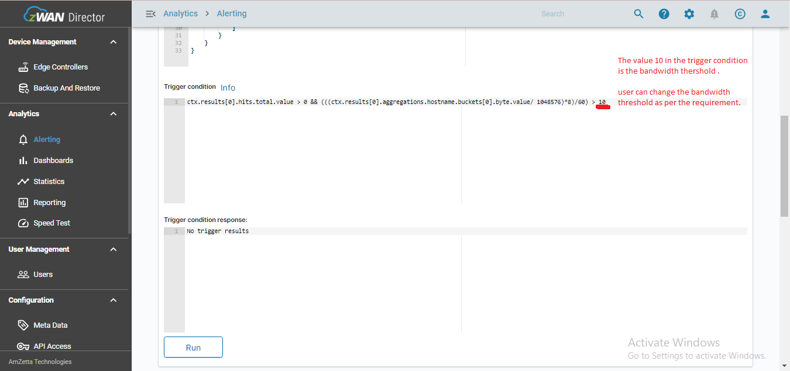

Figure 7: Trigger condition.

### ACTION

1. Configure the Action, enter the following info.
- Enter a unique and a valid action name under "Action name".
- Select the destination mail in "Destination"
- Enter the valid message subject in "Message Subject" (check the message preview )

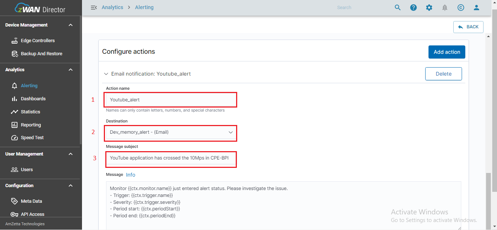

Figure 8: Configure action.

2. Enter the message as as provided in the respective alert markdown file.

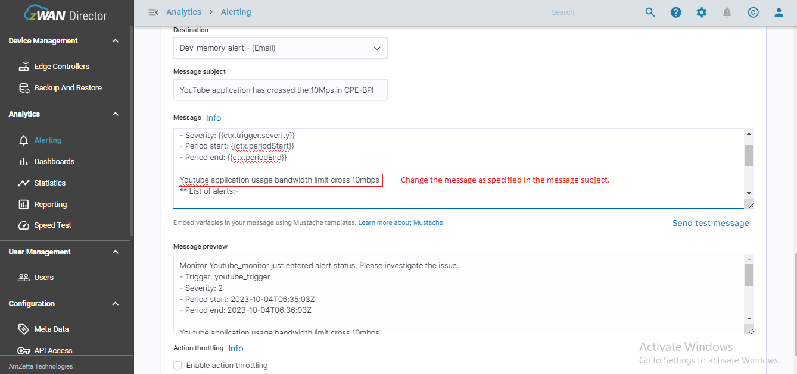

Figure 9: Message action.

3. Select create to create the Action.
(do not select throttle)

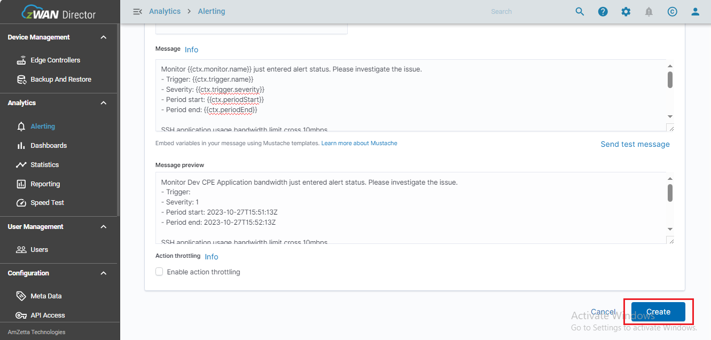

Figure 10: create action.

### Disabling the monitor:

1. To disable the monitor that has been created. Follow the steps.
- Select the specific Monitor to be disabled.
- From the Action drop down select the disable.
- Check the state for the monitor.

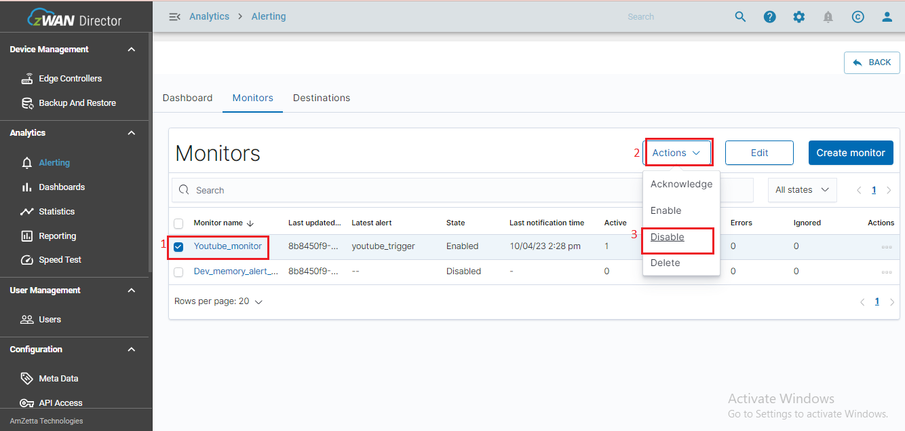

Figure 11: Disabling the monitor .
