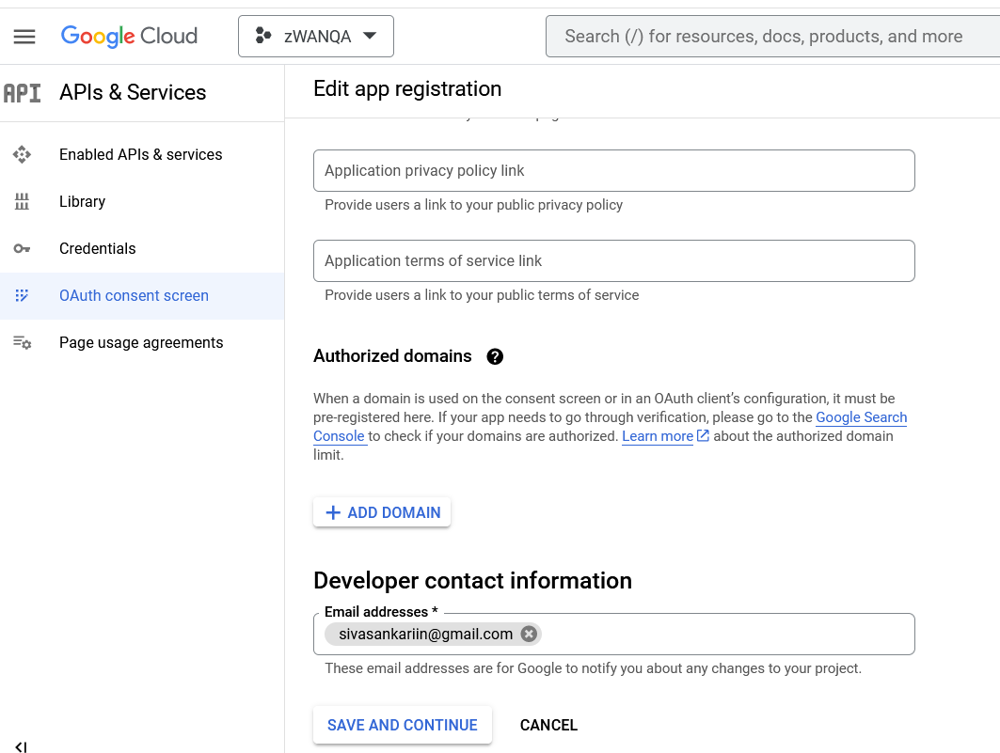

# Google Configuration guide

\*\* Configure Google Authentication

- From zWAN UI, Settings --> ZID Login
Login to zID with tenant credentials

\*\* Configuring google as identity provider

Add Identity Provider as Google
1. Select the Identity providers under Configure section

2. Select Google under social

3. Copy the Redirect URI and note it.

## Create a Project in Google

1. Launch the URL https://console.cloud.google.com/getting-started in browser

2. Login to gmail account
3. Click Select Project

4. Click New Project

5. Give the Project Name and click Create

6. In getting started menu, click Explore and enable API’s

7. Go to credentials, click Create Credentials and click consent screen

8. Select External and click create

9. In app registration page, give the mail address and click save and continue

10. Click save and continue for the remaining options.

11. Click Back to Dashboard
12. Again go to credentials and click O Auth Client ID

13. Select Web Application

14. Provide application name, authorized redirect URI which one copied from ZID identity provider page. 
Example:
https://zwanqa.amzetta.co.in:8082/auth/realms/zwan-tenant/broker/google/endpoint

15. OAuth client will create with client ID and secret code.

16. Copy the client ID and secret code

## Add Identity Provider as Google Continued…

4. Go to ZID Page, give the client ID, secret code, left as default for remaining options and save it

5. Now login to Director UI, google authentication option will be shown in UI

6. Give the valid user credentials and login.

7. UI shown as "you do not have access to the requested Resource"

8. Login to Director UI with the default user credentials, and go to users page.

9. Select the gmail user which one dont have access and give access.

10. Now Refresh the UI which shown the permission issue or login again.

11. The Director UI will be launched, can see the login accoutn details under myaccount.

**Note:**

Google Login will work with external fqdn which is a public one.

## References

https://keycloakthemes.com/blog/how-to-setup-sign-in-with-google-using-keycloak

