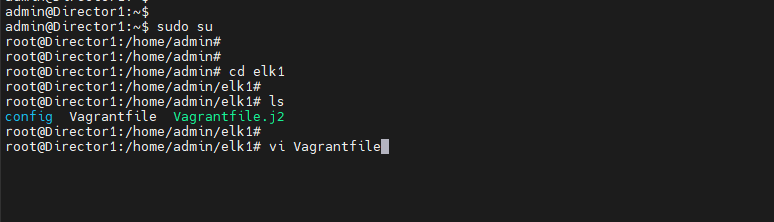
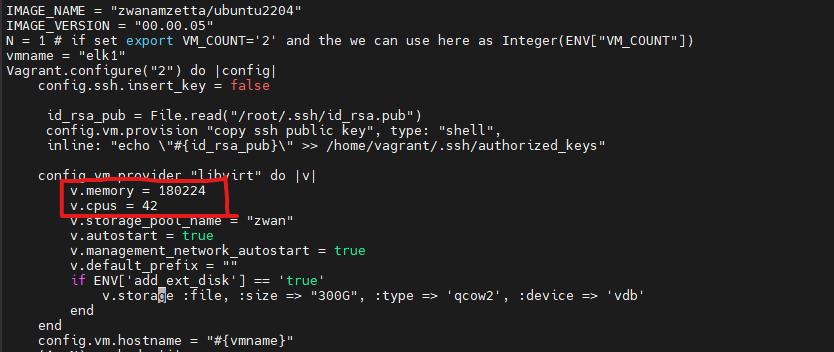
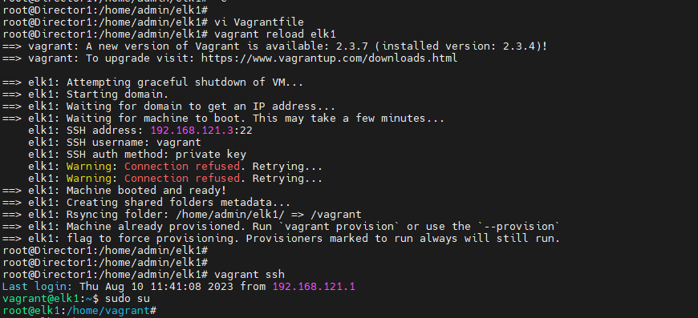
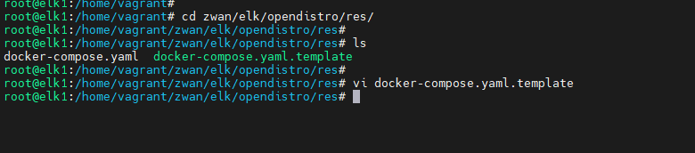
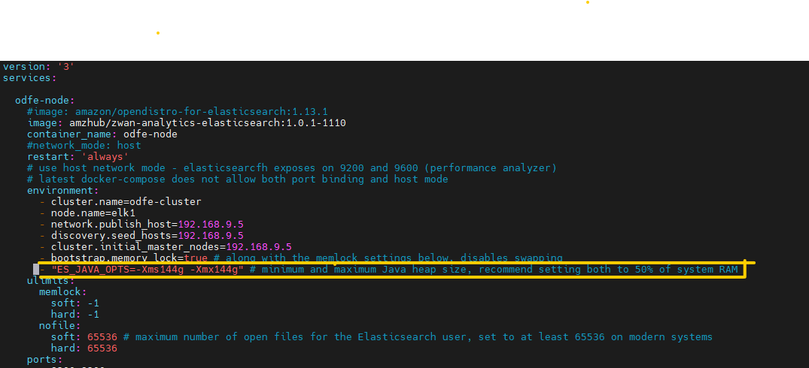
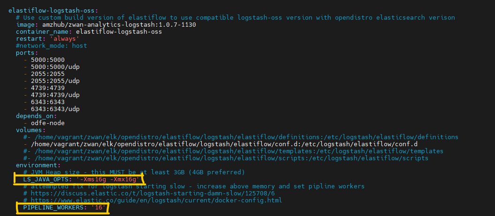
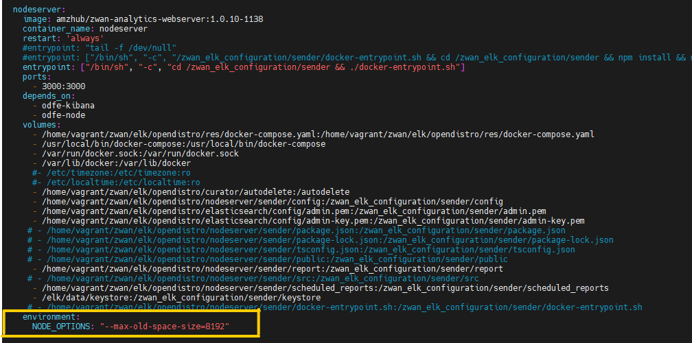
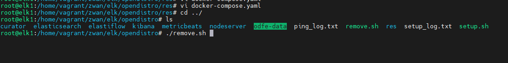
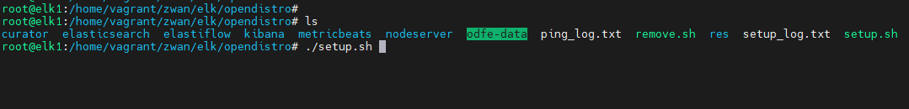

# ELK VM vagrant image resizing - (RAM and CPU core resizing)

By default the ELK VM RAM and CPU core size is 
- RAM      - 32GB
- CPU core - 8

 To calculate the required ELK VM resource increase follow the calculation mentioned

    NOTE: Please verify the Available RAM and CPU core size in the Director host server and calculate accordingly the CPU and CORE size for ELK VM.(provide a example for resizing the ELK VM)

## Director resourse value

| host      | resource |
| --------- | -------- |
| RAM       | 256GB    |
| CPU core  | 64 core  |

## Default VM resource and Host 

| VM            | RAM size    | CPU core   |
| ------------- | ----------- | ---------- |
| Mongo db VM   | 4GB         |  2         |
| Open VPN      | 8GB         |  2         |
| K3s           | 16GB        |  8         |
| ELK VM        | 32GB        |  8         |
| Host hypervisor | 16GB      |  4         |

## Available resource in Director host After default VM utilization

| host      | resource |
| --------- | -------- |
| RAM       | 180GB    |
| CPU core  | 40 core  |

## ELK VM RAM and CPU core  number for resizing(increase)

- Based on the availbale Host resource. RAM can utilite 80% of remaining resource.
- Core can utilize 75% of remaining CPU core from host(core should be physical core)

#### ELK VM resource after increasing from default

| ELK VM    | Increased resource value |
| --------- | -------------------------|
| RAM       |   176 GB                 |
| CPU core  |   42                     |

## Procedure to increse the ELK VM 

- Changes in ELK VM Vagrantfile 
- Changes in Docker-compose file inside ELK VM

### Changes in ELK Vagrantfile

1. Connect the Director server using ssh and enter the root user as

        sudo su

2. Use the following commands to navigate to Vagrantfile and to open it using text editor

        cd elk1
        vi Vagrantfile

Figure 1: navigation to ELK VM Vagrantfile

 

3. Once inside the Vagrantfile. Enter the value of RAM in MB in v.memory
 and CPU core value in v.cpus. save the file and exit.

 | ELK VM    | Values to increase      |
| --------- | -------------------------|
| RAM       |   176 GB                 |
| CPU core  |   42                     |

            v.memory = 180224
            v.cpus = 42

Figure 2:  Vagrantfile changes

 

4. Run the Vagrant reload command for the changes to effectively take place.

            vagrant reload elk1

Figure 3: vagrant reload command

 

5. After the reload done. Enter the ELK VM using following commands

            vagrant ssh
            sudo su

6. Verify the RAM and CPU core updated values using the following commands.

            free -h
            lscpu

## Changes in Docker-compose file inside ELK VM

The resource allocation in the ELK VM after resizizing are,

| ELK VM    | Increased resource value |
| --------- | -------------------------|
| RAM       |   176 GB                 |
| CPU core  |   42                     |

| ELK VM docker changess   | Increased resource value                |
| -------------------------| ----------------------------------------|
| odfe-node(elasticsearch) |   144 GB   - (80% of RAM in ELK)        |
| elastiflow(logstash)     |   16  GB   - (10% of RAM in ELK)        |
| nodeserver               |    8  GB   - (5% of RAM in ELK)         |

        NOTE: Based on the RAM you allocated in Vagrant file claculte the size for docker based on the percentages given. nodeserver value needs to chnges only if the analytics TAG is lesser than 1.1.14

This value has to be further assigned to the dockers running in the ELK VM.

1. Inside the ELK VM as root user. Navigate to the docker-compose.yaml.template file to make the necessary docker changes.

            cd zwan/elk/opendistro/res/

            vi docker-compose.yaml.template

Figure 4: navigation to docker-compose.yaml.template file

 

2. For odfe-node(elasticsearch) enter the RAM value as per the percentage calculated and specify the number in GB . follow the screenshot

           - "ES_JAVA_OPTS=-Xms144g -Xmx144g" # minimum and maximum Java heap size, recommend setting both to 50% of system RAM

Figure 5: odfe-node(elasticsearch) value

 

3. For elastiflow-logstash(Logsstash) enter the RAM value as per the percentage calculated and specify the number in GB and also specify the value for pipline worker (same value of logstash RAM ). follow the screenshot

            LS_JAVA_OPTS: '-Xms16g -Xmx16g'

            PIPELINE_WORKERS: '16'

Figure 6: elastiflow-logstash(Logsstash) value

 

4. Only change the nodeserver value when the analytics TAG lesser than 1.1.14 . nodeserver(nodeserver) enter the RAM value as per the percentage calculated (please check the indention). follow the screenshot

              environment:
                NODE_OPTIONS: "--max-old-space-size=8192"

Figure 7: nodeserver value

 

5. After the changes save and exit the file.

6. Navigate to remove script and run the script.

            cd /home/vagrant/zwan/elk/opendistro

            ./remove.sh

Figure 8: navigation to remove.sh 

 

7. Execute the setup script from the same directory

            ./setup.sh

Figure 10: setup.sh 

 

8. After running the setup.sh script. Login to to Director UI and load the analytics pages.

