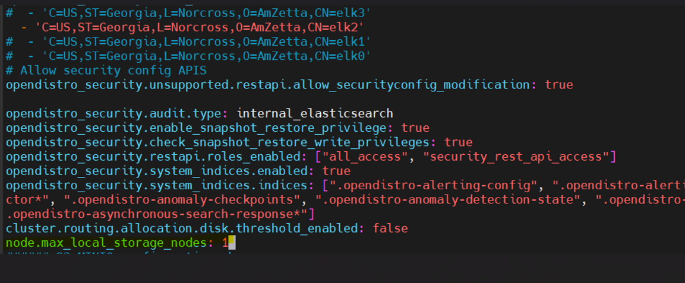
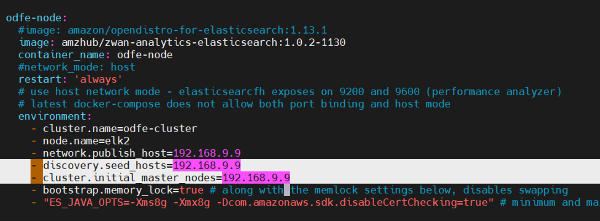
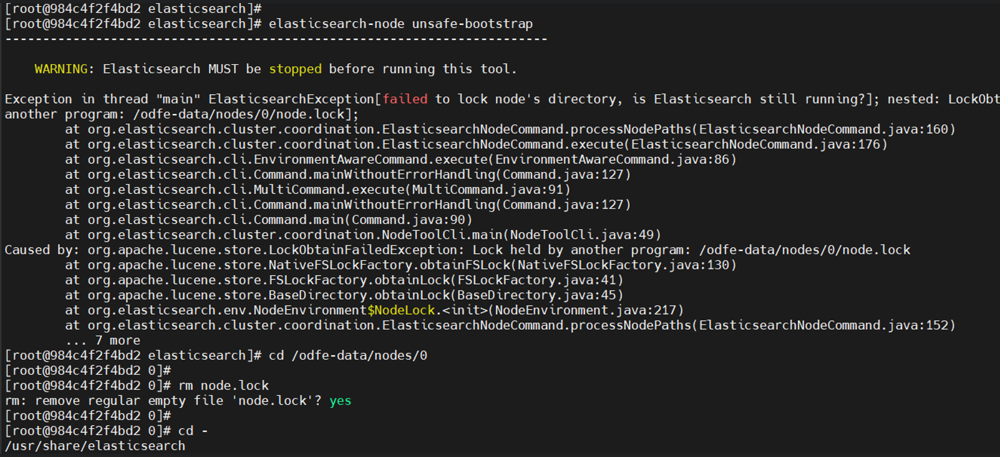
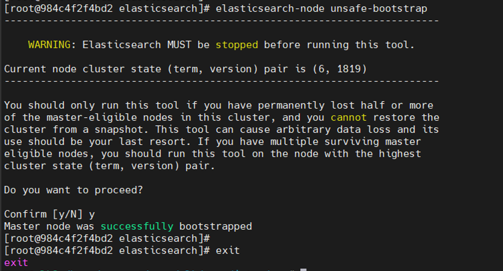
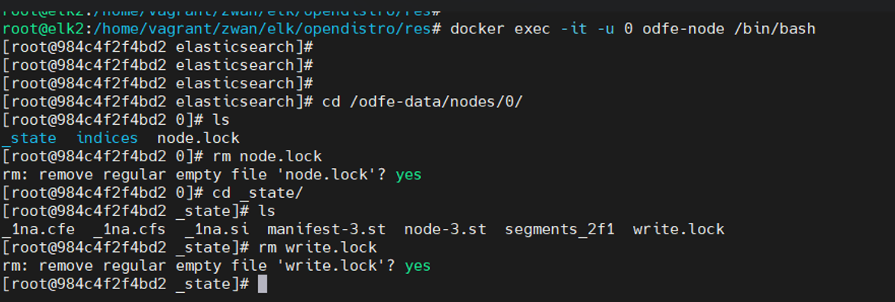

# Cluster To Standalone

zWAN Director cluster needs atleast '**n/2 + 1'** nodes out of '**n'** nodes to be running for proper functioning. If n/2 + 1 node fails, the cluster will not function, the failed nods should be replaced immediately for proper functioning. In case failed nodes cannot be replaced the cluster can be downgraded to single node server. To convert a cluster into single node please follow below steps.

- [Backup the configuration](#backup-the-configuration-data)
- [Convert to standalone server](#convert-to-standalone-server-from-the-cluster)
- [Restore the configuration](#restore-the-configuration-data)


## Backup the configuration data:

Note: After taking backup following backup files should be moved out of VM and stored safe to upload to Minio for restoring the Director. 
 - mongo_latest.dump.gz  
 - postgres_latest_dump.tar.gz  
 - elk_latest_dump.tar.gz  
 - ec_provision_certs_latest_dump.tar.gz 

### Mongo DB Backup:
  Fetch the live Mongo VM IP to take backup 
  Run this command inside k3s VM(Path:  /home/vagrant/ ) 

```
# mongodump --host <MongoVM_IP> --port 27017 -j=1 --archive=mongo_latest.dump.gz --gzip
```

### Postgres DB Backup:
  Run this command inside k3s VM (Path:  /home/vagrant/ ) 

```
# crictl exec -it $(crictl ps | grep postgres-cluster | awk '{print $1}') env PGPASSWORD=postgresql_password pg_dump -U postgres -d keycloak -h localhost -p 5432 > postgres_dump.sql && tar cfvz postgres_latest_dump.tar.gz postgres_dump.sql 
```

### EC Provision Certificate Backup:
  Fetch the live Openvpn VM IP (e.g.,OpenvpnVMIP=192.168.9.3) to take backup 
  Run this command inside k3s VM(Path: /home/vagrant/ ) 

```
# mkdir -p ec_provision_certs/k3s_certs  
# mkdir –p ec_provision_certs/openvpn_certs 
# rsync -zavrP /etc/edge-controller-provision-info/ ec_provision_certs/k3s_certs/ 
# rsync -zavrP /etc/edge-controller-provision-info/ ec_provision_certs/openvpn_certs/ 
# tar cfvz ec_provision_certs_latest_dump.tar.gz ec_provision_certs
```

### ELK Backup
Inside ELK VM switch to path /home/vagrant/ , execute the “recovery_backup.sh” script from the following location. 

```
# /usr/local/bin/recovery_backup.sh 
```

### Recover procedure of ELK VM to run as standalone from Cluster.  
Inside the ELK VM switch to path /home/vagrant/,  fetch the hostname and IP associated with eth2 interface  
  ```
    # hostname
    # ip –br a
  ```

 - Elasticsearch.yml changes:  Make the following changes in “elasticsearch.yml” 

  ```
    # vim /home/vagrant/zwan/elk/opendistro/elasticsearch/config/elasticsearch.yml 
    Change-1: Set the max_local_storage_nodes as 1, As below. 

    (e.g.,) node.max_local_storage_nodes: 1 
    Change-2: Comment the failed node except the current active ELK node.  

    (i.e.,) opendistro_security.nodes_dn: 
    (e.g.,)  
    opendistro_security.nodes_dn: 
      - 'C=US,ST=Georgia,L=Norcross,O=AmZetta,CN=elk3' 
    #  - 'C=US,ST=Georgia,L=Norcross,O=AmZetta,CN=elk2' 
    #  - 'C=US,ST=Georgia,L=Norcross,O=AmZetta,CN=elk1' 
    #  - 'C=US,ST=Georgia,L=Norcross,O=AmZetta,CN=elk0
  ```



 - docker-compose.yaml changes: inside the elk vm make the changes for docker-compose 


  ```
      # cd  /home/vagrant/zwan/elk/opendistro/res 
      # docker-compose down 
      # vi docker-compose.yaml 
      Change-1: Remove the failed ELK VM IP in “discovery.seed_hosts” 
      (e.g.,)  
      Original value: - discovery.seed_hosts=192.168.9.5,192.168.9.9,192.168.9.13 
      After change: - discovery.seed_hosts=192.168.9.13 
      Change-2: Remove the failed ELK VM IP in “cluster.initial_master_nodes”) 
      (e.g.,)  
      Original value: cluster.initial_master_nodes=192.168.9.5,192.168.9.9,192.168.9.13 
      After Change: cluster.initial_master_nodes=192.168.9.13 
  ```


  ```
    # docker-compose up -d
  ```

  - Odfe-node container bootstrap changes 

  ```
    # cd /home/vagrant 
    # docker exec -it -u 0 odfe-node /bin/bash 
    # elasticsearch-node unsafe-bootstrap 
    # cd /odfe-data/nodes/0 
    # rm node.lock  
    # rm: remove regular empty file 'node.lock'? y
  ```




  ```
    # elasticsearch-node unsafe-bootstrap 
    # Y (confirm yes to proceed) 
    # cd /odfe-data/nodes/0/_state 
    # rm write.lock 
    # rm: remove regular empty file 'write.lock'? y 
   ```


  - Exit from the docker and restart odfe-node docker. 

  ```
    # elasticsearch-node unsafe-bootstrap 
    # Y (confirm yes to proceed) 
  ```



  ```
    # exit 
    # docker restart odfe-node
  ```

  - Node error for restart

  ```
    # docker exec -it -u 0 odfe-node /bin/bash 
    # cd /odfe-data/nodes/0 
    # rm node.lock 
    # rm: remove regular empty file 'node.lock'? y 
    # cd /odfe-data/nodes/0/_state 
    # rm write.lock 
    # rm: remove regular empty file 'write.lock'? y 
    # exit 
    # docker restart odfe-node 
  ```

 


### Index mangement script
1. Inside ELK VM navigate to "index-management.sh" . Change the "replica" value based on (number current active node - 1)

example: if the current numeber of active nodes is 1, then "replica=0"  based on (n-1), where n is the number of active nodes
  ```
    # cd /usr/local/bin/
     (change the replica count in the index-management.sh, based on n-1 . where n is the number of active nodes)
    # ./index-management.sh  (save and run the script)
  ```

#### Validation of ELK VM  
1. Check the odfe-node service docker status using the following command

  ```
   # docker ps
  ```
2. Once the odfe-node service is healthy , Pass the following curl command to check the master state and index list: 
    
  ```
    # curl -XGET -k -u admin:zWAN@teamw0rk https://localhost:9200/_cat/master 
    # curl -XGET -k -u admin:zWAN@teamw0rk https://localhost:9200/_cat/indices 
    # curl -XGET -k -u admin:zWAN@teamw0rk https://localhost:9200/_cluster/health?pretty 


  NOTE:  for the cluster health command ,
    - The Prefered cluster state should be "green" (the cluster is healthy and functional).
    - If the cluster state is "yellow" (currently the new node is syncing with the old node, but later the state will become green . Re-run the command ).
    - If the cluster state is "red" (the cluster is unhealthy , need to investigate the cluster shard allocation )
  ```

## Convert to standalone server from the cluster

 - Inside k3s VM (Path: /home/vagrant/). Uninstall k3s binary. 
  ```
  # k3s-uninstall.sh
  ```
 - In mongo VM stop mongo 
  ```
  # cd /home/vagrant/zwan/mongo
  # docker-compose down
  ```

 - In Host machine remove /var/www/html/deployment_version.json 
  ```
  # sudo rm /var/www/html/deployment_version.json 
  ```

- Change setup/master.yaml file 

  - Out of 3 nodes in a cluster 2 nodes were down. In master.yaml set “enabled: true" for working node and “enabled: false” for Inactive/inaccessible node. Refer to the sample master.yaml in Sample-Master-Yaml section in this same document. 

 - Run setup script  
  ```
  $ ./setup.sh 
  ```

## Restore the configuration data:

- Upload following backup files to minio 
  - mongo_latest.dump.gz  
  - postgres_latest_dump.tar.gz  
  - elk_latest_dump.tar.gz  
  - ec_provision_certs_latest_dump.tar.gz  

 - Remove "restore_ec_tunnels_certs" from restore_components list in setup.sh.


  - Comment CERTIFICATE_SERVICE_CERTS_DUMP_FILE as in following in setup/bkp-restore-default-conf.yml
```
  MONGO_DUMP_FILE: mongo_latest.dump.gz
  POSTGRES_DUMP_FILE: postgres_latest_dump.tar.gz
  ELK_DUMP_FILE: elk_latest_dump.tar.gz
  # CERTIFICATE_SERVICE_CERTS_DUMP_FILE: certificate_service_certs_latest_dump.tar.gz
  EC_PROVISION_CERTS_DUMP_FILE: ec_provision_certs_latest_dump.tar.gz
```

  - Comment “{{ VALUES.CERTIFICATE_SERVICE_CERTS_DUMP_FILE }}” from init() function in setup/roles/restore/templates/check_restore_files.j2 
```
   FILES=( \ 
         {{ VALUES.MONGO_DUMP_FILE }} \ 
         {{ VALUES.POSTGRES_DUMP_FILE }} \ 
         {{ VALUES.ELK_DUMP_FILE }} \ 
         # {{ VALUES.CERTIFICATE_SERVICE_CERTS_DUMP_FILE }} \ 
         {{ VALUES.EC_PROVISION_CERTS_DUMP_FILE }} \ 
   ) 
```

 - Add following tasks in setup/roles/restore/tasks/main.yml at the bottom of the file 
```
- name: Remove db-backup-and-restore-manager 
      kubernetes.core.helm: 
        name: db-backup-and-restore-manager 
        release_namespace: northbound 
        state: absent 
        wait: true 
      when: VALUES.RESTORE_ACTION == "restore_se_and_vs" 

    - name: Remove certificate-service 
      kubernetes.core.helm: 
        name: certificate-service 
        release_namespace: northbound 
        state: absent 
        wait: true 
      when: VALUES.RESTORE_ACTION == "restore_se_and_vs"
```


 - From the disaster recover deployment source under setup directory, execute the following command. 
  ```
  $ cp setup/roles/restore/templates/elk_disaster_recovery.j2 setup/roles/restore/templates/restore_elk.j2 
  ```

 - Initiate restore from deployment

  ```
  $ ./setup.sh restore
  ```


Sample master.yaml file. 

```
servers: 

# Server 1 ip, user, password details 
  - ip: 10.200.34.27 
    port: 22 
    name: server1 
    user: user 
    # pem: 
    password: scarlet10 
# Master component will install k3s, openvpn, mongo and elk vms 
    components: 
      - Master: 
        - name: elk 
          cpu: 8 
          memory: 32GB 

# Server 1 LAN interface names as displayed with ip -br a command. These two interfaces will be connected to 
# a switch. IP need not be assigned to them. 
    lan-nics: 
      - enp4s0f0 
      - enx00e04c680420 
# Provide the interface name to which the Public IP is mapped, the below value is used only for public ip. 
# With public ip systems the interface cannot be identified with the serverip, if the below value is not provided 
# vxlan interface creation will fail. 
# Add host_interface as an array. Maximum 3 interface. First interface will be conside as primary interface. 
    host_interface:  
      # - interface1 
      # - interface2 
      # - interface3 

# Server 1 - Ip value to configure for the bond interface created with the lan interfaces. 
# Please make sure the subnet of the all the bond ips ( configured for server1, 2 and 3) are same. 
    bond_ip: 27.0.0.10 
    enabled: false 

# Server 1 ip, user, password details 
  - ip: 10.200.34.28 
    port: 22 
    name: server2 
    user: user 
    # pem: 
    password: scarlet10 

# Master component will install k3s, openvpn, mongo and elk vms 
    components: 
      - Master: 
        - name: elk 
          cpu: 8 
          memory: 32GB 

# Server 1 LAN interface names as displayed with ip -br a command. These two interfaces will be connected to 
# a switch. IP need not be assigned to them. 
    lan-nics: 
      - enp4s0f0 
      - enp0s31f6 

# Provide the interface name to which the Public IP is mapped, the below value is used only for public ip. 
# With public ip systems the interface cannot be identified with the serverip, if the below value is not provided 

# vxlan interface creation will fail. 
# Add host_interface as an array. Maximum 3 interface. First interface will be conside as primary interface. 
    host_interface:  
      # - interface1 
      # - interface2 
      # - interface3 

# Server 1 - Ip value to configure for the bond interface created with the lan interfaces. 
# Please make sure the subnet of the all the bond ips ( configured for server1, 2 and 3) are same. 
    bond_ip: 27.0.0.11 
    enabled: true 

# Server 1 ip, user, password details 
  - ip: 10.200.34.29 
    port: 22 
    name: server3 
    user: user 
    # pem: 
    password: scarlet10 
# Master component will install k3s, openvpn, mongo and elk vms 
    components: 
      - Master: 
        - name: elk 
          cpu: 8 
          memory: 32GB 
# Server 1 LAN interface names as displayed with ip -br a command. These two interfaces will be connected to 

# a switch. IP need not be assigned to them. 
    lan-nics: 
      - enp4s0f0 
      - enp4s0f1 

# Provide the interface name to which the Public IP is mapped, the below value is used only for public ip. 
# With public ip systems the interface cannot be identified with the serverip, if the below value is not provided 

# vxlan interface creation will fail. 
# Add host_interface as an array. Maximum 3 interface. First interface will be conside as primary interface. 
    host_interface:  
      # - interface1 
      # - interface2 
      # - interface3 

# Server 1 - Ip value to configure for the bond interface created with the lan interfaces. 
# Please make sure the subnet of the all the bond ips ( configured for server1, 2 and 3) are same. 
    bond_ip: 27.0.0.12 
    enabled: false 

keepalived: 
# For HA setup host_vrrp_ip and host_vrrp_id should be provided. 
# The Count and Order of host interfaces and keepalived IPs should be matched. 
# Provider Host keepalived IP(host_vrrp_ip) which will be shifted among the Servers. The IP should be in the SAME SUBNET as the 3 Servers. 
   - host_vrrp_ip: 10.200.34.239 

# Provider Host VRRP ID(host_vrrp_id) to be unique for each HA setup 
     host_vrrp_id: 239 

# vxlan group id to be unique for each setup 
vxlan_id: 27 

# Public IP to be configured 
external_ip: 
  # - 10.200.4.2 
  # - 10.200.4.234 

# Director site type args: ( DC or DR ) 
director_site: "DC" 

# Default value is the public docker repo 
docker_registry:  

# Setting the value 1, means default msp account will be created. Leave it empty, while restoring deployment. 
install_msp: 1 

# Setting the value 1, means default tenant account will be created. Leave it empty, while restoring deployment. 
install_tenant: 1 

## Provide disk size in GB, setting the value to 0 means no external disk will be created. 
external_disk: 

## Used for storing the analytics data. Leave empty for default. 
  analytics_disk_size: 0 

## Provide external disk path to store Analytics data. Leave empty for default. 
  analytics_data_path:  

## Used for storing the backup data. Leave empty for default. 
  minio_disk_size: 0 

## Provide external disk path to store Minio data. Leave empty for default. 
  minio_data_path:  
  
## Root CA information provide details for all fields below 
certsInfo: 
  # Country code for the root CA certificate (e.g., 'IN' for India) 
  countryCode: IN 
  # State or province for the root CA certificate 
  state: TN 
  # City for the root CA certificate 
  city: CH 
  # Organization name for the root CA certificate 
  organization: AMZ 
  # Organizational unit (e.g., department) for the root CA certificate 
  organizationalUnit: CIG 
  # Email address for the root CA certificate 
  email: admin@amzetta.co.in 


## SMTP details for the director alerting to send the alerts. 
smtp_details: 

## Enable / Disable the director alerting. Set 0 to disable or 1 to enable the director and analytics storage alerts 
  smtp_enabled: 1 
## SMTP host. 
  smtp_host: smtp.office365.com 
## SMTP port. 
  smtp_port: 587 
## SMTP encryption method[tls/ssl/none]. 
  smtp_encryption_method: tls 
## SMTP username 
  smtp_username: admin@amzetta.co.in 
## SMTP password. 
  smtp_password: internet. 
## SMTP from email address[From whom the alert send] 
  smtp_from_email_address:  aswinrajkumarj@amzetta.co.in 
## SMTP to email address[To whom the alert receives].Add smtp to_email_address as an array. No support for cc and bcc email address 
  smtp_to_email_address: 
    - admin@amzetta.co.in 
```