# **DC Backup**

1. Login to MSP page https://<domain-name>:7080 and select DB Backup tab.

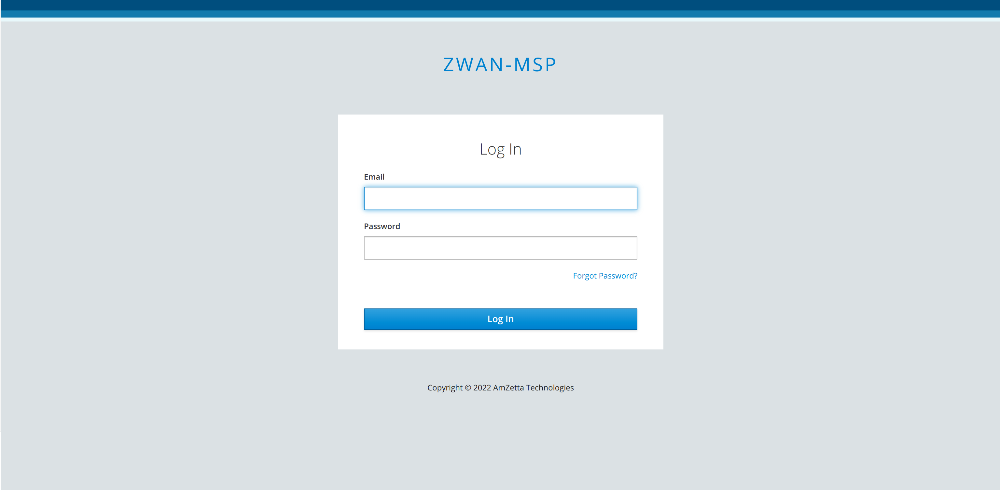

2. Click the server configuration tab, then choose the backup type (S3/AZURE/FTP/SFTP) from the drop-down menu to save our backups. S3 backup type is chosen by default.

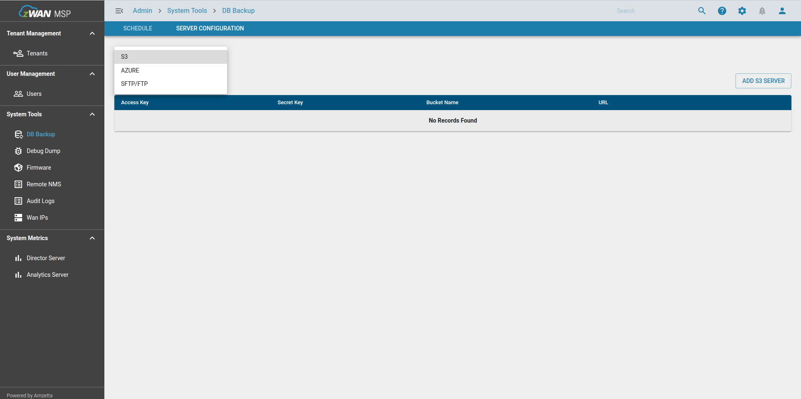

3. Choose "ADD S3 SERVER," "ADD AZURE SERVER," or "ADD SFTP/FTP SERVER" depending on the backup method you've chosen. Then, enter the backup server information to upload the backup files.

   Configuring an S3 server
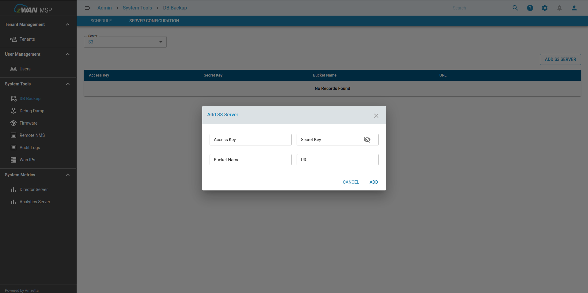

   Azure cloud server setup

   Configuring an SFTP/FTP server

4. "CONFIGURATION BACKUP" and "ANALYTICS BACKUP" button on shedule tab will enable only when we add anyone backup server on server configuration tab.
   
   Before the server configuration

   After the server configuration
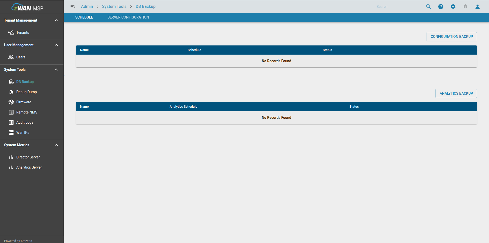

5. Select schedule tab, 2 types of schedules will be available, one is to take director configuration backup and another one is to take analytics data. We can individually configure two different or same schedules.

6. To schedule director configuration, click on "CONFIGURATION BACKUP" and add the backup job with your required schedule.

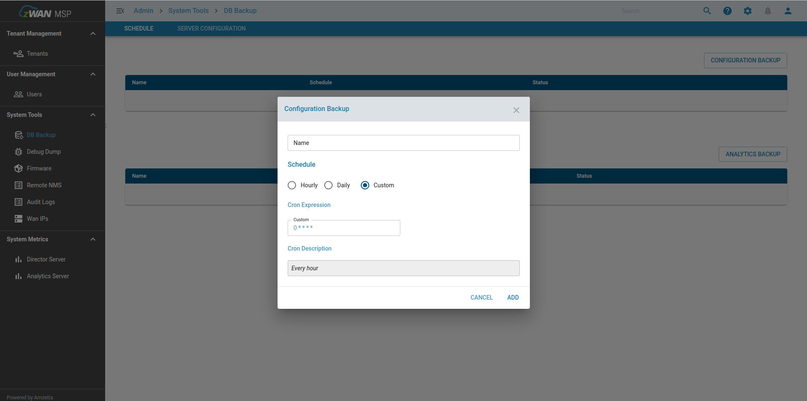

7. To schedule analytics data, click on "ANALYTICS BACKUP" and add the backup job details with your required scheudule.

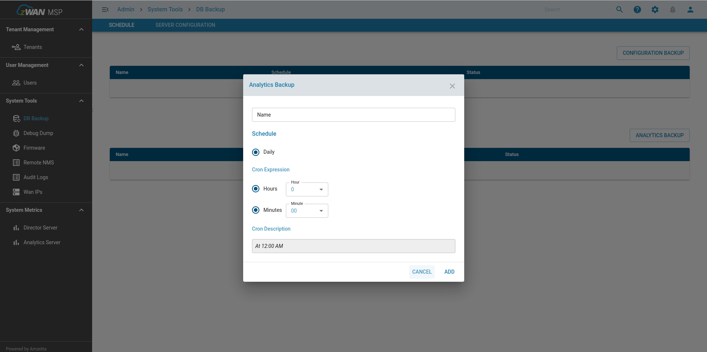

8. After adding the job, press “start” button to start DC backup. Backup files will be uploaded to the configured backup location.

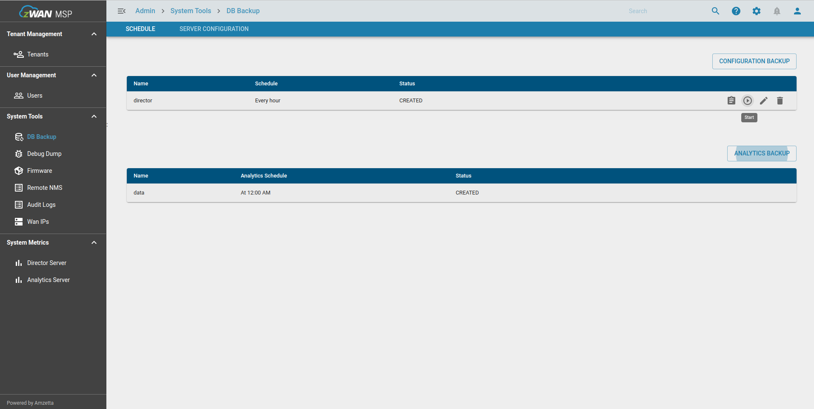

9. On regular configured intervals the backup files will be uploaded to the backup locations.

# **DR restore**

1. Download deployment source and navigate to deployment/setup path and open restore.yml file. Specify the backup file names.

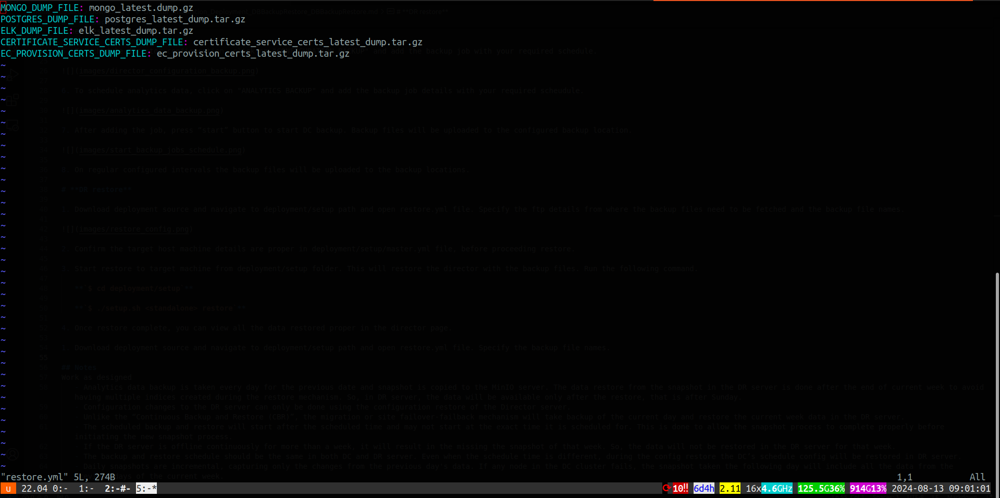

2. Confirm the target host machine details are proper in deployment/setup/master.yml file, before proceeding restore

3. Start restore to target machine from deployment/setup folder. This will restore the director with the backup files. Run the following command.

   **`$ cd deployment/setup`**

   **`$ ./setup.sh <standalone> restore`**

4. Select the restote type and specify the server details from where the backup files need to be fetched. Individual server details can be asked as per the restore type

   S3 Server Configuration
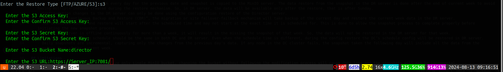

   Azure Server Configuration
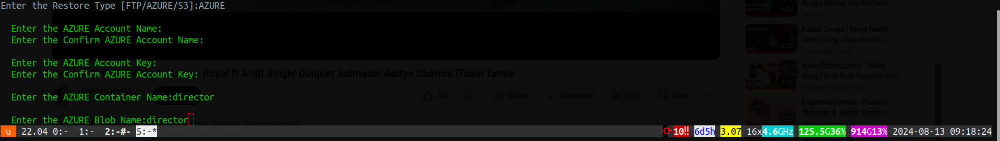

   SFTP/FTP Server Configuration
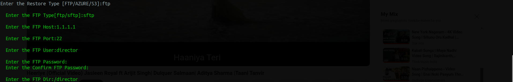

5. Once restore complete, you can view all the data restored proper in the director and analytics pages.

## Notes
Work as designed
   - Analytics data backup is taken every day for the previous date and snapshot is copied to the MinIO server. The data restore from the snapshot in the DR server is done after the end of current week to avoid having multiple indices created during the restore mechanism. So, in DR server, the data will be available only after the restore, that is after Sunday.
   - Configuration changes to the DR server can only be done using the configuration restore of the Director server.
   - Unlike the “Continuous Backup and Restore (CBR)”, the migration or site failover-failback mechanism will take backup of the current day and restore the current week data in the DR server.
   - The scheduled backup and restore will start after the scheduled time and may not start at the exact time it is scheduled for. This is done to allow the snapshot process to complete properly before initiating the new snapshot process.
   - If the DR server is offline continuously for more than a week, it will result in the missing the snapshot of that week. So, the data will not be restored in the DR server for that week.
   - The backup and restore schedule should be the same in both DC and DR server. Even when the schedule time is different, during the config restore the DC’s schedule config will be restored in DR server.
   - Daily snapshots are incremental, capturing only the changes from the previous day's data. If any node in the DC cluster fails, the snapshot taken the following day will include all the data from the previous days of the current week.

## Limitations
   - User must always create and utilize only single MinIO bucket, changing the bucket without following the modification process will cause data loss and the snapshots will not be incremental.
   - Deleting active MinIO bucket, which is being used for backup and restore, will result in data loss.
   - Configuring multiple schedule time within a day should be strictly avoidable. 
   - In circumstances, where the MinIO bucket does not have any space left and the CBR process is unable to free up the space by deleting the snapshot, a manual intervention is required to trouble shoot and cleanup the space or user can increase the MinIO bucket size (follow the documentation to increase the MinIO storage size).
   - The MinIO bucket will be used exclusively for config/data backup and restore. Refrain from deleting, manipulating, or even viewing the files as it will result in catastrophic failure resulting in data loss.
   - Backup and restore schedules are only in UTC time format.
   - Analytics configuration backup and restore currently not supportted for SFTP and FTP.
   - Analytics data backup and restore currently not supportted for AZURE, AWS, SFTP and FTP.
   - Allowed only one backup and restore server configuration as of now.

## Known Issues

