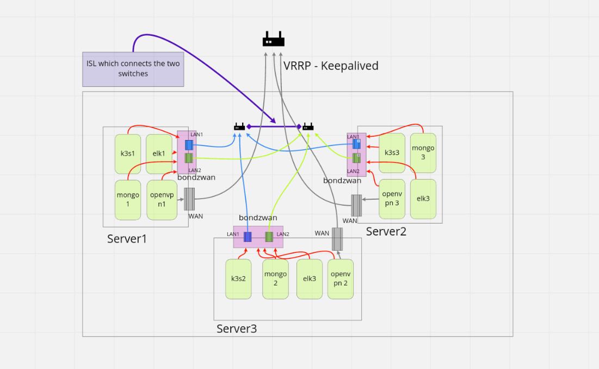
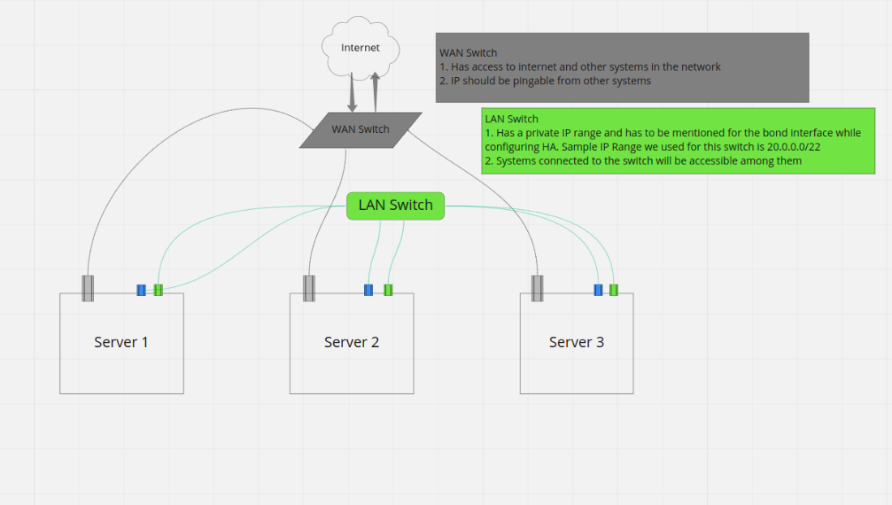

# zWAN Director Cluster (High Availability)

### Content
 - [Introduction](#introduction)
 - [Architecture](#architecture)
 - [Requirements](#requirements)
 - [Installation](#3-installation)
   - [Prerequisites](#prerequisites)
   - [Configuration](#configuration)
   - [Installation for HA Setup](#installation-for-ha-setup)
   - [Director health monitoring](#director-health-monitoring)
   - [Director Update](#director-update)
   - [Node addition/deletion](#node-additiondeletion)
   - [Cluster disaster recovery](#cluster-disaster-recovery)
 - [Limitations](#limitations) 
 - [Known Issue](#known-issues) 


## Introduction

## Architecture

#### HA Setup Representation



#### HA Network Setup Representation



## Requirements

---

Minimum of 3 systems with the below configuration is required for director cluster.

- [Hardware requirements](/QA_BUILD/Director/Hardware%20Requirements.md#hardware-requirements).
- [Software requirements](/QA_BUILD/Director/Hardware%20Requirements.md#software-requirements).

## 3\. Installation

---

Source can be downloaded from build released FTP location  
ftp://zWAN@ussftp.amzetta.com/zwan-provider/

### Prerequisites

Prerequisites in the installer and the director host are installed automatically from the scripts.  
In the installer host, pre_req.sh needs to be run before setup.sh, installs the required software components.  
In the director host, the ansible playbooks takes care of the installation of S/W requirements, the playbooks are called from setup.sh

Note:

1\. Scripts needs to be run only in user mode.

2.If diab setup is already installed in the Remote Host, remove the same using the destroy.sh and make sure the VM’s and iptables rules are deleted.

### Configuration

1.  Copy the zwan-provider-xxx.zip to file installer host using winscp.
2.  Login to installer host and go the file copied location.
3.  Extract the files using the command unzip zwan-provider-xxx.zip.
4.  Go to deployment/setup location
5.  Modify the master.yml file with the valid server details.

Give the valid server details in the master.yml file (Comments are added to each section)

### Installation for HA setup

- If CPE VM’s needs to be retained, comment the lines in the destroy.sh related to CPE VMs.
- To delete the exiting ansible setup, run ./setup.sh cleanup using the same file used for setup.  
  Steps to install
- To start the setup in the director host
- Login to installer host and go to the deployment/setup location
- **./pre_req.sh** - Install the S/W requirements in the installer system
- **./setup.sh** - Validates the S/W and H/W requirements in the director hosts, creates the VM with the components.
- The installation will create below 4 VM’s in three director host.
  - K3s
  - Mongo
  - Openvpn
  - Elk
- On Successful installation - An MSP (Managed Server provider) account is created - One default tenant account is created  
  Note: CPEs won't be created.
- Sample Master file for HA Setup

```c
servers:
# Server 1 ip, user, password details
  - ip: 10.200.4.2
    port: 22
    name: server1
    user: user
    # pem:
    #password:
# Master component will install k3s, openvpn, mongo and elk vms
    components:
      - Master:
        - name: elk
          cpu: 8
          memory: 32GB
# Server 1 LAN interface names as displayed with ip -br a command. These two interfaces will be connected to
# a switch. IP need not be assigned to them.
    lan-nics:
      - enp4s0f0
      - enp4s0f1
# Provide the interface name to which the Public IP is mapped, the below value is used only for public ip.
# With public ip systems the interface cannot be identified with the serverip, if the below value is not provided
# vxlan interface creation will fail.
# Add host_interface as an array. Maximum 3 interface. First interface will be conside as primary interface.
    host_interface:
      # - interface1
      # - interface2
      # - interface3
# Server 1 - Ip value to configure for the bond interface created with the lan interfaces.
# Please make sure the subnet of the all the bond ips ( configured for server1, 2 and 3) are same.
    bond_ip: 20.0.0.10
keepalived:
# For HA setup host_vrrp_ip and host_vrrp_id should be provided.
# The Count and Order of host interfaces and keepalived IPs should be matched.
# Provider Host keepalived IP(host_vrrp_ip) which will be shifted among the Servers. The IP should be in the SAME SUBNET as the 3 Servers.
  #  - host_vrrp_ip: 10.200.4.239
# Provider Host VRRP ID(host_vrrp_id) to be unique for each HA setup
    #  host_vrrp_id: 239
# vxlan group id to be unique for each setup
vxlan_id:
# Public IP to be configured
external_ip:
  # - 10.200.4.2
  # - 10.200.4.234
# Director site type args: ( DC or DR )
director_site: "DC"
# Default value is the public docker repo
docker_registry:
# Setting the value 1, means default msp account will be created. Leave it empty, while restoring deployment.
install_msp: 1
# Setting the value 1, means default tenant account will be created. Leave it empty, while restoring deployment.
install_tenant: 1
## Provide disk size in GB, setting the value to 0 means no external disk will be created.
external_disk:
## Used for storing the analytics data. Leave empty for default.
  analytics_disk_size:
## Provide external disk path to store Analytics data. Leave empty for default.
  analytics_data_path:
## Used for storing the backup data. Leave empty for default.
  minio_disk_size:
## Provide external disk path to store Minio data. Leave empty for default.
  minio_data_path:
```

### Director health monitoring
Director health like node failure, link failure, services down, disk utilization are continuously monitored and system administrators are notified by email. Refer [Director monitoring and alerting](/Director_Installation/Deployment/DirectorMonitoring.md) for details. 


### Director Update

Make sure the previous versions are installed in director host.

Copy the new zwan-provider-xxx.zip to file installer host using winscp.

Login to installer system and go the source file location.

Extract the files using the command unzip zwan-provider-xxx.zip.

Go to deployment/setup location

Modify the master.yml file with the valid server details which is deployed already.

Run the update command as in below format to update the director. 

`**./setup.sh [standalone] update <component-1> [<component-2> .... <component-N>]**`

Specify standalone as second argument in above command in case of stand alone server. 

Following are the valid components supported for update.

- nginx
- elk
- zid
- clustersvc
- externalsvc
- msp
- tenant

```
Example:
    ./setup.sh update clustersvc
    ./setup.sh update nginx elk zid clustersvc externalsvc msp tenant

In case of standalone
    ./setup.sh standalone update clustersvc
    ./setup.sh standalone update nginx elk zid clustersvc externalsvc msp tenant
```


**Component Name: clustersvc**

```
a) namespace: datastore
    1) redis-operator
    2) rfr-redis
    3) rfs-redis
b) namespace: longhorn [Only for cluster setup and not for standalone]
    1) csi-attacher
    2) csi-provisioner
    3) csi-resizer
    4) csi-snapshotter
    5) engine-image-ei
    6) instance-manager-e
    7) instance-manager-r
    8) longhorn-admission-webhook
    9) longhorn-conversion-webhook
    10) longhorn-csi-plugin
    11) longhorn-driver-deployer
    12) longhorn-manager
    13) longhorn-ui
    14) share-manager-pvc
c) namespace: network-optimizer
    1) flow-optimizer
    2) twamp-result
    3) twamp-scheduler
d) namespace: northbound
    1) alerting
    2) certificate-processor
    3) certificate-service
    4) db-backup-and-restore-manager
    5) dc-monitor
    6) debug-dump
    7) ec-event-receiver
    8) edge-controller-provisioner
    9) edge-controller-proxy
    10) firmware-manager
    11) management-service
    12) mesh-event-handler
    13) mesh-manager
    14) sensor-event-monitor
    15) shadow-db
    16) template-builder
    17) tenant-service
    18) web-ssh
e) namespace: queue-worker
    1) event-processor
    2) fw-update-processor
    3) policy-processor
    4) results-processor
    5) shadow-db-processor
f) namespace: southbound
    1) edge-controller-manager
g) namespace: topology
    1) topo-discover
```

**Component Name: zid**

```
a) namespace: zid
    1) amzpostgres-postgresql-ha-pgpool
    2) amzpostgres-postgresql-ha-postgresql
    3) zid
```

**Component Name: externalsvc**

```
1) alpsee-ui
2) mapikarp-ui
3) minio
4) msp
5) zwangateway
6) web-ssh
```

**Component Name: elk**

```
1) zwan-analytics-webserver
2) zwan-analytics-kibana
3) elastiflow-logstash-oss
4) zwan-analytics-elasticsearch
```

### Node addition/deletion
Cluster can be scaled up/down based on requirement by adding/deleting nodes to the cluster, or a failed nodes can be replaced. Please follow [Cluster modification](/Director_Installation/Deployment/ClusterModify.md) for details. 

### Cluster Disaster Recovery  
zWAN Director cluster needs atleast '**n/2 + 1'** nodes out of '**n'** nodes to be running for proper functioning. If n/2 + 1 node fails, the cluster will not function, the failed nods should be replaced immediately for proper functioning. In case failed nodes cannot be replaced the cluster can be downgraded to single node server. Refer [Cluster recovery](/Director_Installation/Deployment/ClusterRecovery.md) for details. 


### Limitations

- Two systems should always be up at any point of time.
- Minimum 20 secs will be taken to shift the Host Keepalived incase if any of the k3s, openvpn or elk vm is not running.

### Known Issues

- Unknown interface issue may happen

