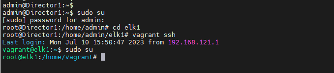
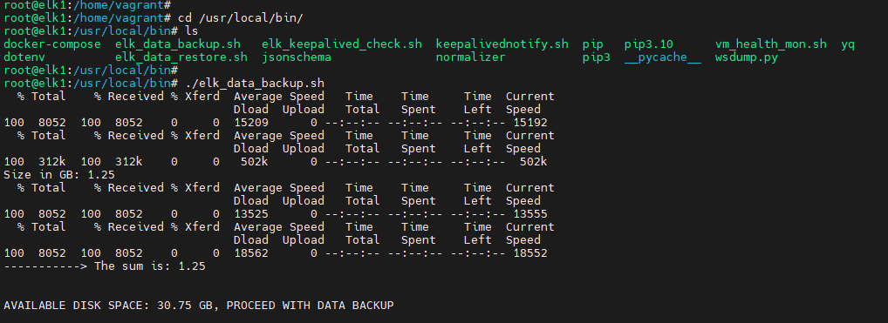
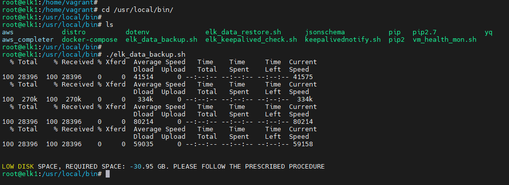
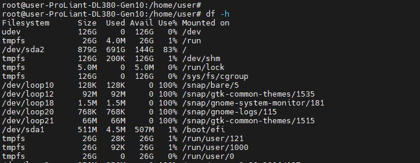
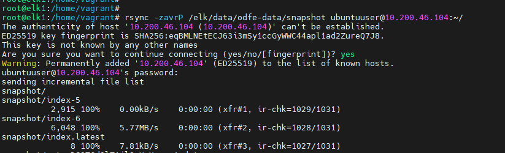
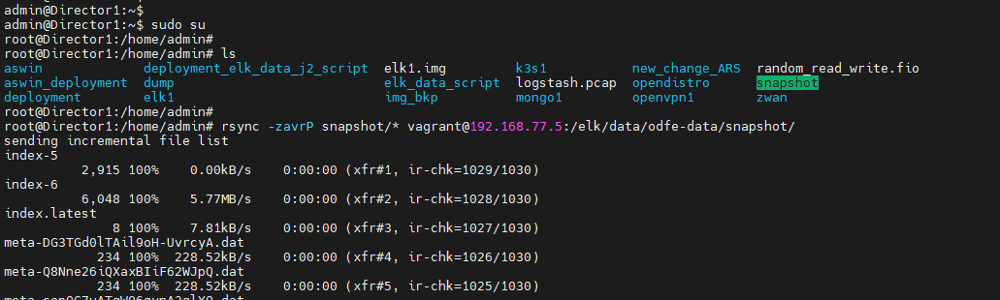
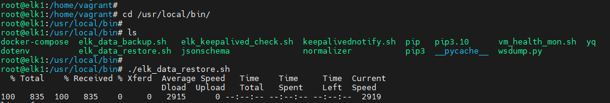
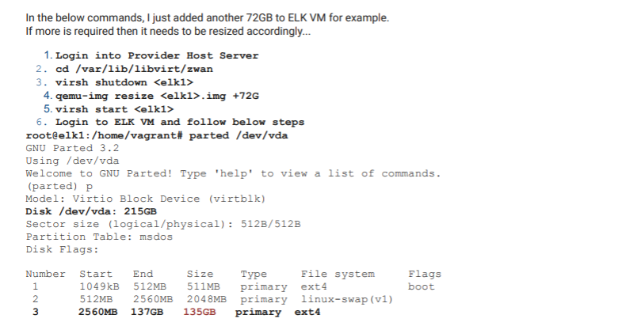
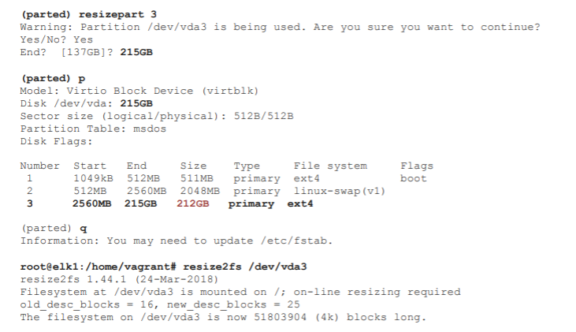
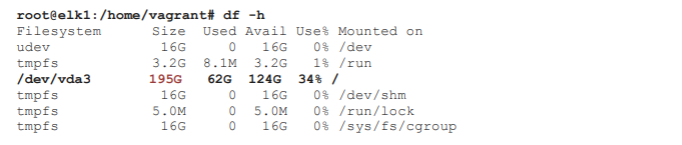

# Analytics (ELK) data backup and restore

Analytics (ELK) data backup and restore,  mechanism is to take backup of Analytics data-set (ie; Historical data till current time period ) in the remote server. Later restoring the backed up data-set in the required director server.  “snapshot” technique is to take data backup and restore.
After the restoration, all the Analytics charts will display the historical data.

Application of Analytics (ELK) data backup and restore:

1. Periodical backup of the Analytics data in the remote server.
2. Migration of Director version.
3. Migration of static IP between the two directors.

> Note:The below mentioned procedure is suitable for migration of director version backup procedure.

 

## Data backup Procedure:

STEP 1:  On completion of configuration backup from MSP. Follow the  given steps to take the data backup of Analytics (ELK).

- Log-in to the director server by taking ssh (enter the valid hostname and server-IP)

    `ssh <HOSTNAME>@<SERVER-IP>`
    
       ex; ssh  user@1.1.1.1
- Once connected the server host, connect to the ELK VM as root (For connecting to ELK VM use the following commands in order)

          sudo su
          cd elk1
          vagrant ssh
          sudo su

Figure 1: connecting to ELK VM

 

STEP 2. Once connected to the elk VM, navigate to /usr/local/bin . Run the “elk_data_backup.sh” script to take the backup of Analytics (ELK) data. (Use the following commands)

       cd  /usr/local/bin
       ./elk_data_backup.sh

1. If it prompts "AVAILABLE DISK SPACE:<...GB>, PROCEED WITH DATA BACKUP", then the script automatically proceed with backup process.

Figure 2: AVAILABLE DISK SPACE prompt

 

2. If it prompts "LOW DISK SPACE, REQUIRED SPACE:<...GB> (will exit the script automatically). Please follow the PRESCRIBED PROCEDURE", to take backed-up.

Figure 3: LOW DISK SPACE, REQUIRED SPACE prompt

 

### Prescribed Procedure:

1. Extension of ELK VM disk space (host has available space):
> Note: From the fig: 3- REQUIRED SPACE: 30.95 GB, you will be prompted with REQUIRED SPACE :<...GB> as per the VM usage. Mandatory to add 5GB along with required space. (Required space = 30.95 GB + 5 GB)
 
Required space = REQUIRED SPACE :<...GB> + 5GB

- To add the “REQUIRED SPACE :<...GB> + 5GB “ to ELK VM from the host, check the host available space using df –h command.

Figure 4: Host disk space

 

- If the host has available space more than REQUIRED SPACE, Proceed with the ELK VM disk space extension procedure. (Extend the ELK DISK SPACE based on REQUIRED SPACE. Procedure to extend the ELK VM DISK size is given at the end of the document)
- AfterELK VM disk space extension , Follow the STEP 1 and STEP 2 to run  elk_data_backup.sh (./elk_data_backup.sh)

2. If the Host available disk space lesser than “REQUIRED SPACE:<...GB> + 5GB”. You can reduce the ELK VM used space by deleting the older data/indices manually

STEP 3. Once the ELK data backup is done. Need to copy the snapshot folder from ELK VM to host machine or remote machine (If moving to host please check the space is available else copy to remote machine). Use the following command to move to home.
            
        cd /home/vagrant

- Run rsync command from the ELK VM. change <USERNAME> and <HOST_IP> as per your remote system.

    `rsync -zavrP /elk/data/odfe-data/snapshot  <USERNAME>@<HOST_IP>:~/`
    
      rsync -zavrP /elk/data/odfe-data/snapshot admin@1.1.1.1:~/

Figure 5: rsyn command execution

 

## Restoration procedure
STEP 1. On completion configuration restoration Follow the given steps to proceed with restoration of Analytics (ELK) data.

- Log-in the director server by taking ssh (enter the valid hostname and server-IP)

        ssh  <HOSTNAME>@<SERVER-IP>
        (ex)    ssh  user@1.1.1.1
        sudo su

STEP 2. Move the  backed-up snapshot directory to ELK VM from the location of backup (remote machine or host)

- If the backed up snapshot folder resides in host use the command to copy it to ELK VM .
(Use the example rsync command exactly from the directory where the snapshot folder present. DON’T RUN THE rsync INSIDE THE SNAPSHOT DIRECTORY, follow the figure: 6)

Figure 6: rsyn command execution

 

        rsync -zavrP snapshot/* vagrant@192.168.77.5:/elk/data/odfe-data/snapshot/   

        (example)
        
         rsync -zavrP snapshot/* vagrant@192.168.77.5:/elk/data/odfe-data/snapshot/

STEP 3. After moving the snapshot folder, connect to ELK VM (For connecting to ELK VM use the following commands - use the figure: 1)

        cd elk1
        vagrant ssh
        sudo su

STEP 4: Once inside the elk vm, navigate to /usr/local/bin . Run the “elk_data_restore.sh” script to restore the Analytics (ELK) data which is backed-up. (Use the following commands)

        cd  /usr/local/bin
        ./ elk_data_restore.sh

Figure 7: execution of elk_data_restore.sh

 

STEP 5: On completion of restoration. Login to the Director UI and Load the dashboards check the historical and current data.

### Procedure to extend the ELK VM disk size:

- The procedure is suitable only if the host OS disk type is of /dev/vda or /dev/sda (If the disk partion  type is /dev/mapper/kickseed--vg-root  then the procedure is not suitable). Run the command from the host to get the disk partion type

            df -h        

 

 

 

