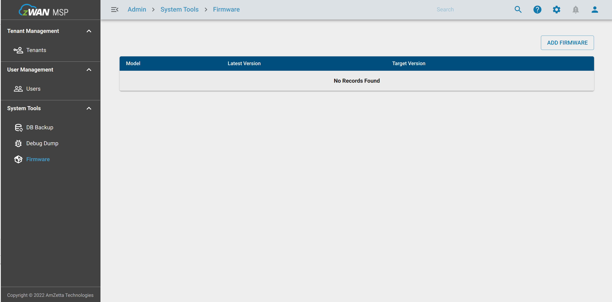
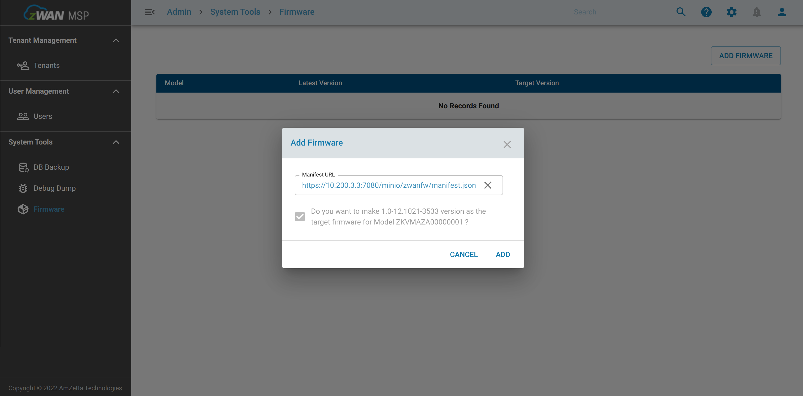
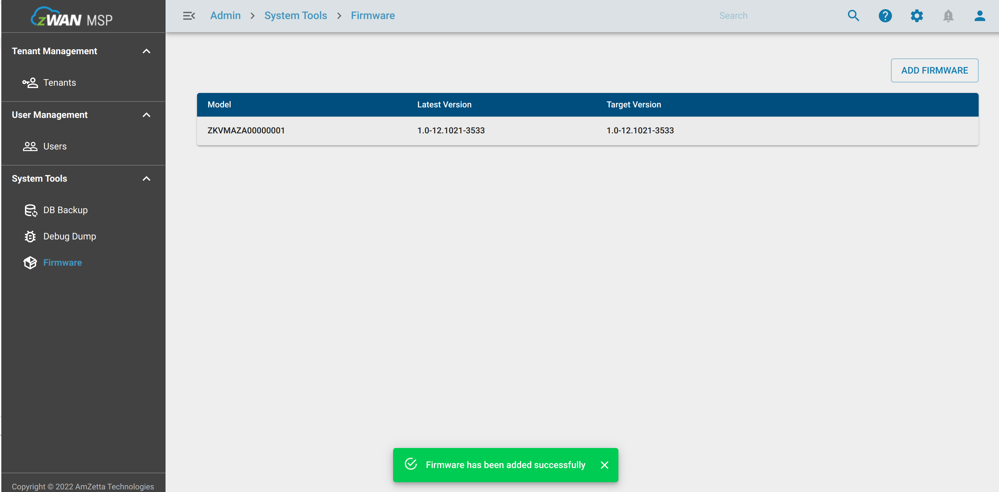
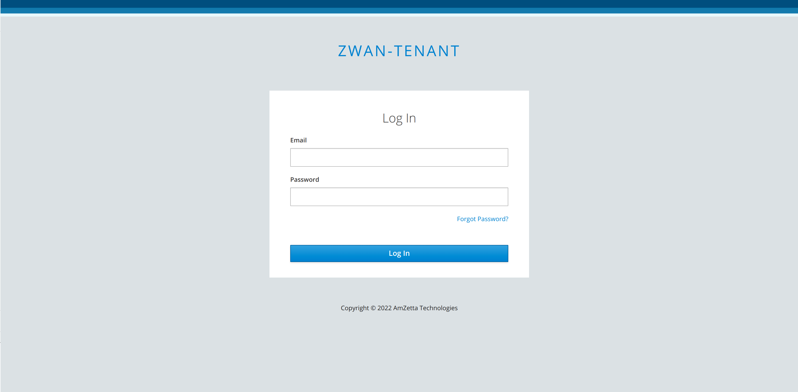
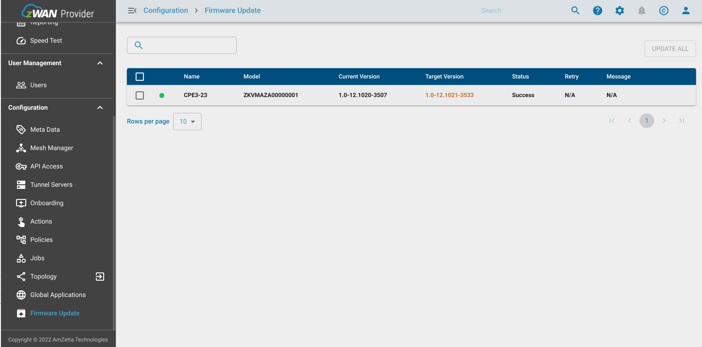
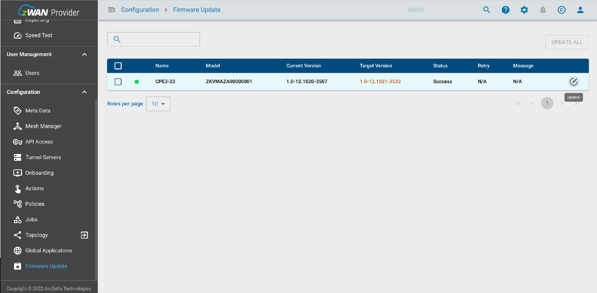
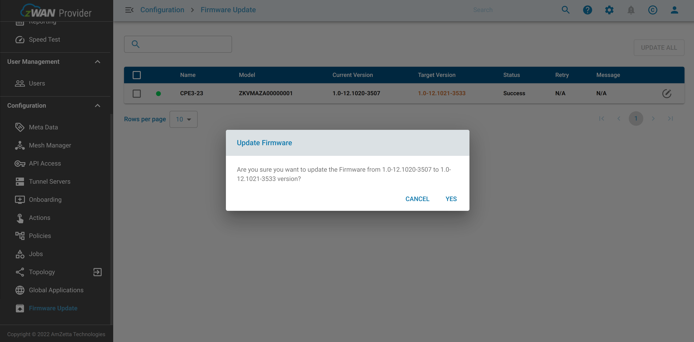
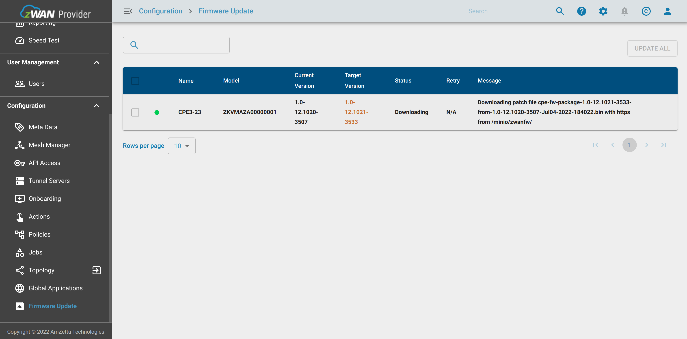
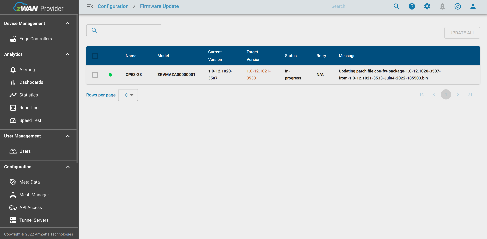
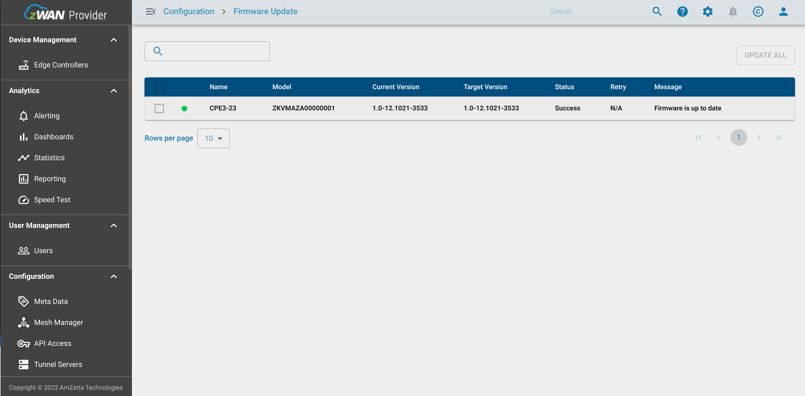

# **Firmware update**

 - [Introduction](#introduction)
 - [Server Setup](#server-setup)
 - [Firmware management](#manage-firmware-images-from-msp-portal)
 - [Update Firmware](#update-the-cpe-firmware)

## Introduction


 - The CPEs firmware are managed through the MSP Portal. Each firmware version is specific to a CPE model, and when a new firmware becomes available, it is updated and managed in the MSP Portal using a manifest file.

 - The Director utilizes the manifest file to determine whether a firmware update is available for a specific CPE model. Please refer [**Manifest**](#manifest-file-format) section for details. 

 - CPE firmware updates are automated, ensuring that the firmware is upgraded to the latest version available in the MSP Portal whenever the CPE is rebooted. Additionally, users have the option to manually update the firmware via the firmware update page when required. 

 - Firmware is updated only on meeting certain [**Criteria**](#firmware-update-criteria)
 - Firmware [**Auto update**](#firmware-auto-update) can be disabled for particular CPE using meta data. Refer [**Auto update**](#firmware-auto-update) section for details.

Firmware images can be uploaded and fetched from any web/fileserver or any S3 compatible object store, On premiss hosted director has inbuilt S3 compatible Minio Server that can be used for firmware upload. 


## Server setup

Please refer [Minio setup](/Director_Installation/Deployment/FirmwareUpdate/MinioSetup.md) to configure Mino server and upload the firmware image and corresponding manifest file. 
Please use S3 or equivalent service for firmware update on cloud hosted director. 

## Manage firmware images from MSP portal

- Login to MSP page https://\<domain-name>:7080 and select “Firmware” tab.

|  |
| ---------------------------- |

- Click “ADD FIRMWARE” button. Copy and past the manifest.json URL link to “Add Firmware” window. Press validate button and press “ADD” button.

|  |
| ---------------------------- |

|  |
| ------------------------------ |


## Update the CPE firmware.

- Login to the director page. https://\<domain-name>:443/<tenant-name>

|  |
| ------------------------------ |

- Click “Firmware Update” option. In this page following CPE / bananapi details can be viewed.

| CPE / Bananapi Details |
| ---------------------- |
| name                   |
| Model                  |
| Current Version        |
| Target Version         |
| Status                 |
| Retry                  |
| Message                |

 - Verify your “Current Version” of the firmware present in the CPE / bananapi board. In “Target Version”, it should show the version specified in the manifest.json file.

|  |
| ------------------------------------ |

 - Click on “Update” button to start update to the latest version of firmware. Watch the update status in “Messages” section.

 Note: Firmware update option is enabled/selectable only on meeting certain [**Criteria**](#firmware-update-criteria)

|  |
| ------------------------------- |

 - After clicking “Update” button, “Update Firmware” dialogue box will be prompted for conformation. Verify the firmware versions and click “Yes”.

|  |
| --------------------------------------- |

 - **Download Started State:**

|  |
| ------------------------------------ |

 - **Update Started State:**

|  |
| --------------------------------------- |

 - **Update Completed:**

|  |
| ----------------------------------------- |

 -  Check “Current Version” and “Target Version” are same after update “Status” is “Success”.


## Manifest file format

## **manifest.json content details:**

| Field      | Description                                                          |
| -------    | ----------------------------------------------------------------     |
| model      | CPE or bananapi model number                                         |
| version    | Lastest firmware version to be updated                               |
| images     | List of firmware update links                                        |
| from       | Current version of firmware in CPE                                   |
| to         | Lastest version of firmware to be updated in CPE                     |
| path       | Firmware update patch download path                                  |
| tenantName | (Optional) Name of the tenant to make firmware update tenant specific|

```
{
	model : <CPE Model>
	version : <firmware version>
	images : <[
		{
			from: <from firmware version>
			to: <to firmware version>
			path: <path to firmware image uploaded in any web server>
		},
	]>,
	tenantName: [<tenant name>]
}
```

Example 
```
{
  "model": "ZKVMAZA00000001",
  "version": "1.2-04.1038",
  "tenantName": "zwan-tenant",
  "images": [
    {
      "from": "1.2*",
      "to": "1.2-04.1038",
      "path": "https://10.11.111.41:7080/minio/123/cpe-fw-package-1.2-04.1038-Jan17-2025-060420.bin"
    }
  ]
}

```

## Firmware update criteria 

A firmware update happens on meeting below criteria. 

 - A new firmware version if available for a particular CPE model.
 - CPE current firmware version is less than the version specified manifest file.
 - CPE is online (There is a hidden menu to override the online check and force firmware update. In the firmware page URL add this params '?ignoreFWCheck=true' to end of the url to force enable firmware update).

Note: Only major version is used for comparing firmware version, minor version and build version is ignored. 

```
Example 
Firmware will update in below cases
current fw : 1.2-xx.xxxx, new fw: 1.3-xx.xxxx
current fw : 1.3-02.xxxx, new fw: 1.3-01.xxxx
current fw : 1.3-01.1012, new fw: 1.3-01.1011 (This is the scenario in the Neal's case where new build number is less than current build number)

Firmware will not update in below cases
current fw : 1.3-02.xxxx,  new fw: 1.2-01.xxxx (Current FW major version is greater than new FW major version)
```


## Firmware Auto Update
  CPE firmware automatically updates to the latest firmware by default, however this feature can be disable to a particular CPE by adding a meta data flag AUTO_FW_UPDATE to false. Disable auto update is required for HA CPE's where both the CPE's should not be update at the same time. 