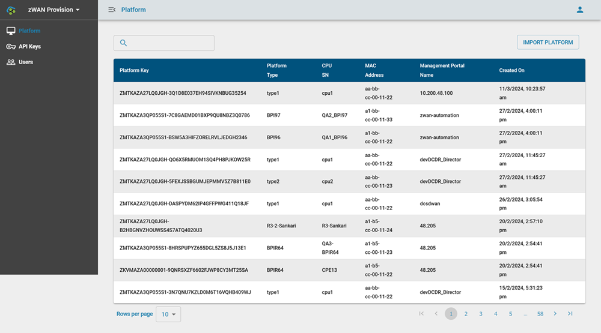
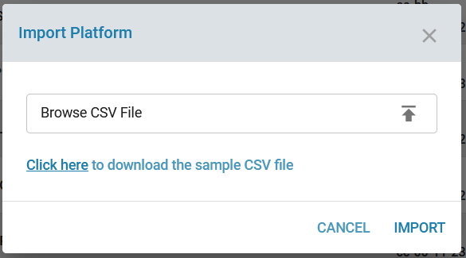
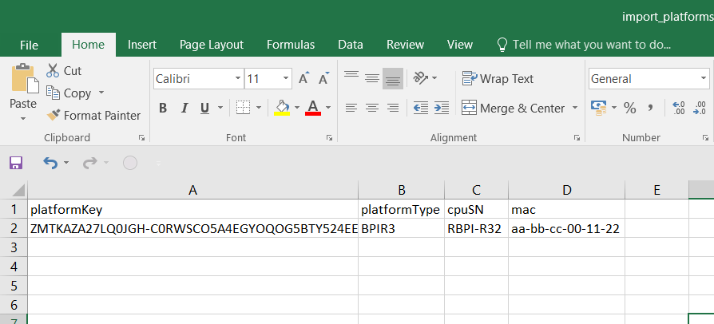
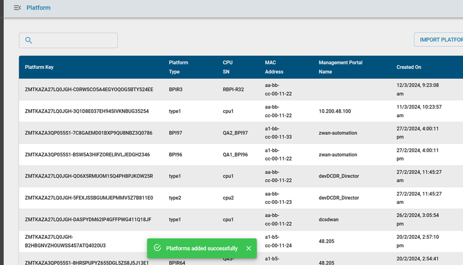
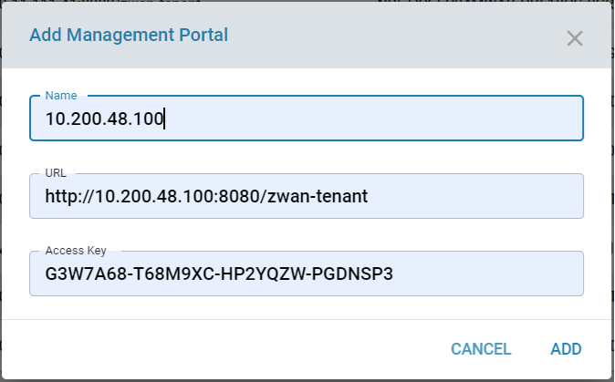
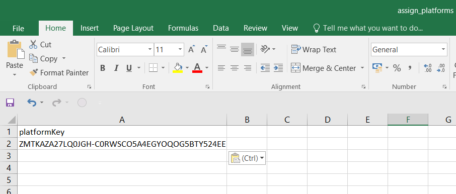
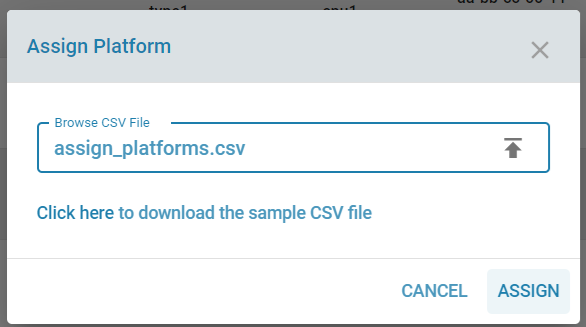
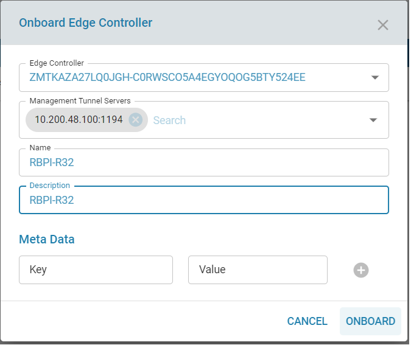
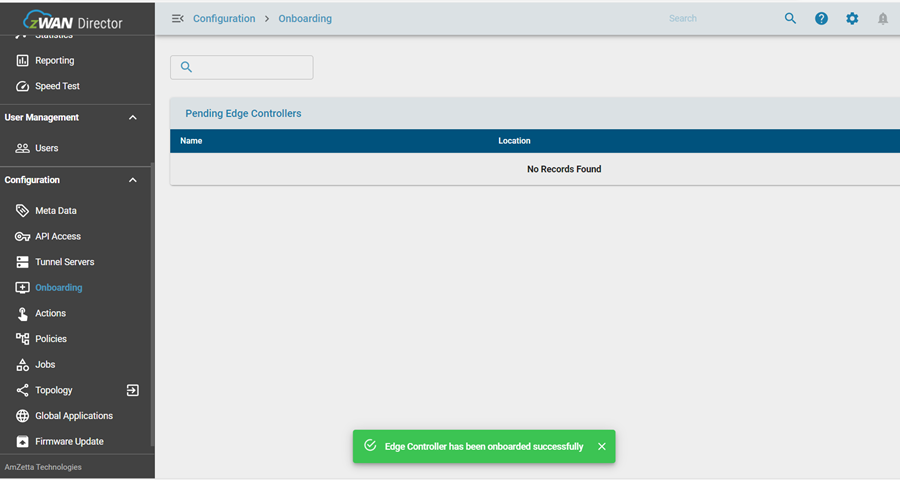
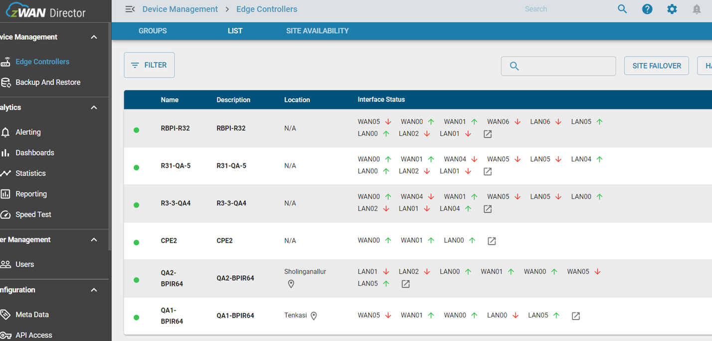

# OnBoarding Using Provision Server

This document contains the steps to explain the onboaring edge controller using Provision Server.

- Launch the provision server
https://provision.amzetta.com/#/login
- Login to the Provision Server using Admin user

- Click Import Platform

- Download the sample file from this option Click here to download the sample CSV file
- From edge controller copy the Product ID
- Give the platformKey (Product Key), platformType (BPIR64/BPIR3/x86..etc) , cpuSN (User defined name) and mac (MAC Address).

- Import the file to Provision Server

- Another tab, open the Director UI and login it.
- Go to API Access page, Copy the URL and access key.

- Logout and login to the provision server using non admin user
- Go to management portal, click add management portal.
- Give user defined name, copied URL, access key and Add it.

- Go to Platform page, click assign platform and Download the sample file from this option "Click here to download the sample CSV file"

- Give the platformKey (Product Key) and import the file to Provision Server

- Click Assign Management Portal, Select the Management Portal Name, Platform and Assign it.

- Login to Director UI
- Go to Onboarding page

- Select the deivce, give the name, description and onboard it.

