`				`**Install Director in Hetzner Dedicated Server** 

**1. Finding Dedicated Server :**

In Dedicated Server Products Hetzner offer lot of solutions starting from branded servers, latest AMD/Intel processor servers, GPU Servers for AI Workloads, and
auction servers ( these are terminated or EOL product hardware which can be reused).

Here is the list of dedicated servers products in the hetzner.

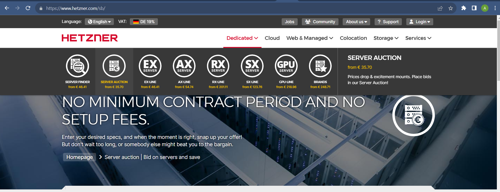

From the Server Auction, search for some servers with a good 16 core CPU and above 96GB RAM with 1 TB SSD. Here is the search pattern to find the server

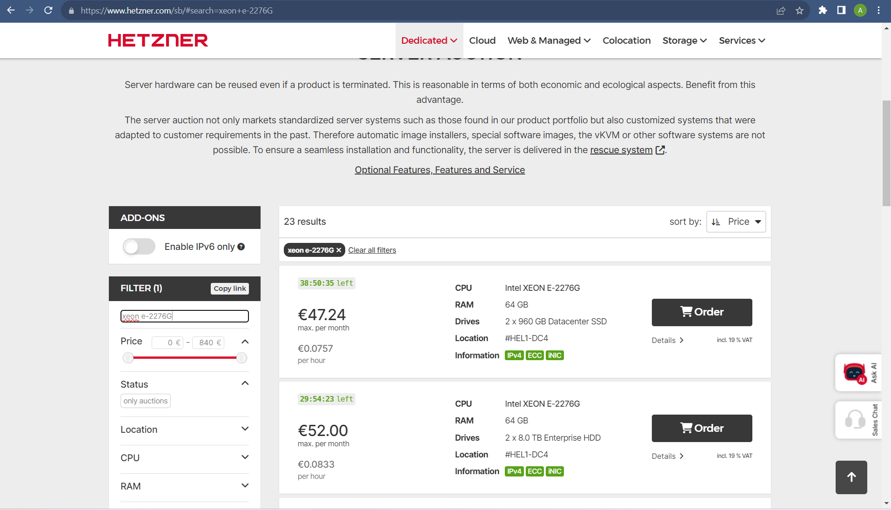

After the server is choosen, that server can be ordered. Here is the server selection and its associated configuration for the selected server.

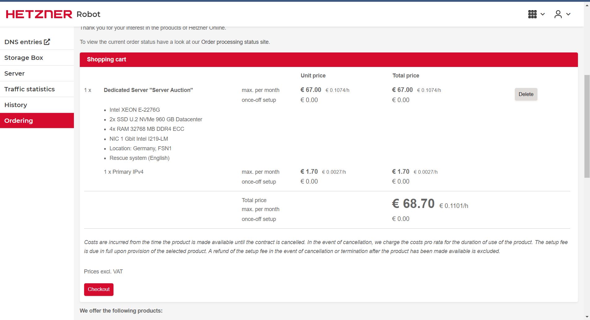

Once the Auction Server is order, it will take some minutes to get the server ready, an email will be sent to the purchasing@amzetta.com with the root/password details to access that server.
By default the server will be in rescue mode, so that any OS can be installed in that server. 

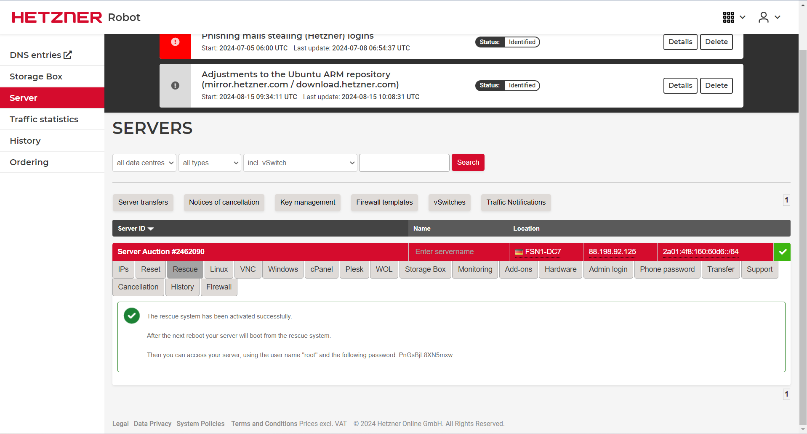

Using the putty tool access the server with the given IP and the credentials, the server will be in the resuce mode like this..

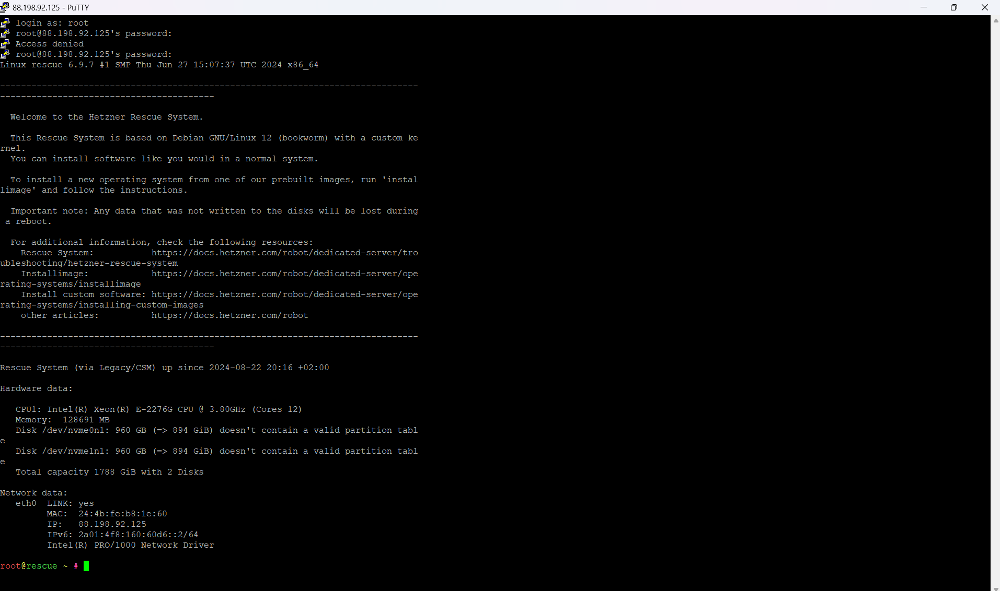

The above image has all the instruction to how to start the installation (run the command 'installimage') and please follow the details in the 
link  (https://docs.hetzner.com/robot/dedicated-server/operating-systems/installimage/)

The command 'installimage' will guide through the OS selection, allows to modify the configuration file to select the software raid, paritions size, etc and the OS intallation.

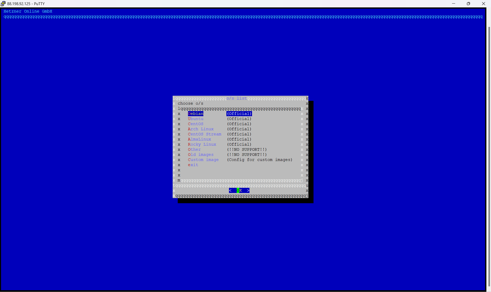

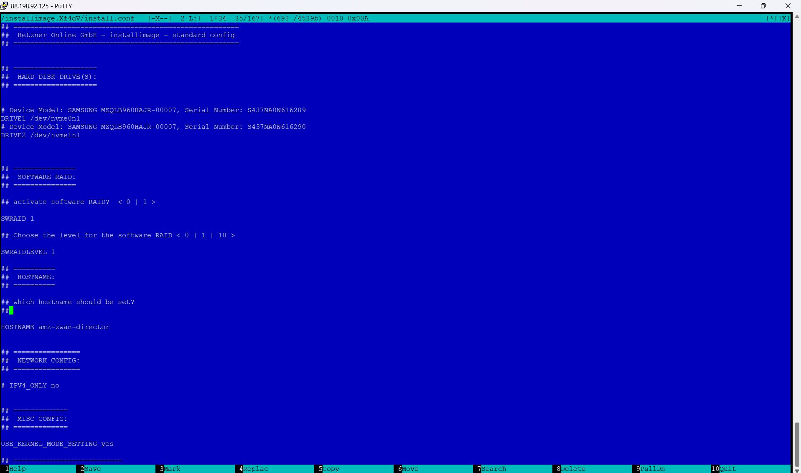

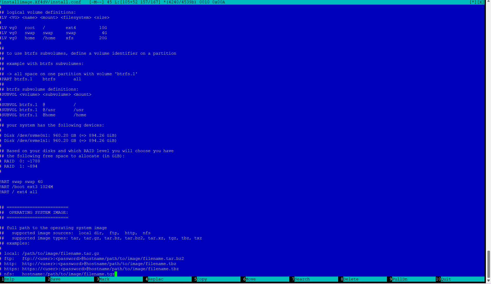

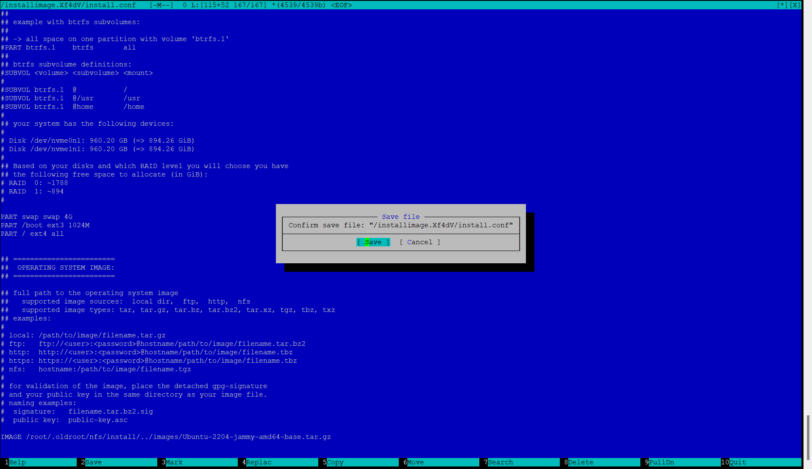

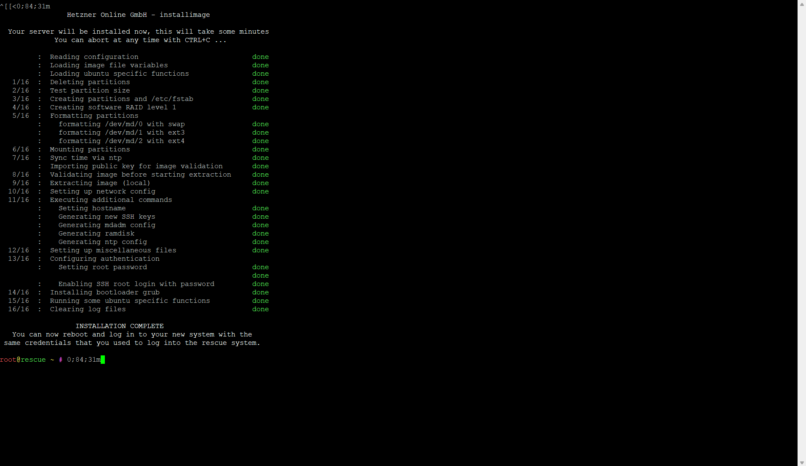

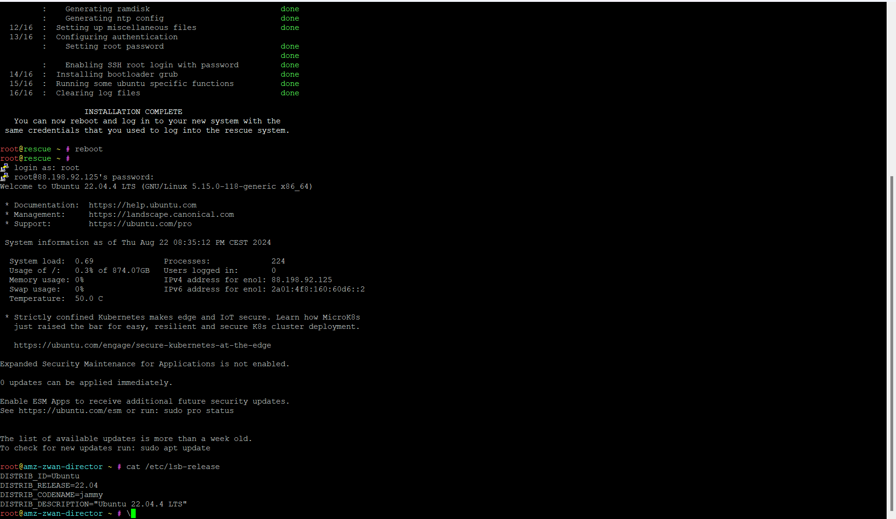

After the OS installation create a zwan user with the default password (zWAN@teamw0rk).

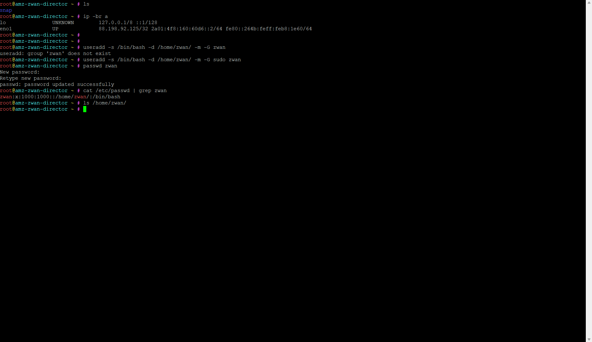

After this follow the steps of triggering the director software installation in a local physical server with some tweaks. This Hetzner dedicated server has only 16 Cores, so the checks for the cores count needs to be commented in the code.

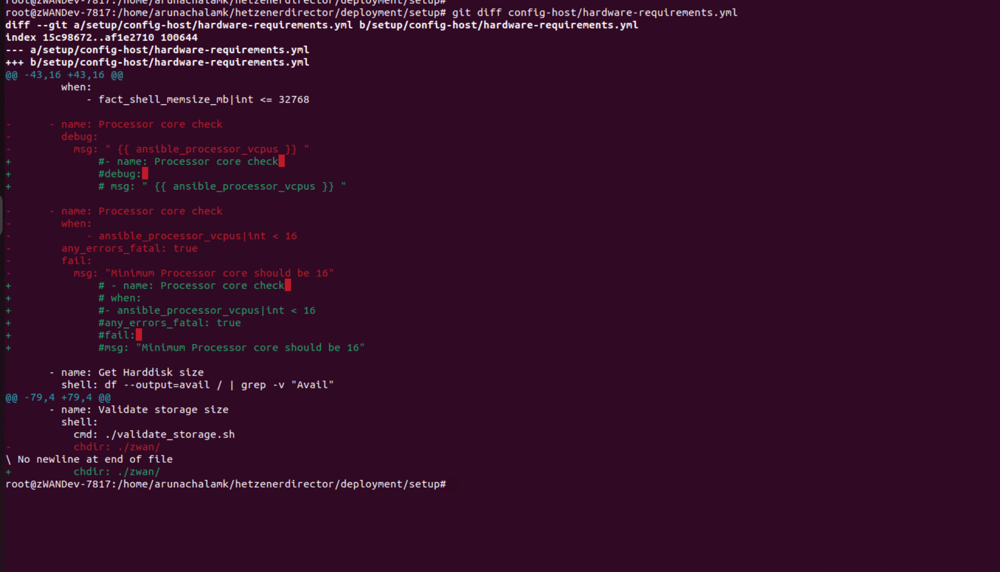

The master.yml file changes are shown below for this installation in the Hetzner dedicated server

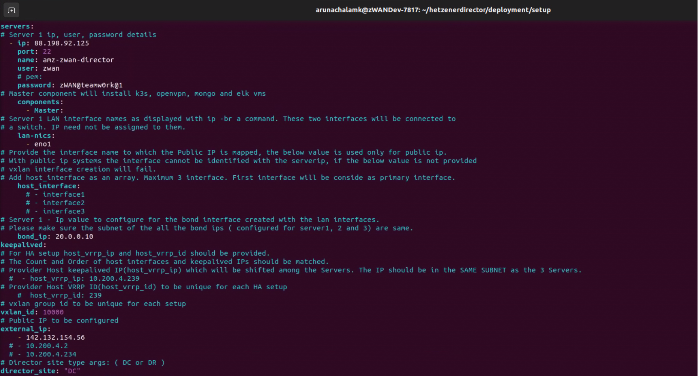

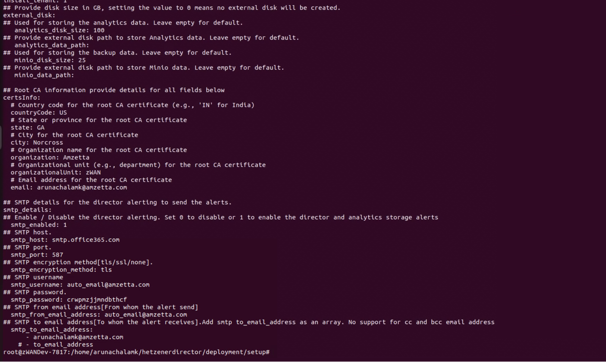

Once the installation is done .

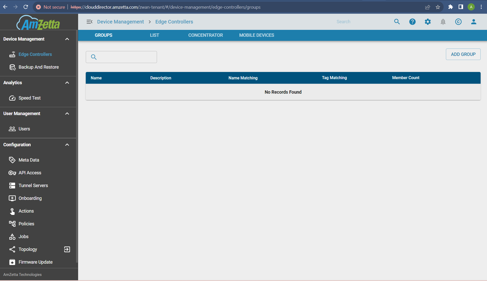
