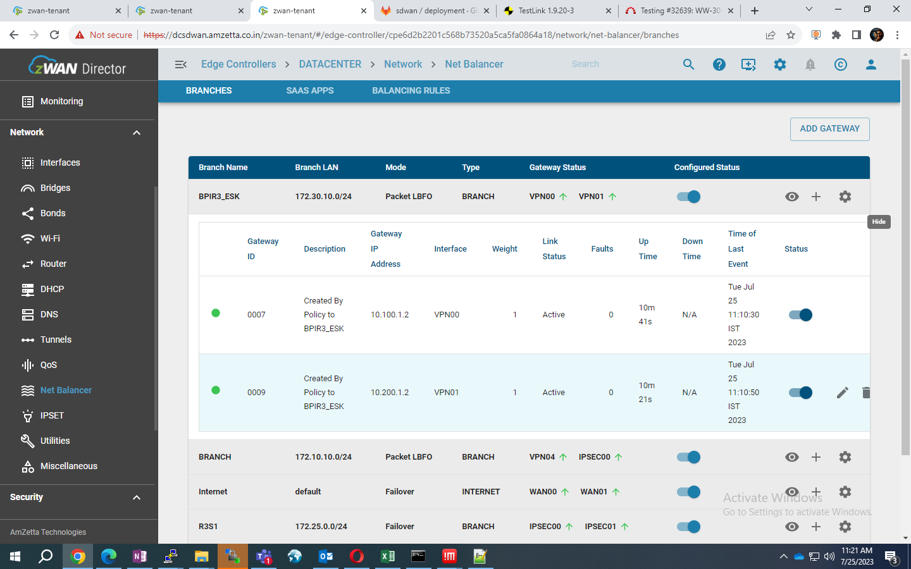
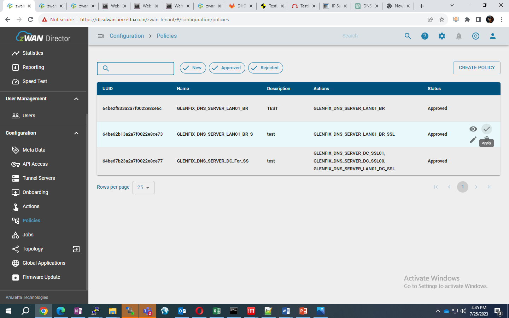

## DNS OVERVIEW

DNS, which stands for Domain Name System, is a fundamental component of the internet that translates human-readable domain names into IP addresses. It acts as a directory service, allowing users to access websites and services using familiar domain names (e.g., www.example.com) instead of needing to remember the corresponding IP addresses (e.g., 192.0.2.1).

**Domain Names:** Domain names are user-friendly names given to websites and services to make them easily identifiable and memorable. They are hierarchical, with levels separated by dots (periods). The rightmost part is the top-level domain (TLD), like .com, .org, .net, etc., while the leftmost part identifies a specific domain or subdomain (e.g., example.com). 
**IP Addresses:** IP addresses are numerical labels assigned to devices connected to a network, such as computers, servers, routers, and other network devices. They identify the location of these devices on the internet and allow data packets to be routed between them. 
**DNS Servers:** DNS servers are specialized computers that store databases containing mappings between domain names and their corresponding IP addresses. When you enter a domain name in your web browser, the browser needs to find the IP address associated with that domain to establish a connection to the server hosting the website. 
**DNS Caching:** To reduce the load on DNS servers and improve response times, DNS resolvers and servers often cache DNS records for a specified period. This caching mechanism helps to serve subsequent requests for the same domain more quickly. 

## PREREQUISITE FOR DNS FORWARDING
1. Minimum 2 edge devices are required for DNS forwarding. One device is for DC and another device is for Branch 
1. On the DC side, create one to many IPSEC/SSLVPN tunnels and On the Branch devices, Create IB over DC via IPSEC/SSLVPN tunnels - All the branch traffic should go to DC via the Tunnels. 
Confirm the existence of an Internet connection of branch devices over the DC (Data Center) tunnel. Configure the Internet access of branch devices via the DC as shown below 
 
 
 
 
 
 

## DNS FORWARDING CONFIGURATION VIA ONDEMAND POLICY
Step1: On-board the required edge controllers to the provider UI 
Step2: Navigate to Edge controller list --> Configurations --> Metadata --> Create/Import metadata for DC and Branch (Here DC is DATACENTER and Branch is BPIR3-ESK). 
1.	Ensure that the WAN configuration, LAN configuration, and VPN configuration have been completed and verified.
1.	Ensure that the IP address host values are distinct for both the client and server. It is essential to have unique IP addresses assigned to each device to avoid conflicts and enable proper communication between the client and server. 

**Metadata details of DC - DATACENTER** 
 
 
 
 

**Metadata details for Branch - BPIR3-ESK** 
 
 
 
 

Step3: Navigate to Edge controller list --> Configurations --> Actions --> Templates page 
 

Step4: Import DNS server configuration template 
 

Step5: Navigate to Configurations --> Actions --> Actions page 
 

#### Action for BR device:
Step6: Go to Actions tab --> click on create action --> select the DNS server template --> now create the action for BRANCH with blow details 
Input interface --> LAN01(BR) 
Access control --> ALLOW 
Global TLS --> DISABLE 
DNS SEC --> ENABLE 
Forward zone --> host name (vpn00.net ),ip address (DC SSLVPN tunnel ip eg:10.10.10.1) 
Status --> ENABLE 
TLS mode -->DISABLE 
Follow the same for SSVPN01 tunnel also. 
 
 

Step7: Navigate to Policy --> Create Policy for DNS forwarding for branch devices with the Action that is created in previous step. 
 
 

#### Action for DC device:
Step8: Navigate to Configurations --> Actions --> Actions page --> Create Three actions for DC DNS Forwarding with below details 
1. **Action 1 for LAN01** 
Input interface --> LAN01(DC) 
Access control --> ALLOW 
Global TLS --> ENABLE 
DNS SEC --> ENABLE 
Forward zone --> host - dns.quad9.net, ip address 9.9.9.9 
Status --> ENABLE 
TLS mode --> ENABLE 
 
 

1. **Action 2 for VPN00** 
Input interface --> VPN00 
Access control --> ALLOW 
Global TLS --> ENABLE 
DNS SEC --> ENABLE 
Forward zone --> host (dns.quad9.net ),ip address 9.9.9.9 
Status --> ENABLE 
TLS mode --> ENABLE 
 

1. **Action 3 for VPN00** 
Input interface --> VPN01 
Access control --> ALLOW 
Global TLS --> ENABLE 
DNS SEC --> ENABLE 
Forward zone --> host (dns.quad9.net ),ip address 9.9.9.9 
Status --> ENABLE 
TLS mode --> ENABLE 
 

Step9: Navigate to Policy --> Create Policy for DNS forwarding for DC devices with those three Action that is created in previous steps. 
 
 

Step10: Click on apply policy in order to apply to the specific device or group of device as below 

1. Apply the policy which is created at step 7 to the branch device 
 
 

1. Apply the policy which is created at step 9 to the DC devices 
 
 

Step11: Navigate to Configuration --> Jobs --> On demand --> Node policy and verify the policy results. 
 

Step12: Navigate to edge controller list --> Navigate to the Branch edge controller where the policy is applied --> Navigate to DNS Server --> Check whether the DNS Server is created based on the policy.(Branch Edge controller -BPIR3-ESK) 
 

Step13: Navigate to edge controller list --> select the DC edge controller where the policy is applied --> Navigate to DNS Server --> Check whether the DNS Server is created based on the policy.(DC Edge controller –DATA CENTER) 
 

Step14: To validate internet traffic and DNS request of Branch devices are going through the DATACENTER, Do a tcpdump on (Brows the some website on Branch LAN PC eg: olx.com, apple.com, udemy.com) 
Execute the below tcpdump command on Branch Edge controller
1. tcpdump –nvi ETH01 port 53 | grep olx.com 
1. tcpdump –nvi VPN00 port 53 | grep olx.com 
1. tcpdump –nvi VPN01 port 53 | grep olx.com 
1. tail  –f /var/log/dns.log | grep olx.com
 
 

**Note:** Follow the same steps for DNS forwarding to DC via IPSEC tunnels. 
