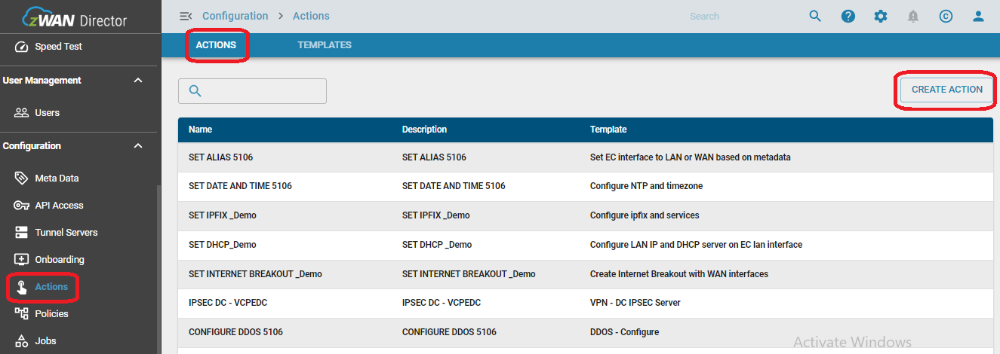

## QoS OVERVIEW

Zwan Traffic Shaping for each interface is achieved using QoS classes. The interface could be Ethernet, VPN, Bond or Bridge.

### Funtionality

QoS Class has one ore more Flow Classification Rules and the Shaping parameters called Policy which includes bandwidth limit and priority. One or more such QoS Classes are applied to an interface. When packet flows through the interface, it will go through each QoS Class one by one and its rule one by one until the packet matches with a rule. If the packet match the filer specified in the rule, then it will honor the Bandwidth limit set which was contained by the QoS Class.

To put it simple: 
1. Create one or more flow classification rule 
1. Create QoS Class with bandwidth control (like maximum bandwidth and guaranteed bandwidth) and priority 
1. Associate the Flow Classification rule to the QoS Class. 
1. Then add the one of more QoS class to an interface. 
1. QoS Class within an interface can be enabled or disabled. Make sure appropriate QoS Class is enabled for that Interface. 
1. Qos for an Interface can be enabled or disabled. Make sure it is enabled. 
1. Make sure all the changes are saved 

### QoS Policies:
1. Priority (high or low) - high priority Class gets more priority while traffic shaping 
1. Guaranteed minimum bandwidth - Specify minimum bandwidth guaranteed for a QoS Class 
1. Maximum Bandwidth - Specify minimum bandwidth guaranteed for a QoS Class 
1. DSCP marking - Optionally set DSCP marking. Packets that uses this QoS Class, will have DSCP mark specified here 

### QoS Rule:
Refer Flow Classification section for Rules. Set one of the QoS class manager as Target for the rule 

## PREREQUISITE FOR QoS
1. LAN PCs connected to the Edge controller and internet should work fine for the LAN PCs 
1. In case of Tunnels with QoS, Corresponding tunnel configuration should be done before executing the QoS policies. 

## QoS CONFIGURATION VIA ONDEMAND POLICY
**List of Templates**
1. qosClass.yml -  'QoS Create Class' 
1. qosClassRule.yml - "QoS Create Classifier" 
1. qosInterfaceBandwidth.yml - 'QoS Set interface bandwidth' 
1. qosInterfaceClassBandwidth.yml - 'QoS Set interface class bandwidth' 
1. qosClassRuleInterface.yml - "QoS Compound Template to create Class and Application aware Classifier" 

Step1: On-board the required edge controllers to the provider UI 
Step2: Navigate to Edge controller list --> Configurations --> Metadata --> Create/Import metadata for the Edge devices. 

**Metadata details**
 
 
 
 
 

### QoS CLASS TEMPLATE - CREATE CLASS
**Action for QoS Class** 
Step3: Navigate to Edge controller list --> Configurations --> Actions --> Templates page 
 

Step4: Go to Actions tab --> click on create action --> select the QoS create class template --> now create the action for QoS Class 
 
 

Step5: Navigate to Policy --> Create Policy for QoS Class with the Action that is created in previous steps. 
 

Step6: Click on apply policy in order to apply to the specific device or group of device as below 

Step7: Navigate to Configuration --> Jobs --> On demand --> Node policy --> Click on the details of the job on the right corner and verify the policy results. 
 

### RESULTS FOR QoS CLASS
Step8: After Applying policy --> Navigate to the edge controller and verify the updated changes in QoS that is done via policy 
 

### QoS CLASS RULE TEMPLATE - QoS CREATE CLASSIFIER
**Action for QoS Class** 
Step1: Navigate to Edge controller list --> Configurations --> Actions --> Templates page and import the QoS class rule template 
 

Step2: Navigate to Configurations --> Actions --> Actions page 
 

Step3: Go to Actions tab --> click on create action --> select the QoS Create Classifier Template --> now create the action for QoS Classifier rule 
 
 
 
 

Step4: Navigate to Policy --> Create Policy for QoS Classifer rule with the Action that is created in previous steps and apply it to the specific device or group of device as below 
 

Step5: Navigate to Configuration --> Jobs --> On demand --> Node policy --> Click on the details of the job on the right corner and verify the policy results. 
 

### RESULTS FOR QoS CLASSIFIER
Step6: After Applying policy --> Navigate to the edge controller and verify the updated changes in QoS classifier page that is done via policy 
 

### QoS INTERFACE BANDWIDTH - QoS SET INTERFACE BANDWIDTH
**Action for QoS Interface Bandwidth** 
Step1: Navigate to Edge controller list --> Configurations --> Actions --> Templates page and import the QoS set interface bandwidth template 

Step2: Navigate to Configurations --> Actions --> click on create action --> select the QoS set interface bandwidth template --> now create the action for QoS set interface bandwidth template rule 
 

Step3: Navigate to Policy --> Create Policy for QoS set interface bandwidth with the Action that is created in previous steps and apply it to the specific device or group of device as below 

Step4: Navigate to Configuration --> Jobs --> On demand --> Node policy --> Click on the details of the job on the right corner and verify the policy results. 

### RESULTS FOR QoS SET INTERFACE BANDWIDTH
Step5: After Applying policy --> Navigate to the edge controller and verify the updated changes in QoS interface manager page that is done via policy 
 

### CONCLUSION FOR QoS CLASS, CLASSIFIER AND SET INTERFACE BANDWIDTH TEMPLATES
QoS class, QoS classifier and Set interface bandwidth are inter connected to each other. After applying all three templates verify the QoS functionality in the LAN PCs 
Login to the LAN PC and do a FTP file transfer via the Tunnels. By doing this corresponding DSCP values will be applied and verify the DSCP marking in VPN interfaces using tcpdump  
 
 

### QoS COMPOUND TEMPLATE - CREATE CLASS, CLASSIFIER, INTERFACE MANAGER IN A SINGLE TEMPLATE
**Action for QoS Compound template** 
Step1: Navigate to Edge controller list --> Configurations --> Actions --> Templates page and import the QoS compound template to create class and application aware classifier rule template 
 

Step2: Navigate to Configurations --> Actions --> click on create action --> select the QoS Compound template to create a class and application aware classifier rule --> now create the action for QoS Classifier rule 
 
 
 

Step3: Navigate to Policy --> Create Policy for QoS Compound tempalate with the Action that is created in previous steps and apply it to the specific device or group of device as below 
 

Step4: Navigate to Configuration --> Jobs --> On demand --> Node policy --> Click on the details of the job on the right corner and verify the policy results. 
 

### CONCLUSION FOR QoS COMPOUND TEMPLATE
Step6: After Applying policy --> Navigate to the edge controller and verify the updated changes in QoS Interface manager page, Class manager page and Classifier page that is done via policy 
 
 
 

Step7: Now verify the Google cloud websites from the LAN PCs since we added the classifier rule for google cloud in QoS
 
