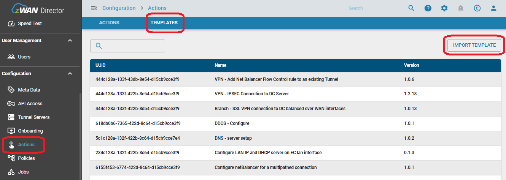

## INTRODUCTION TO CENTRALIZED POLICIES

Centralized policies allow us to manipulate the whole overlay fabric traffic in a centralized fashion and eliminate the manual method of pushing configuration on device and avoiding human errors.

In traditional method, configurations are typically applied on a device per device basis from the zWAN Provider Portal. To overcome this by implementing a centralized management plane that implement on all devices without any human error.

This document explains step-by-step procedure to create and apply DDoS Configuration via On-demand policy.

## DDOS OVERVIEW

Distributed Denial of Service or more commonly known as DDoS attack is an malicious attempt to disrupt the normal flow of traffic of a targeted server, or network byt overwhelming the target with a flood of internet traffic.

zWAN provides basic support for DDoS or DoS attacks, but if the attacker's traffic has already passed your ISP and reaching the EC, the link to the EC is already exhausted which would disrupt the normal traffic flow. What zWAN DDoS does is that, once an attack is detected based on the thresholds configured, it will stop processing the packets and drop them. This prevents wastage of CPU and Memory resources on the EC and also prevents any KP or OOM killers from getting exercised.

## FUNCTIONALITY
1. DDoS can be enabled/disabled on a global basis
1.  DDoS can be enabled/disabled on a per WAN interface
1. Attack Thresholds can be set for different type of traffic per source. The attacks thresholds are mainly

    1. ICMP FLOOD       Defaults : 300 packets/sec
    1. UDP FLOOD        Defaults : 1000 packets/sec
    1. TCP SYN          Defaults : 300 packets/sec
    1. TCP RST          Defaults : 50 packets/sec
    1. SSH BRUTEFORCE   Defaults : 10 packets/sec
1. IPs that attempted to attack or port scan the EC can be viewed
1. Permanent or temporary allow lists and block lists are supported

**Note:** In order for DDOS to work, the firewall INPUT policy should be set to default DROP.

## DDoS CONFIGURATION VIA ONDEMAND POLICY

Step1: Onboard the Edge controller to the Director UI 

Step2: Navigate to Edge controller list --> Configurations --> Actions --> Templates page

Step3: Click on Import template and import the ddos-configure template 

Step4: Navigate to Configurations --> Actions --> Actions page 

Step5: On the Actions --> Click on Create action --> Create DDoS configuration. 

Step6: Navigate to Policy --> Create Policy for DDoS with the Action that is created in previous step. 

Step7: After creation of policy --> Click on review option --> Review the policy. 

Step8: Click on Approve policy in order to apply it. 

Step9: Click on apply policy in order to apply to the specific device or group of device. 

Step10: Apply to the device and make sure policy applied successfully message is displayed. 

Step11: Navigate to Configuration --> Jobs --> On demand --> Node policy and verify the policy results. 

Step12: On the Jobs --> click on the details to check for the detailed information on the Policy Job and download the success / failure log if required. 

## CONCLUSION
DDoS page Before applying policy 

Step13: After applying the policy, Navigate to DDoS and check for the configurations that are applied via policy. The changes that are given in action will gets reflected on the DDoS page. 

